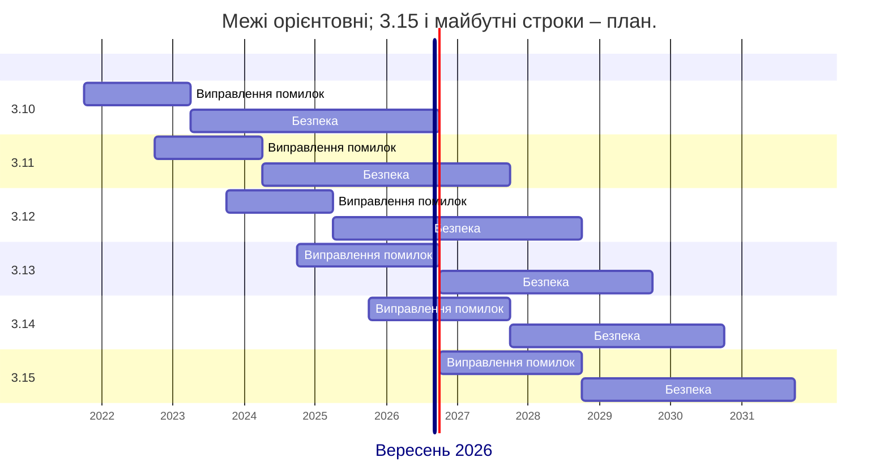
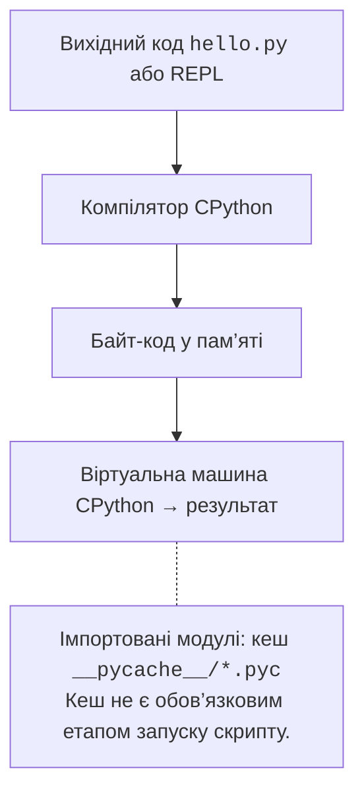

# Мова Python і CPython

## Мова Python та її версії

**Python** – мова програмування загального призначення. Її створив Гвідо ван Россум; перший публічний випуск з’явився 1991 року. Python 3.0 вийшов 2008 року. Мова придатна для автоматизації, обробки даних, вебзастосунків і наукових обчислень. У цьому курсі вона є засобом вивчення об’єктно-орієнтованого програмування: студент поступово переходить від окремого скрипту до проєкту з класами й тестами. Офіційний підручник: <https://docs.python.org/3.14/tutorial/>.

Не слід ототожнювати мову з програмою, яка виконує її команди. **CPython** – основна реалізація Python, написана переважно мовою C. **PyPy** – інша реалізація, відома JIT-компіляцією. Сумісність бібліотек і підтримувані версії цих реалізацій різняться. Для лабораторних використовуємо звичайну збірку CPython 3.14, а не попередній випуск наступної версії та не спеціальну вільнопотокову збірку.

Філософія Python підкреслює читабельність, явність дій і простоту. Її стислий виклад містить PEP 20: <https://peps.python.org/pep-0020/>. Команда `import this` показує цей текст в інтерпретаторі. На практиці це означає зрозумілі назви, короткі функції та відсутність прихованих залежностей від налаштувань комп’ютера.

Нові версії мови виходять щороку. Протягом перших років виправляються помилки, далі – лише проблеми безпеки. Для версій до 3.13 перша фаза тривала приблизно 18 місяців, починаючи з 3.13 – приблизно два роки. Загальна підтримка триває близько п’яти років; точні дати визначає розклад конкретного випуску (рис. 1.1).



Рис. 1.1. Орієнтовний цикл підтримки версій Python {.caption}

Таблиця 1.1. Стан гілок Python на дату підготовки матеріалу {.caption}

| **Версія** | **Стан у вересні 2026** | **Кінець підтримки** |
| --- | --- | --- |
| 3.10 | Безпека | 10.2026 |
| 3.11 | Безпека | 10.2027 |
| 3.12 | Безпека | 10.2028 |
| 3.13 | Виправлення помилок | 10.2029 |
| 3.14 | Виправлення помилок | 10.2030 |
| 3.15 | Попередній випуск | 10.2031, план |

Джерело таблиці та планових дат: <https://devguide.python.org/versions/>. Під час встановлення обирайте актуальний виправний випуск гілки 3.14, наприклад `3.14.x`, а не довільно найновіший попередній випуск. Остання цифра позначає виправлення; вона може змінитися після підготовки матеріалу.

У Python 3.14 з’явилися шаблонні t-рядки, відкладене обчислення анотацій та офіційна підтримка вільнопотокового режиму. T-рядок утворює об’єкт шаблону, а не готовий `str`. Анотації самі по собі не перевіряють типи введених даних. Вільнопотоковий режим не робить кожну програму автоматично швидшою. Ці можливості розглядатимемо після основ; у першій роботі достатньо звичайного інтерпретатора та `print`. Огляд: <https://docs.python.org/3.14/whatsnew/3.14.html>.

## Як CPython виконує програму

Файл `hello.py` містить текст програми в кодуванні UTF-8. CPython перевіряє його синтаксис і компілює в **байт-код** – інструкції своєї віртуальної машини. Потім інтерпретатор виконує ці інструкції (рис. 1.2). Тому вислів «Python виконує текст рядок за рядком без компіляції» є надто грубим спрощенням.



Рис. 1.2. Спрощена модель виконання програми CPython {.caption}

Під час імпорту модуля Python може зберегти байт-код у `__pycache__`, наприклад `helper.cpython-314.pyc`. Це кеш для швидшого завантаження модуля, а не самостійний застосунок. Для головного скрипту, переданого команді `python hello.py`, такий кеш зазвичай не записується. Відсутність `.pyc` не свідчить про помилку. Створення кешу залежить також від прав запису й параметрів запуску. Докладніше: <https://docs.python.org/3.14/tutorial/modules.html>.

**REPL** (*Read–Eval–Print Loop*) – інтерактивний режим: прочитати вираз, обчислити, показати результат і чекати наступного. Запустіть `python` без імені файлу. Позначка `>>>` належить інтерпретатору; її не потрібно вводити в текст програми.

```py
>>> 2 ** 100
1267650600228229401496703205376
>>> import sys
>>> sys.version_info[:2]
(3, 14)
>>> exit()
```

У сучасному REPL є підсвічування й зручне редагування кількох рядків; вигляд залежить від термінала. Для експерименту REPL зручний, але лабораторну зберігайте у `.py`: закриття інтерактивного сеансу не створює файл із вашою програмою. Команда `python -m module` запускає модуль за його ім’ям; наприклад, `python -m pip --version` викликає pip саме вибраного інтерпретатора.
