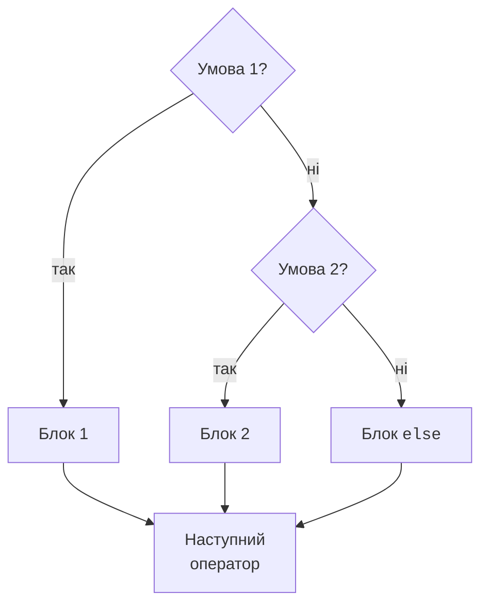
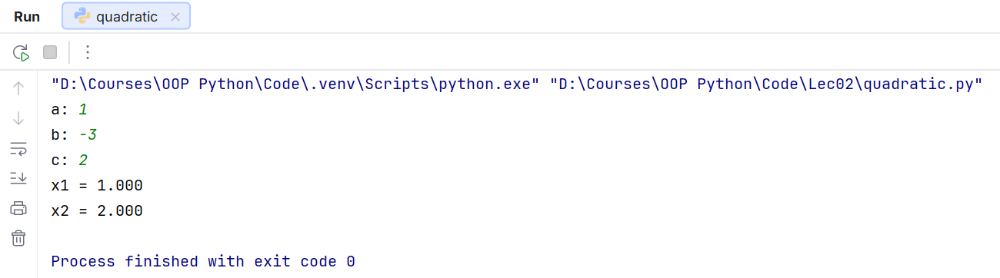

# Розгалуження та зіставлення

## Розгалуження if, elif, else

Умова після `if` перетворюється на логічне значення. Двокрапка починає блок, а відступ визначає його межі. У ланцюжку `if`/`elif` виконується лише перша гілка з істинною умовою. `else` виконується, якщо жодна попередня умова не спрацювала (рис. 2.4).



Рис. 2.4. Послідовна перевірка умов if та elif {.caption}

Кілька незалежних `if` можуть виконати кілька блоків. Це доречно для незалежних властивостей: число може бути і додатним, і парним. Для взаємовиключних категорій потрібен один ланцюжок. Розміщуйте пороги послідовно: якщо спочатку перевірити `score >= 60`, наступна гілка `elif score >= 90` вже не спрацює для відмінного результату.

Умовний вираз `a if condition else b` повертає значення: `label = "парне" if n % 2 == 0 else "непарне"`. Він підходить для короткого вибору, але вкладені умовні вирази важко читати. `pass` – порожній оператор для тимчасового блоку; він не завершує цикл.

### Приклад. Квадратне рівняння

Ввести скінченні числові коефіцієнти `a`, `b`, `c`. Якщо `a` дорівнює нулю, рівняння є лінійним або виродженим. Інакше обчислити дискримінант і дійсні корені. Введення тексту замість числа тут не обробляється.

```py
import math

a = float(input("a: "))
b = float(input("b: "))
c = float(input("c: "))
if not (math.isfinite(a) and math.isfinite(b)
        and math.isfinite(c)):
    print("Коефіцієнти мають бути скінченними")
elif a == 0:
    if b != 0:
        print(f"Лінійне: x = {-c / b:.3f}")
    elif c == 0:
        print("Безліч розв’язків")
    else:
        print("Розв’язків немає")
else:
    d = b * b - 4 * a * c
    if not math.isfinite(d):
        print("Надто великі коефіцієнти")
    elif d < 0:
        print("Дійсних коренів немає")
    elif d == 0:
        print(f"x = {-b / (2 * a):.3f}")
    else:
        root = math.sqrt(d)
        print(f"x1 = {(-b - root) / (2 * a):.3f}")
        print(f"x2 = {(-b + root) / (2 * a):.3f}")
```

Для введення `1`, `-3`, `2` програма друкує `x1 = 1.000` і `x2 = 2.000`. Окремо перевірте `1, 2, 1`, `1, 0, 1`, `0, 2, -4`, `0, 0, 0` та `0, 0, 1`. Ці набори покривають різні гілки.

Тут точне порівняння введеного коефіцієнта з нулем є свідомим вибором. Для довільних виміряних коефіцієнтів близький до нуля дискримінант потребує обґрунтованого допуску. Пряма формула також може втрачати точність через віднімання близьких чисел. Це навчальний алгоритм для помірних коефіцієнтів, а не універсальний чисельний розв’язувач.



Рис. 2.5. Введення коефіцієнтів і корені у вікні Run {.caption}

## Структурне зіставлення match

`match` обчислює значення і перевіряє шаблони `case` згори вниз. Виконується перший відповідний блок. Автоматичного переходу до наступного блоку немає, тому `break` між гілками не потрібен. Вертикальна риска `|` поєднує альтернативні шаблони; `_` – шаблон будь-якого значення без збереження його в змінній.

Окреме ім’я в шаблоні є **захопленням** (*capture*), а не порівнянням із раніше створеною змінною. Тому `case command:` приймає будь-яке значення. Для текстової команди потрібні лапки: `case "sum":`. Умова-страж (*guard*) після `if` перевіряється після збігу шаблону. Якщо вона хибна, пошук продовжується. Вступ: <https://peps.python.org/pep-0636/>.

### Приклад. Меню калькулятора

Команди `+`, `add`, `/`, `div` задають операцію, `0` або `exit` завершують роботу. Операнди вводяться окремими рядками в числовому форматі. Перед запуском циклу користувач уже має знати цей контракт.

```py
import math

while True:
    command = input("Операція (+, /, 0): ").strip()
    if command == "0" or command == "exit":
        break
    if command not in ("+", "add", "/", "div"):
        print("Невідома команда")
        continue
    a = float(input("a: "))
    b = float(input("b: "))
    if not (math.isfinite(a) and math.isfinite(b)):
        print("Потрібні скінченні числа")
        continue
    match command:
        case "+" | "add":
            print(f"Результат: {a + b:.2f}")
        case "/" | "div" if b != 0:
            print(f"Результат: {a / b:.2f}")
        case _:
            print("Ділення на нуль заборонене")
```

Сеанс із командою `add`, числами `2`, `3`, а потім командою `0` містить `Результат: 5.00`. Команда `div` із числами `2` та `0` дає повідомлення про ділення на нуль і повертає до меню. Кортеж у перевірці `not in` тут використано лише як компактний перелік команд; колекції докладно вивчатимуться пізніше.
