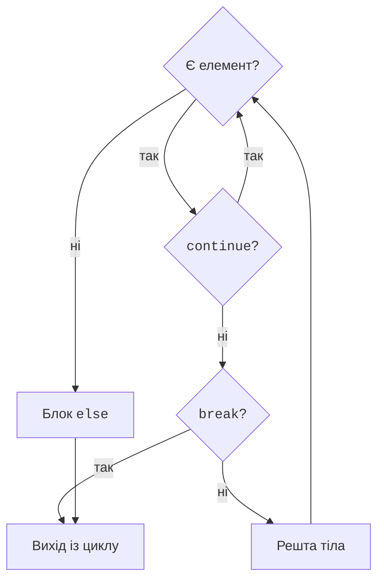

# Цикли та типові алгоритми

## Цикли while та for

`while` повторює блок, доки умова істинна. Вона перевіряється перед кожною ітерацією, тому тіло може не виконатися жодного разу. Потрібно забезпечити зміну стану, яка приведе до завершення. Якщо лічильник не збільшується, умова може залишитися істинною назавжди.

`for` перебирає елементи послідовності. Для цілочисельного діапазону використовують `range(start, stop, step)`. Межа `stop` не входить до діапазону. Крок не може бути нульовим. `range(5)` задає 0, 1, 2, 3, 4, а `range(5, 0, -2)` – 5, 3, 1. Сам об’єкт `range` не створює список усіх цих чисел у пам’яті.

```py
total = 0
for number in range(1, 6):
    total += number
print("Сума:", total)

number = 5
while number > 0:
    print(number, end=" ")
    number -= 2
print()
```

Результат – `Сума: 15` та рядок `5 3 1`. Зверніть увагу на останній `print()`: він завершує рядок після кількох викликів із `end=" "`. Вкладений цикл виконує повний внутрішній прохід для кожної ітерації зовнішнього.

### break, continue та else циклу

`break` завершує найближчий цикл, а `continue` переходить до наступної ітерації. У `while` перед `continue` часто треба оновити лічильник, інакше програма повторюватиме ту саму перевірку. У `for` наступний елемент отримує сам цикл.

Блок `else` циклу виконується після нормального вичерпання елементів `for` або після хибної умови `while`. Після `break` він пропускається. Це не означає «цикл виконався хоча б раз»: для порожнього діапазону `else` теж виконується. Вихід через виняток чи `return` також не запускає цей блок. На рис. 2.6 показано звичайний цикл `for`.



Рис. 2.6. Шляхи виконання циклу, continue, break та else {.caption}

### Приклад. Вгадай число

Комп’ютер обирає ціле число від 1 до 20. Користувач має п’ять спроб; неправильний формат або число поза діапазоном не витрачає спробу. Для автоматичної перевірки нижче можна замінити вибір на `secret = 7`.

```py
import random

secret = random.randint(1, 20)
attempts = 0
while attempts < 5:
    text = input("Число 1..20: ").strip()
    if not (1 <= len(text) <= 2 and text.isascii()
            and text.isdecimal()):
        print("Введіть одну або дві цифри")
        continue
    guess = int(text)
    if not 1 <= guess <= 20:
        print("Число поза діапазоном")
        continue
    attempts += 1
    if guess == secret:
        print(f"Вгадано зі спроби {attempts}")
        break
    print("Більше" if guess < secret else "Менше")
else:
    print(f"Спроби вичерпано. Число: {secret}")
```

Для контрольного секрету 7 і введень `5`, `10`, `7` повідомлення: `Більше`, `Менше`, `Вгадано зі спроби 3`. Для п’яти невдалих допустимих спроб виконується `else`. Під час звичайної гри конкретне число й послідовність підказок можуть відрізнятися.

## Типові алгоритми з циклами

**Накопичувач** починається з нейтрального елемента: для суми це 0, для добутку – 1. **Лічильник** збільшується тільки за потрібної умови. **Прапорець** зберігає відповідь «так/ні», наприклад чи знайдено порушення. Ці ролі варто відображати в назвах змінних.

Для мінімуму не слід без пояснення брати початковий нуль: усі введені числа можуть бути додатними. Використайте перше значення або `None`. Наведений повний приклад читає три правильно записані цілі числа, не зберігаючи всю серію в колекції.

```py
minimum = None
total = 0
positive_count = 0
for index in range(3):
    value = int(input(f"Число {index + 1}: "))
    total += value
    if minimum is None or value < minimum:
        minimum = value
    if value > 0:
        positive_count += 1
print("Мінімум:", minimum)
print("Середнє:", total / 3)
print("Додатних:", positive_count)
```

Для `4`, `-2`, `7` маємо мінімум -2, середнє 3.0, два додатні числа. У перевірці мінімуму коротке обчислення `or` не дозволяє порівнювати число з `None` на першій ітерації.

### Алгоритм Евкліда

Для невід’ємних цілих `a` та `b` НСД не змінюється після заміни пари на `b` і `a % b`. Друга компонента зменшується, доки не стане нулем. Множинне присвоєння спочатку обчислює праву частину зі старими значеннями, а потім зв’язує імена з новими.

```py
a = 84
b = 30
while b != 0:
    a, b = b, a % b
print("НСД:", a)
```

Результат – `НСД: 6`. Послідовність пар: `(84, 30)`, `(30, 24)`, `(24, 6)`, `(6, 0)`. Для від’ємних вхідних чисел спочатку беруть `abs`. Якщо потрібне НСК, для ненульових чисел зручно обчислювати `abs(a // gcd * b)`. Випадок нуля визначають окремо до ділення.

### Прості числа та вкладені цикли

Просте число – ціле число, більше за 1, яке має рівно два додатні дільники. Число 1 не є простим. Для перевірки числа `n` досить шукати дільник до квадратного кореня включно: більший дільник мав би парний менший. `math.isqrt(n)` повертає точний цілий корінь для невід’ємного цілого, уникаючи похибок `float`.

У вкладених циклах `break` виходить лише з внутрішнього. Це дозволяє перервати перевірку одного складеного числа, але продовжити перебір усього діапазону. Повний приклад наведено в лабораторній роботі. Опис керувальних конструкцій: <https://docs.python.org/3.14/tutorial/controlflow.html>.

## Перевірка програми та типові помилки

Перевірка – це зіставлення фактичного результату з очікуваним. Повідомлення `Process finished with exit code 0` означає нормальне завершення, але не доводить правильність формули. Для кожного розгалуження підберіть приклад, який проходить відповідну гілку. Для циклу перевірте нуль, одну й кілька ітерацій, а також вихід через `break` і завершення з виконанням `else`.

У PyCharm **Ctrl+Alt+L** форматує код. Інспекції підсвічують підозрілі місця та порушення стилю; **Alt+Enter** відкриває запропоновані дії. Не застосовуйте виправлення механічно: прочитайте, яку конструкцію воно змінює. Інспекція не замінює виконання програми з даними.

::: info Знімок екрана
Editor: MyVar=5 and if MyVar==1 : followed by an indented print. Show inspection tooltip and Problems.
:::

Рис. 2.7. Зауваження до пробілів і назв у PyCharm {.caption}

Таблиця 2.2. Помилки та способи перевірки {.caption}

| **Проблема** | **Як виправити** |
| --- | --- |
| Замість 10 отримано `55` | Перетворити результат `input` на число перед додаванням |
| Гілка ніколи не працює | Перевірити порядок порогів і різницю між `if` та `elif` |
| Цикл не завершується | Перевірити зміну лічильника перед `continue` |
| Пропущено останнє число | Врахувати невключну межу `range` |
| Неправильний мінімум | Ініціалізувати першим значенням або `None` |
| Рівні числа дають `False` | Розрізняти `is`, `==` та наближене порівняння |
| Помилка відступів | Чотири пробіли, однаковий рівень для операторів блоку |

Перед захистом складіть таблицю «вхід – очікування – фактичний результат». Перевіряйте межі тарифів і оцінок з обох боків, нульові значення та неможливі геометричні дані. Випадкові програми перевіряйте на контрольному стані або фіксованому секреті, а після перевірки поверніть звичайний режим. Не включайте до тестів випадкові адреси об’єктів чи залежні від комп’ютера ідентифікатори.
