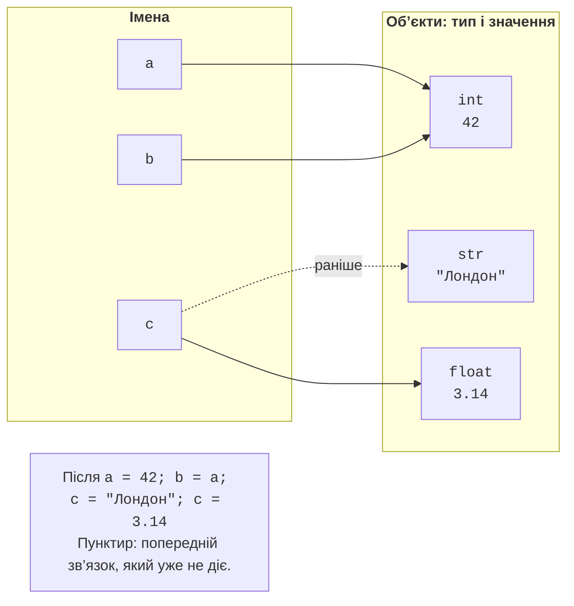
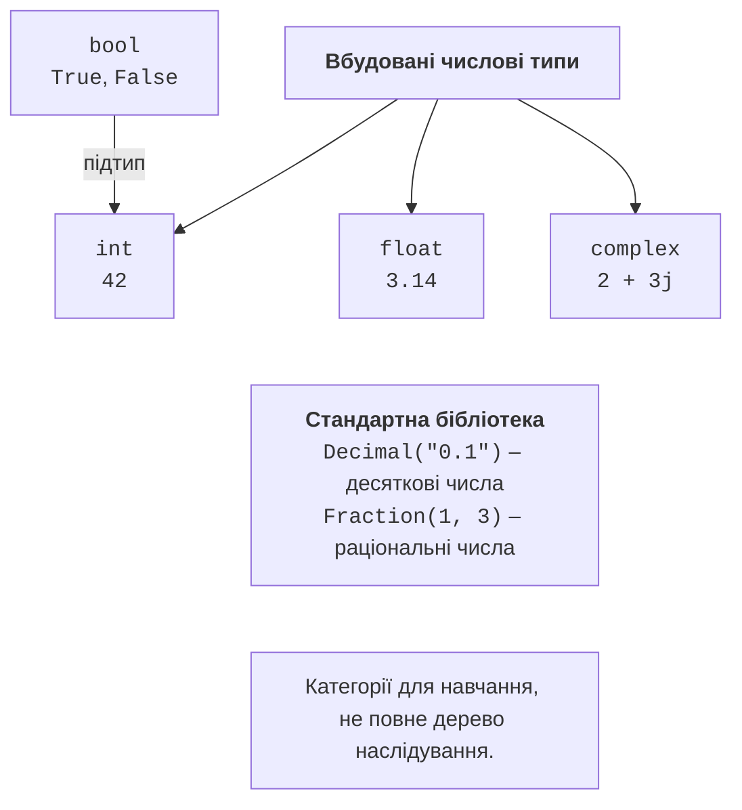

# Об’єкти, імена та типи даних

## Об’єкти, імена та динамічна типізація

Програма опрацьовує **об’єкти** (*objects*). Кожний об’єкт має тип, значення та ідентичність. Тип визначає дозволені операції: числа можна додавати, рядки можна з’єднувати. **Ім’я** (*name*) зв’язується з об’єктом під час присвоєння. Запис `count = 5` не оголошує комірку, яка назавжди має тип `int`: він зв’язує ім’я `count` із цілим числом.

**Динамічна типізація** означає, що типи об’єктів перевіряються під час виконання. У наступному присвоєнні те саме ім’я може посилатися на рядок. Це дозволено мовою, але часто погіршує зрозумілість програми. Для змінної кількості студентів краще зберігати ціле число протягом усього алгоритму.

```py
a = 42
b = a
c = "Лондон"
c = 3.14
print(type(a).__name__, type(c).__name__)
print(a == b, a is b)
```

Результат: `int float`, а в наступному рядку `True True`. Присвоєння `b = a` створило ще один зв’язок із тим самим об’єктом (рис. 2.1). Воно не копіює об’єкт. Після `a = 43` ім’я `b` усе ще позначатиме число 42: цілі числа незмінні, а присвоєння лише змінює зв’язок імені.



Рис. 2.1. Імена та об’єкти після повторного присвоєння {.caption}

Функція `type(x)` повертає тип об’єкта, а `id(x)` – ціле число, яке ідентифікує об’єкт протягом його життя. Значення `id` не є порядковим номером змінної і не повинно входити до очікуваного результату тесту. У різних запусках воно може змінюватися; після видалення об’єкта його ідентифікатор може бути використаний знову.

Оператор `==` порівнює значення, а `is` – ідентичність об’єктів. Для чисел і тексту зазвичай потрібен `==`. Не перевіряйте `score is 100`: можливе повторне використання об’єктів інтерпретатором не є правилом вашого алгоритму. Для спеціального значення `None` прийнято `x is None`.

Python не додає автоматично рядок до числа: вираз `"5" + 2` спричинить `TypeError`. Треба явно обрати зміст: `int("5") + 2` дає 7, а `"5" + str(2)` дає рядок `"52"`. Саме відсутність довільних неявних перетворень мають на увазі, називаючи типізацію Python строгою.

### Назви та стиль

Ідентифікатор не починається з цифри, не містить пробілів і не збігається з ключовим словом. Регістр важливий: `total` і `Total` – різні імена. Використовуйте англомовні назви `student_count`, `unit_price`, `is_ready`. Константи за домовленістю записують як `MAX_ATTEMPTS`; це стиль, а не заборона змінювати значення. Не називайте змінні `str`, `sum` або `input`, щоб не затіняти потрібні вбудовані функції.

Модуль `keyword` містить `kwlist` і `softkwlist`. Слова `match` та `case` є м’якими ключовими словами: спеціальне значення вони мають у певному контексті. Поради щодо назв і чотирьох пробілів для відступу: <https://peps.python.org/pep-0008/>.

## Числові типи та точність

Убудовані числові типи – `int`, `float`, `complex`; `bool` є підтипом `int`. На рис. 2.2 показано навчальне групування, а не дерево абстрактних класів модуля `numbers`. Зокрема, `Decimal` не потрібно помилково малювати як підклас `float`.



Рис. 2.2. Вбудовані та додаткові числові типи {.caption}

`int` зберігає цілі числа довільної точності в межах доступної пам’яті. Число `2 ** 100` обчислюється точно. Для читабельності дозволені підкреслення: `1_000_000`. Літерали `0b1010`, `0o12`, `0xA` позначають те саме десяткове число 10 в різних системах числення.

`float` у звичайній збірці CPython використовує двійкове подання подвійної точності. Число `0.5` подається точно, але десяткове `0.1` – наближено. Не кожне велике ціле число зберігається у `float` без втрат. Для точного лічильника або ідентифікатора використовуйте `int`, не `float`.

```py
import math

value = 0.1 + 0.2
print(value)
print(value == 0.3)
print(math.isclose(value, 0.3))
print(math.isclose(1e-12, 0.0, abs_tol=1e-9))
```

Результат:

```
0.30000000000000004
False
True
True
```

`math.isclose` перевіряє близькість із відносним і абсолютним допусками. Поблизу нуля зазвичай потрібен додатний `abs_tol`. Допуск обирають за змістом задачі й одиницями вимірювання, а не копіюють довільну константу. Форматування `.2f` приховує зайві цифри під час друку, але не змінює спосіб зберігання числа.

Значення `float("inf")` і `float("nan")` теж дозволені. Для фізичних величин перевіряйте `math.isfinite(x)`. `nan` не дорівнює навіть самому собі; тому одна перевірка `x <= 0` не відхилить усі непридатні значення.

`complex` має дійсну й уявну частини: `z = 2 + 3j`, `z.real`, `z.imag`. Для комплексних чисел визначено арифметику й рівність, але не порядок `<` або `>`. Корінь із від’ємного числа можна обчислити через `cmath.sqrt`; `math.sqrt` працює з дійсними числами і відхиляє від’ємний аргумент.

`bool` має два значення: `True` та `False`. У числовому контексті вони поводяться як 1 і 0. Проте ознаку `is_valid` слід використовувати як логічну величину, а не як прихований лічильник без пояснення.

### Decimal і Fraction

Для грошей можна зберігати цілі копійки або застосувати `Decimal`. Створюйте десяткові числа з рядків: `Decimal("0.1")`. Конструктор `Decimal(0.1)` перенесе вже наявне двійкове наближення. Операції Decimal теж залежать від точності контексту; нескінченний дріб не стає точним тільки завдяки зміні типу.

`Fraction(1, 3)` з модуля `fractions` зберігає раціональне число як дріб. Воно доречне для точних відношень цілих чисел. Ці два типи належать стандартній бібліотеці, тому встановлювати їх через pip не потрібно. Опис типів: <https://docs.python.org/3.14/library/stdtypes.html>.

## Рядки, None та перетворення

`str` – незмінна послідовність символів Unicode. Лапки `'Лондон'` і `"Лондон"` рівнозначні. У рядку `"\n"` записано символ нового рядка, а `"\\"` позначає один зворотний слеш. Окремого символьного типу немає: `"А"` – теж рядок. Детально рядки розглядатимуться в темі 6.

Значення `None` позначає відсутність результату. Воно відрізняється від нуля та порожнього рядка. Наприклад, мінімум ще не введеної серії можна початково позначити `None`; нуль міг би бути справжнім результатом.

Таблиця 2.1. Приклади явних перетворень {.caption}

| **Вираз** | **Результат** | **Пояснення** |
| --- | --- | --- |
| `int("12")` | `12` | Рядок містить ціле число |
| `int(-3.9)` | `-3` | Відкидання дробової частини до нуля |
| `float("12.5")` | `12.5` | Десяткова крапка, не кома |
| `str(12)` | `"12"` | Текстове подання |
| `bool(0)` | `False` | Нуль є хибним |
| `bool("False")` | `True` | Непорожній рядок є істинним |

`int("12.5")` не перетворить десятковий рядок на ціле число. Не слід мовчки робити `int(float(text))`, якщо задача вимагає саме цілого: так студент може приховати неправильне введення. Спочатку визначте формат допустимих даних, потім виконуйте відповідне перетворення.

**Істинність** (*truthiness*) дозволяє використовувати значення в умовах. Хибними є `None`, `False`, числові нулі та порожні рядки й колекції. Рядки `"0"`, `"False"` та `" "` є істинними. Щоб перевірити відповідь «так», порівнюйте текст, наприклад `answer.strip().lower() == "так"`.
