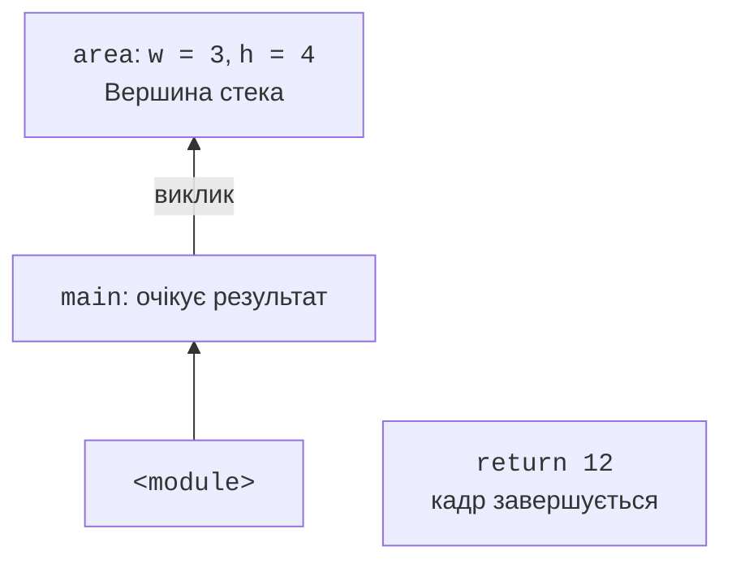

# Оголошення функцій та аргументи

## Оголошення, виклик і результат

Оператор `def` створює об’єкт функції та зв’язує його з ім’ям. Тіло з відступом виконується під час **виклику** (*call*), а не під час оголошення. Імена в заголовку називають **параметрами** (*parameters*); конкретні значення у виклику – **аргументами** (*arguments*). Офіційний вступ: <https://docs.python.org/3.14/tutorial/controlflow.html#defining-functions>.

```py
def area(width: float, height: float) -> float:
    """Повернути площу прямокутника."""
    return width * height


result = area(3.0, 4.0)
print(f"Площа: {result:.1f}")
print(area(2.5, 2.0))
```

```
Площа: 12.0
5.0
```

Запис `: float` описує очікуваний тип параметра, а `-> float` – тип результату; докладніше анотації розглянемо нижче. Вони не змінюють множення. `return` негайно завершує поточний виклик і передає значення тому виразу, який його викликав. Рядки після виконаного `return` у цьому проході не виконуються.

На рис. 3.1 кадр функції містить її локальні імена. Після повернення площі виконання продовжується в місці виклику. Новий виклик отримує власні локальні зв’язки імен.



Рис. 3.1. Кадри вкладених викликів {.caption}

### `return`, `print` і `None`

`print` виводить текст, а `return` повертає об’єкт. Ці дії можна поєднати, але це не одне й те саме. Функція без `return`, а також функція з `return` без виразу, повертає `None`. Це окреме значення «результату немає», а не число нуль і не порожній рядок.

```py
def show_total(total: int) -> None:
    print("Разом:", total)


answer = show_total(12)
print(answer)
```

```
Разом: 12
None
```

Якщо далі треба порівняти суму або записати її до звіту, функція обчислення повинна повернути суму. Виведення краще залишити місцю виклику. Не слід перевіряти відсутність числового результату через `if not result`: тоді правильний нуль також вважатиметься відсутнім. Для значення-вказівника використовуйте `result is None`.

### Кілька результатів і мінімум про колекції

**Кортеж** (*tuple*) містить упорядковані елементи. Запис `return low, high` насправді повертає один кортеж. Його можна розпакувати у дві змінні: кількість змінних має відповідати кількості елементів. **Список** (*list*) також упорядкований, але його вміст можна змінювати. `items[0]` читає перший елемент, `len(items)` – кількість, `append` додає елемент. **Словник** (*dict*) зв’язує ключ зі значенням: `{"tea": 25.0}`. Докладні операції над колекціями будуть у темі 5.

```py
def bounds(a: int, b: int) -> tuple[int, int]:
    return min(a, b), max(a, b)


low, high = bounds(9, 2)
print(low, high)
prices: dict[str, float] = {"tea": 25.0}
values: list[int] = [low, high]
values.append(12)
print(prices["tea"], values)
```

```
2 9
25.0 [2, 9, 12]
```

### Контракт і рядок документації

**Контракт** описує допустимі вхідні дані, результат і побічні ефекти. Анотація `int` не говорить, чи дозволено від’ємне число, тому діапазон записують словами. Перший рядок тіла, якщо це рядковий літерал, стає **рядком документації** (*docstring*). Він доступний через `function.__doc__`, `help(function)` та підказки IDE. Рекомендації: <https://peps.python.org/pep-0257/>.

Для однієї операції достатньо короткого речення. Для складнішої функції додайте одиниці вимірювання, межі, точність, спосіб позначення відсутнього результату. Не переписуйте в документації кожний оператор: пояснюйте, що обіцяє функція користувачеві.

## Позиційні, іменовані та необов’язкові аргументи

Позиційний аргумент зіставляється з параметром за місцем, іменований – за ім’ям. Іменований виклик пояснює значення чисел без читання тіла. Значення за замовчуванням застосовується лише тоді, коли аргумент не передали. Передане `None` автоматично його не замінює.

```py
def format_price(amount: float, currency: str = "UAH",
                 *, precision: int = 2) -> str:
    """Форматувати суму; precision від 0 до 4."""
    return f"{amount:.{precision}f} {currency}"


print(format_price(12.5))
print(format_price(currency="EUR", amount=7, precision=1))
```

```
12.50 UAH
7.0 EUR
```

Параметр `precision` стоїть після `*`, тому його передають лише за ім’ям. Виклик із третім позиційним аргументом спричинить `TypeError`. Так само помилкові два значення одного параметра, невідоме ім’я або пропущений обов’язковий аргумент. Позиційні аргументи звичайного виклику пишуть перед іменованими.

### Значення за замовчуванням обчислюються один раз

Вираз значення за замовчуванням виконується під час `def`. Якщо це список, усі виклики без відповідного аргументу отримають той самий список. У прикладі нижче помилка навмисна.

```py
def remember(value: int, items: list[int] = []) -> list[int]:
    items.append(value)
    return items


print(remember(4))
print(remember(7))
```

```
[4]
[4, 7]
```

Для нового списку при кожному виклику використайте `None` як ознаку відсутнього аргументу. Об’єднання типів `list[int] | None` прямо повідомляє про обидві можливості. Якщо передано власний список, цей контракт навмисно дозволяє його зміну.

```py
def remember(value: int,
             items: list[int] | None = None) -> list[int]:
    if items is None:
        items = []
    items.append(value)
    return items


print(remember(4))
print(remember(7))
```

```
[4]
[7]
```

Не замінюйте перевірку на `if not items`: порожній список, явно переданий користувачем функції, теж хибний, але це вже інший об’єкт, який за цим контрактом треба доповнити.
