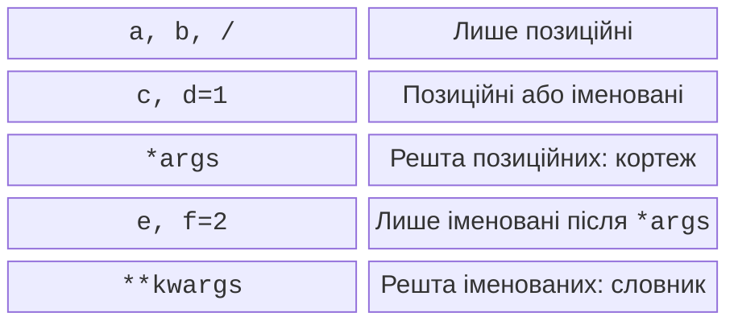

# Види параметрів і передавання об’єктів

## Види параметрів і розпакування

Маркер `/` означає, що параметри ліворуч передають лише позиційно. Маркер `*` означає, що параметри праворуч передають лише за ім’ям. `*args` збирає додаткові позиційні аргументи в кортеж, а `**kwargs` збирає додаткові іменовані аргументи у словник. Назви `args` і `kwargs` – домовленість; спеціальне значення мають зірочки.



Рис. 3.2. Порядок груп параметрів у заголовку {.caption}

У схемі рис. 3.2 групи разом утворюють заголовок `def f(a, b, /, c, d=1, *args, e, f=2, **kwargs)`. Серед позиційних параметрів обов’язкові стоять перед тими, що мають значення за замовчуванням. Для лише іменованих такого обмеження немає. Замість `*args` можна записати голу `*`, якщо збирати зайві позиційні значення не потрібно.

```py
def describe(code: str, /, count: int = 1,
             *, unit: str = "шт") -> str:
    return f"{code}: {count} {unit}"


def total(**prices: float) -> float:
    return sum(prices.values())


position = ("A17", 3)
options = {"unit": "кг"}
print(describe(*position, **options))
print(total(tea=25.0, bread=30.0))
```

```
A17: 3 кг
55.0
```

У визначенні зірочки **збирають**, у виклику **розпаковують**. Ключі словника для `**options` мають бути рядками. Не можна двічі передати `unit`, наприклад прямо й через словник. Необмежений `**kwargs` зручний для набору товарів, але для фіксованих налаштувань краще оголосити точні параметри: IDE тоді помітить друкарську помилку.

### Приклад 1. Статистика оцінок

Потрібно знайти середнє та кількість оцінок, за потреби вилучивши одну найменшу. Приймемо скінченні оцінки від 0 до 100, точність від 0 до 4; порожній набір після вилучення означає відсутній результат. Лише іменовані параметри роблять виклик читабельним.

```py
from math import isfinite


def grade_stats(*grades: float, precision: int = 2,
                drop_lowest: bool = False
                ) -> tuple[float, int] | None:
    """Середнє і кількість; None для недопустимого набору."""
    if not grades or not 0 <= precision <= 4:
        return None
    values = list(grades)
    for grade in values:
        if not isfinite(grade) or not 0 <= grade <= 100:
            return None
    if drop_lowest:
        values.remove(min(values))
    if not values:
        return None
    return round(sum(values) / len(values), precision), len(values)


print(grade_stats(60, 80, 100))
print(grade_stats(60, 80, 100, drop_lowest=True))
print(grade_stats(60, drop_lowest=True))
```

```
(80.0, 3)
(90.0, 2)
None
```

`list(grades)` створює окремий список; `remove` вилучає лише перше входження мінімуму. Отже, для двох однакових найменших оцінок вилучається одна оцінка. Округлення змінює результат, а не кількість знаків під час друку. Значення `80.0` можна окремо показати як `80.00` за допомогою форматування.

## Передавання об’єктів і чисті функції

Параметр стає локальним ім’ям для переданого об’єкта. Python не копіює автоматично весь список. Переприсвоєння параметра змінює локальний зв’язок, а зміна елемента спільного списку видима зовні. Тому вислів «числа передаються за значенням, списки за посиланням» неточний: правило зв’язування однакове, відрізняється змінюваність.

```py
def change(number: int, values: list[int]) -> None:
    number = number + 1
    values.append(number)
    values = [99]


n = 4
items = [1]
change(n, items)
print(n, items)
```

```
4 [1, 5]
```

**Побічний ефект** (*side effect*) – помітна зовні дія, крім повернення результату: зміна списку, друк, введення, зміна глобального стану. **Чиста функція** для однакових даних повертає однаковий результат і не має побічних ефектів. Таку функцію легко перевірити без клавіатури й легко використати в іншому інтерфейсі.

При декомпозиції відокремлюйте читання, перевірку, обчислення та форматування. Не потрібно створювати функцію для кожного оператора. Добра межа – завершене правило з коротким контрактом, наприклад «перетворити метри на кілометри» або «знайти індекс у відсортованому списку». Назва `process` без уточнення зазвичай приховує надто багато різних обов’язків.
