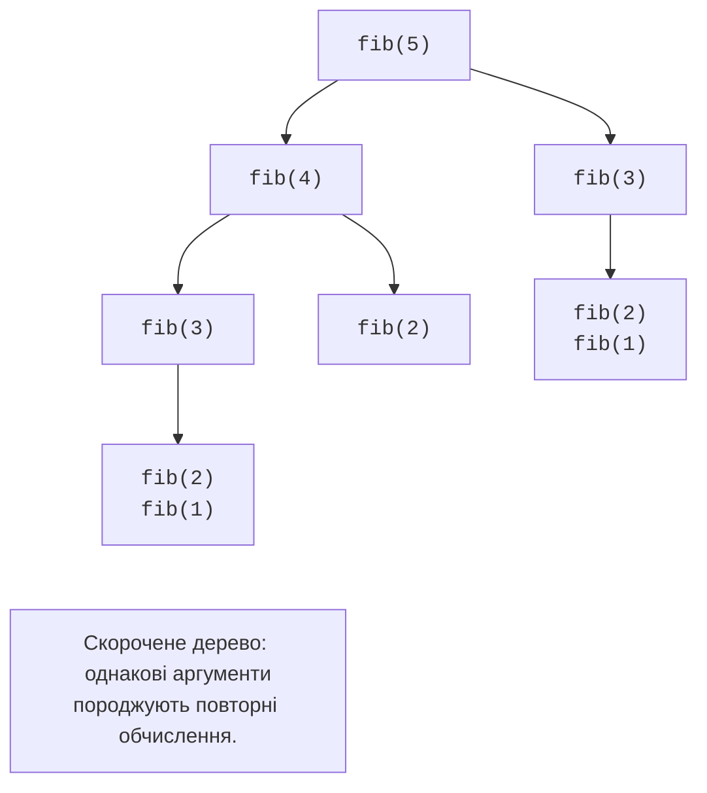

# Рекурсія та стек викликів

## Рекурсія і стек викликів

**Рекурсія** (*recursion*) – виклик функцією самої себе безпосередньо або через інші функції. Потрібні базовий випадок без рекурсивного виклику та крок, який наближає аргумент до нього. Для факторіала база `0! = 1`, а крок `n! = n · (n − 1)!` визначено для цілих невід’ємних чисел. Перевірка лише `n == 0` не захищає від `n = -1`.

```py
def factorial(n: int) -> int | None:
    """Факторіал для 0 <= n <= 100; інакше None."""
    if not 0 <= n <= 100:
        return None
    if n == 0:
        return 1
    previous = factorial(n - 1)
    if previous is None:
        return None
    return n * previous


print(factorial(0), factorial(5), factorial(-1))
```

```
1 120 None
```

Для `factorial(3)` спочатку накопичуються виклики з аргументами 3, 2, 1, 0. Потім результати повертаються у зворотному порядку: 1, 1, 2, 6. Кожний кадр пам’ятає власне `n` та незавершене множення. Для цього потрібна пам’ять, пропорційна глибині.

`sys.getrecursionlimit()` повертає поточну межу глибини стека інтерпретатора. Її значення не слід вважати універсальною константою. Надто глибокий виклик дає `RecursionError`; збільшення межі не виправляє алгоритм без бази. Python не гарантує оптимізації хвостових викликів. Для довгого лінійного проходу обирайте цикл. Довідка: <https://docs.python.org/3.14/library/sys.html#sys.getrecursionlimit>.

::: info Знімок екрана
PyCharm Run. Intentionally broken factorial(-1); capture actual traceback.
:::

Рис. 3.4. Діагностика необмеженої рекурсії {.caption}

### НСД та бінарний пошук

Алгоритм Евкліда замінює пару `(a, b)` на `(b, a % b)` до нульового другого числа. Для невід’ємних аргументів остача менша за дільник, тому маємо рух до бази. Бінарний пошук натомість ділить відсортований проміжок навпіл; його передумова – неспадне впорядкування.

```py
def gcd(a: int, b: int) -> int:
    a, b = abs(a), abs(b)
    if b == 0:
        return a
    return gcd(b, a % b)


def search(items: list[int], target: int,
           left: int, right: int) -> int | None:
    """Шукати на напіввідкритому проміжку [left, right)."""
    if left >= right:
        return None
    middle = (left + right) // 2
    if items[middle] == target:
        return middle
    if items[middle] < target:
        return search(items, target, middle + 1, right)
    return search(items, target, left, middle)


values = [2, 5, 8, 11, 14]
print(gcd(84, 30))
print(search(values, 11, 0, len(values)))
print(search(values, 9, 0, len(values)))
```

```
6
3
None
```

У пошуку права межа не входить до проміжку. Відкинутий середній елемент не повинен залишитися в наступному пошуку, інакше довжина може не зменшуватися. Для повторюваних значень цей алгоритм повертає будь-який знайдений індекс, а не обов’язково перший. Значення `gcd(0, 0)` тут дорівнює 0 за програмною домовленістю.

### Приклад 3. Ханойські вежі

Перенести `n` дисків зі стрижня A на C, використовуючи B, можна трьома діями: перенести `n − 1` дисків на B, перенести найбільший на C, перенести малу вежу з B на C. Не можна класти більший диск на менший. Для нуля дисків не потрібна жодна дія.

```py
def hanoi(n: int, source: str, target: str,
          spare: str, depth: int = 0) -> tuple[int, int]:
    """Для 0 <= n <= 10: друкувати ходи, повернути їх число."""
    if n == 0:
        return 0, depth
    left, d1 = hanoi(n - 1, source, spare, target, depth + 1)
    print(f"{source} -> {target}: {n}")
    right, d2 = hanoi(n - 1, spare, target, source, depth + 1)
    return left + 1 + right, max(d1, d2)


moves, depth = hanoi(2, "A", "C", "B")
print("Ходів:", moves, "Глибина:", depth)
```

```
A -> B: 1
A -> C: 2
B -> C: 1
Ходів: 3 Глибина: 2
```

Глибину вимірюємо кількістю рекурсивних переходів від початкового виклику, тому вона дорівнює `n`. Це не повна кількість кадрів процесу. Число ходів `2 ** n - 1` швидко зростає: глибина невелика, але обсяг виводу вже може бути величезним. Контракт обмежує `n` значенням 10; інтерфейс із введенням повинен перевірити межі перед викликом. Функція має навмисний побічний ефект – друк ходів.

## Рекурсія, ітерація та повторні обчислення

Числа Фібоначчі визначаються базами `F(0) = 0`, `F(1) = 1` і сумою двох попередніх. Прямий переклад формули повторно обчислює однакові підзадачі (рис. 3.5). Зростання числа викликів набагато швидше за зростання аргументу.



Рис. 3.5. Повторні підзадачі прямої рекурсії {.caption}

**Мемоізація** (*memoization*) зберігає результат за аргументами. Готовий `functools.cache` додаємо рядком `@cache` перед визначенням. Механізм декораторів буде в темі 7; зараз це готовий інструмент. Ключі кешу мають бути хешованими: звичайний список непридатний. Кеш необмежений і утримує дані, доки його не очистять. <https://docs.python.org/3.14/library/functools.html#functools.cache>.

```py
from functools import cache


@cache
def fib(n: int) -> int:
    """Число Фібоначчі для цілого 0 <= n <= 100."""
    if n < 2:
        return n
    return fib(n - 1) + fib(n - 2)


def fib_loop(n: int) -> int:
    a, b = 0, 1
    for _ in range(n):
        a, b = b, a + b
    return a


print(fib(10), fib_loop(10))
print(fib.cache_info().misses)
fib.cache_clear()
```

```
55 55
11
```

Одинадцять різних аргументів – від 0 до 10 – обчислено один раз кожний. Кеш не усуває глибину рекурсії. Ітерація зберігає лише два сусідні числа й не витрачає пам’ять на кадри. Для навчального порівняння рахуйте виклики; одиничний замір часу залежить від оточення й прогрітого кешу та не доводить складність алгоритму.

### Приклад 4. Швидке піднесення до степеня

Для невід’ємного цілого показника достатньо обчислити половинний степінь один раз. Для парного `n` результат – квадрат цієї половини, для непарного додатково множимо на основу. Функція повертає значення і кількість викликів, включно з базовим.

```py
def fast_power(base: int, exponent: int) -> tuple[int, int]:
    """Степінь для 0 <= exponent <= 10000 і число викликів."""
    if exponent == 0:
        return 1, 1
    half, calls = fast_power(base, exponent // 2)
    result = half * half
    if exponent % 2:
        result *= base
    return result, calls + 1


value, calls = fast_power(3, 13)
print(value, calls)
print(value == 3 ** 13)
print(fast_power(0, 0))
```

```
1594323 5
True
(1, 1)
```

Показники йдуть як 13, 6, 3, 1, 0. Два незалежні виклики для половинного степеня зруйнували б перевагу алгоритму: треба зберегти `half` і використати двічі. За домовленістю, узгодженою з Python, нульовий степінь, зокрема `0 ** 0`, дорівнює 1. Від’ємний показник поза контрактом; для нього потрібна інша обробка й інший тип результату. Великі цілі мають довільну точність, але множення великих чисел не є операцією сталого часу.
