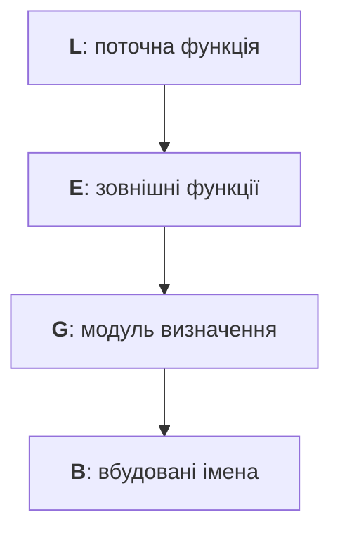

# Функції як значення та області видимості

## Функції як значення та області видимості

Ім’я функції без дужок позначає об’єкт, а з дужками виконує виклик. Об’єкт можна присвоїти змінній, передати іншій функції або повернути. Анотація `Callable[[int], int]` описує функцію з одним цілим аргументом і цілим результатом. У цій темі використовуємо звичайні іменовані функції; лямбда-вирази розглянемо в темі 7.

```py
from collections.abc import Callable


def square(value: int) -> int:
    return value * value


def apply_twice(action: Callable[[int], int], value: int) -> int:
    return action(action(value))


operation = square
print(operation(3))
print(apply_twice(square, 2))
```

```
9
16
```

Передача `square(2)` замість `square` передала б число 4, яке не можна викликати. Контракт функції-аргументу важливий: не кожна функція з одним аргументом придатна для повторного застосування. Її результат повинен бути допустимим входом наступного виклику.

### Правило LEGB

Для звичайного читання імені у функції Python шукає його в локальній області (**Local**), потім у зовнішніх функціях (**Enclosing**), модулі визначення (**Global**) і вбудованих іменах (**Built-in**). Порядок показано на рис. 3.3. Цикл `for` та розгалуження `if` окремої локальної області не створюють. Правила виконання: <https://docs.python.org/3.14/reference/executionmodel.html>.



Рис. 3.3. Пошук імені від локальної області назовні {.caption}

Якщо в тілі є присвоєння імені, воно зазвичай локальне в усьому тілі. Читання до першого локального присвоєння викликає `UnboundLocalError`, навіть якщо в модулі існує ім’я з таким написанням. Це правило визначається структурою функції, а не тим, чи виконалася конкретна гілка `if`.

```py
limit = 10


def local_limit() -> int:
    limit = 3
    return limit


print(local_limit(), limit)
```

```
3 10
```

`global name` указує, що присвоєння змінює ім’я в модулі. `nonlocal name` звертається до вже наявного імені в найближчій відповідній зовнішній функції. Воно не створює нової глобальної змінної. Для читання зовнішнього значення ці оголошення не потрібні. Глобальний змінюваний стан ускладнює ізольовану перевірку; зазвичай простіше передати значення параметром і повернути нове.

### Приклад 2. Лічильник відвідувань

**Замикання** (*closure*) – функція, яка зберігає доступ до імен зовнішньої функції після завершення її виклику. Створимо два незалежні лічильники. Внутрішня функція змінює `count`, тому потрібне `nonlocal`. Початкове значення може бути будь-яким цілим.

```py
from collections.abc import Callable


def make_counter(start: int = 0) -> Callable[[], int]:
    count = start

    def visit() -> int:
        nonlocal count
        count += 1
        return count

    return visit


museum = make_counter()
library = make_counter(10)
print(museum(), museum(), library(), museum())
print(museum.__closure__ is not None)
```

```
1 2 11 3
True
```

Кожний виклик фабрики створює окрему комірку `count`. Об’єкт `__closure__` дає змогу досліджувати такі комірки, але прикладний код не повинен змінювати їх вручну. Замикання зберігає зв’язок із коміркою, а не автоматичну незмінну фотографію значення. Це пояснює неочікувану поведінку функцій, створених у циклі зі спільною змінною; просте рішення – викликати фабрику окремо для кожного потрібного стану.
