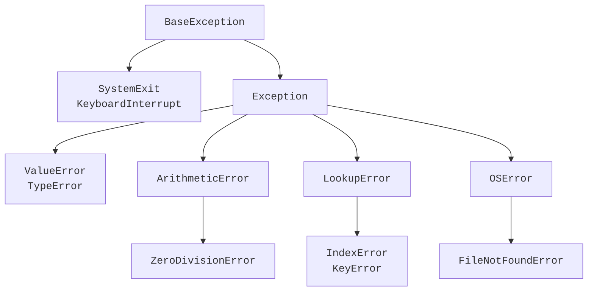

# Види помилок та ієрархія винятків

## Види помилок і діагностичний звіт

**Синтаксична помилка** (*syntax error*) порушує граматику мови. Якщо після `if` немає двокрапки, інтерпретатор не може виконати цей файл. **Помилка виконання** (*runtime error*) виникає під час дозволеної синтаксично операції: наприклад, `int("abc")`. **Логічна помилка** (*logic error*) не обов’язково спричиняє виняток: ділення суми балів на неправильну кількість студентів дає звичайне число.

**Виняток** (*exception*) – об’єкт, який описує незвичайне завершення операції. Якщо відповідного обробника немає, виконання припиняється, а інтерпретатор друкує **traceback** – шлях викликів до помилки. Почніть читання з останнього рядка: тип винятку і повідомлення. Після цього знайдіть останній кадр, що належить вашій програмі, та перевірте значення операндів. Опис і приклади: <https://docs.python.org/3.14/tutorial/errors.html>.

Наступна програма навмисно завершується помилкою. Її мета – дати невеликий відтворюваний приклад діагностики, а не приховати проблему.

```py
def parse(text: str) -> int:
    return int(text)


def process(text: str) -> int:
    return parse(text)


def main() -> None:
    print(process("abc"))


main()
```

Останній рядок звіту:

```
ValueError: invalid literal for int() with base 10: 'abc'
```

Перед ним видно кадри модуля, `main`, `process` і `parse`. **Кадр** (*frame*) містить контекст конкретного виклику: поточний рядок, аргументи та локальні змінні. Підкреслення в сучасному traceback допомагає знайти частину виразу. Підказка *Did you mean* інколи пропонує подібне ім’я, але не доводить правильність заміни. Починаючи з Python 3.13, traceback може мати кольори в сумісному терміналі; колір залежить від середовища й не змінює зміст помилки.

::: info Знімок екрана
Виконати parse/process/main; позначити кадр, рядок і причину.
:::

Рис. 4.1. Кадри викликів і причина помилки у вікні Run. {.caption}

Помилка синтаксису в самому файлі зазвичай виникає до виконання його `try`, тому оточення неправильного оператора цим блоком не допоможе. Логічну помилку також не можна вилікувати `except`: потрібні контрольний результат, спостереження стану та зміна алгоритму.

## Ієрархія вбудованих винятків

Типи винятків утворюють ієрархію (рис. 4.2). Обробник базового типу приймає також його нащадків. Корінь – `BaseException`. Звичайні помилки застосунку походять від `Exception`; `SystemExit` і `KeyboardInterrupt` належать іншій гілці. Тому `except Exception` не перехоплює нормальне завершення через `sys.exit` або запит користувача зупинити програму клавішами Ctrl+C.



Рис. 4.2. Фрагмент ієрархії: стрілка веде від базового типу до нащадка. {.caption}

`ValueError` означає невідповідне значення допустимого типу, наприклад нечисловий рядок для `int`. `TypeError` означає несумісні типи або невідповідну кількість аргументів. `ZeroDivisionError` є нащадком `ArithmeticError`. `IndexError` і `KeyError` належать до `LookupError`: перший стосується індексу послідовності, другий – відсутнього ключа. `FileNotFoundError` уточнює `OSError`: файл або компонент шляху не знайдено. Повне дерево: <https://docs.python.org/3.14/library/exceptions.html>.

Кілька типів можна перехопити одним обробником. У цьому курсі основний запис відповідає Python 3.14: `except ValueError, TypeError:`. Без дужок перелічено **типи**, а не імена змінних. Якщо потрібен сам об’єкт помилки, пишуть `except (ValueError, TypeError) as error:`. Для одного типу дужки не потрібні: `except ValueError as error:`. Традиційний запис `except (ValueError, TypeError):` теж правильний і працює у старіших версіях. Правило затверджене в <https://peps.python.org/pep-0758/>.

```py
for text in ("12", "abc", None):
    try:
        print(int(text))
    except ValueError, TypeError:
        print("Неможливо перетворити на ціле")
```

```
12
Неможливо перетворити на ціле
Неможливо перетворити на ціле
```

Кортеж у цьому прикладі лише зберігає три тестові значення, а цикл послідовно передає кожне до `int`. `None` означає відсутність значення; анотація функції не перетворює його автоматично на число.
