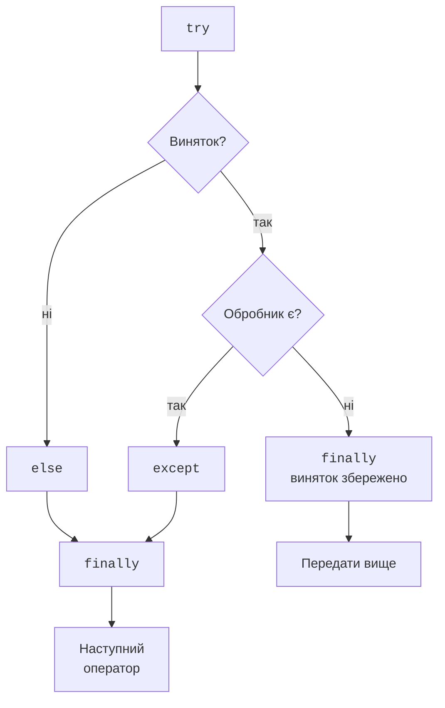
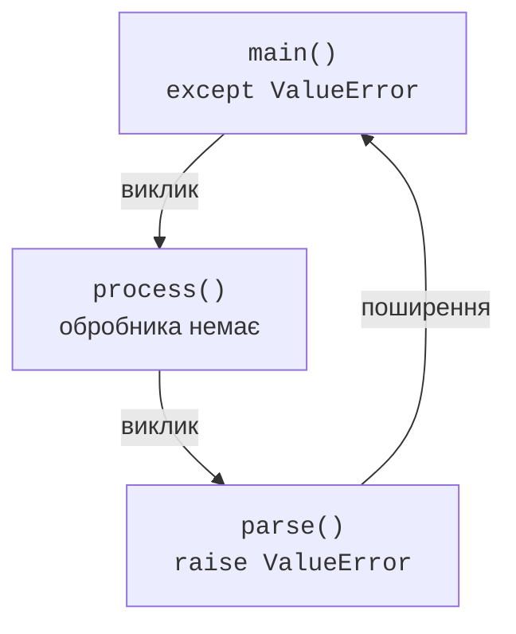

# Обробка та генерування винятків

## Порядок виконання try, except, else і finally

У `try` розміщують операцію, яка може дати очікуваний виняток. При його виникненні решта цього блоку пропускається. Обробники перевіряються зверху вниз: виконується лише перший відповідний `except`. Спочатку розміщують конкретні типи, потім загальні. Якщо поставити `except Exception` першим, обробник `ValueError` після нього ніколи не отримає звичайного `ValueError`.

`else` виконується після нормального завершення `try`, коли не було винятку та виходу через `return`, `break` або `continue`. `finally` виконується при виході з конструкції, зокрема перед поширенням необробленого винятку. Це місце для очищення, а не свідчення успішності операції. Аварійне завершення процесу чи вимкнення живлення не дають програмі гарантій виконання очищення.



Рис. 4.3. Основні шляхи try за відсутності нових помилок у службових блоках. {.caption}

Винятки, що виникають усередині `except` або `else`, не потрапляють до сусідніх обробників тієї самої конструкції. `finally` виконається, а пошук обробника продовжиться зовні. Саме тому короткий `try` допомагає зрозуміти, яку операцію ми дозволили повторити.

```py
def show_ratio(text: str) -> None:
    try:
        denominator = int(text)
        result = 12 / denominator
    except ValueError as error:
        print("Формат:", error.args[0])
    except ZeroDivisionError:
        print("Знаменник дорівнює нулю")
    else:
        print("Частка:", result)
    finally:
        print("Спробу завершено")


show_ratio("3")
show_ratio("0")
```

```
Частка: 4.0
Спробу завершено
Знаменник дорівнює нулю
Спробу завершено
```

Атрибут `args` – кортеж аргументів, переданих конструктору винятку; тут його перший елемент містить повідомлення. Не вважайте текст повідомлення стабільним кодом помилки: він може змінитися між версіями. Для вибору дії перевіряйте тип, а власні коди задавайте явно. Ім’я після `as` очищується після обробника; збережіть потрібні дані окремо, якщо вони потрібні пізніше.

### Приклад 1. Безпечне введення числа

Потрібно прочитати кількість учасників від 1 до 30. Неправильне введення спричиняє повторний запит. Функція `parse_count` відокремлює правило предметної області від діалогу: її легко перевірити без клавіатури. Анотації `str`, `int` описують контракт, але не замінюють перевірок під час виконання.

```py
def parse_count(text: str) -> int:
    value = int(text)
    if not 1 <= value <= 30:
        raise ValueError("кількість має бути від 1 до 30")
    return value


def read_count() -> int:
    while True:
        text = input("Кількість учасників: ")
        try:
            value = parse_count(text)
        except ValueError as error:
            print("Помилка:", error)
        else:
            return value


print("Прийнято:", read_count())
```

Для послідовного введення `0`, `12`:

```
Кількість учасників: 0
Помилка: кількість має бути від 1 до 30
Кількість учасників: 12
Прийнято: 12
```

Перевірте також `abc`, межі `1` і `30`, та `31`. Помилка формату виникає в `int`, помилка діапазону – у нашому `raise`. Обидві обробляються на рівні діалогу. `EOFError` не перехоплено: завершення вхідного потоку не є ще одним неправильним числом. У пакетному запуску без нових даних нескінченний повтор був би помилкою.

## Генерування і поширення винятків

Оператор `raise` створює виняткове завершення поточної операції. Запис `raise ValueError("...")` передає об’єкт із повідомленням. Якщо функція не має відповідного обробника, виняток переходить до її виклику. Кадри послідовно залишають стек; виконання не повертається на рядок після невдалого перетворення (рис. 4.4).



Рис. 4.4. Обробник у main отримує помилку, що виникла в parse. {.caption}

Порожній `raise` усередині обробника повторно передає поточний виняток зі збереженням його traceback. Це корисно, коли локально додано пояснення або зроблено очищення, а рішення має прийняти вищий рівень. `raise error` повторно піднімає той самий об’єкт, але додає місце цього оператора до traceback; для простого передавання поточної помилки краще порожній `raise`.

Коли технічну помилку перетворюють на помилку предметної області, застосовують `raise NewError(...) from error`. Посилання `__cause__` зберігає явну причину. Якщо новий виняток виник під час обробки старого без `from`, старий зберігається в `__context__`. `from None` приховує автоматичний контекст у стандартному звіті, але не видаляє його з об’єкта. Приховуйте подробиці лише тоді, коли кінцевому користувачу вони справді не потрібні.

Не ловіть виняток лише для того, щоб надрукувати «помилка» і повернути `0`. Виклик тоді виглядає успішним, а нуль може бути правильним предметним результатом. Або поверніть задокументований результат, або передайте помилку тому, хто може її обробити.
