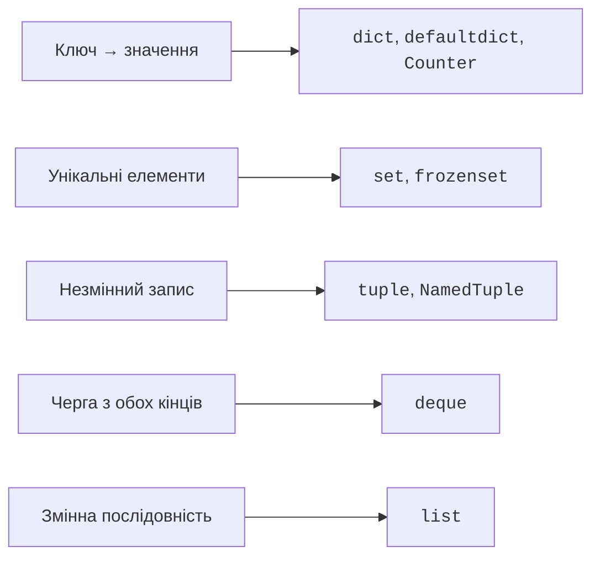

# Модуль collections і вибір структури

## Спеціалізовані колекції стандартної бібліотеки

Модуль `collections` додає структури для повторюваних задач: <https://docs.python.org/3.14/library/collections.html>. Спочатку слід визначити операції й правила задачі, а вже потім обрати спеціалізацію звичайних `list` і `dict`.

### Counter і defaultdict

`Counter` рахує появи хешованих елементів. Для відсутнього ключа індексування повертає 0. `most_common(n)` дає найчастіші елементи; за однакових частот зберігається порядок першої появи. Для алфавітного розв’язання нічиїх сортують пари за `(-count, name)`.

```py
from collections import Counter, defaultdict

counts = Counter(["pen", "book", "pen"])
print(counts.most_common(), counts["ruler"])
counts.subtract({"pen": 4})
print(counts["pen"], dict(+counts))
groups: defaultdict[str, list[str]] = defaultdict(list)
for name, group in [("Анна", "КІ-1"), ("Олег", "КІ-1")]:
    groups[group].append(name)
print(dict(groups))
```

```text
[('pen', 2), ('book', 1)] 0
-2 {'book': 1}
{'КІ-1': ['Анна', 'Олег']}
```

`subtract` зберігає нульові й від’ємні лічильники. Арифметичні операції `+`, `-`, `&`, `|` над двома `Counter` залишають тільки додатні результати; унарний `+counts` прибирає недодатні. Тому `stock - sold` не годиться для пошуку від’ємних залишків: недостачу перевіряють до віднімання або використовують `subtract`.

`defaultdict(list)` викликає фабрику `list` при звертанні `d[key]` до відсутнього ключа й зберігає новий список. Передають функцію `list`, а не результат `list()`. Кожний новий ключ одержує власний список. `d.get(key)` не викликає фабрику та не створює ключ.

### deque, OrderedDict і ChainMap

`deque` – **двобічна черга** (*double-ended queue*). `append` і `pop` працюють справа, `appendleft` і `popleft` – зліва. Операції на кінцях мають приблизно сталу вартість, на відміну від `list.pop(0)`. `rotate(1)` переносить останній елемент на початок; від’ємний крок обертає в протилежному напрямі. Для порожньої черги `pop` і `popleft` спричиняють `IndexError`.

```py
from collections import deque

recent: deque[int] = deque(maxlen=3)
for value in [10, 20, 30, 40]:
    recent.append(value)
print(list(recent))
recent.rotate(1)
recent.appendleft(99)
print(list(recent))
```

Результат: `[20, 30, 40]` та `[99, 40, 20]`. Обмеження `maxlen` при додаванні на один кінець автоматично відкидає елементи з протилежного. Воно зручне для історії останніх вимірів, але непридатне для черги замовлень, які не можна втрачати мовчки. Доступ до середини `deque` не має переваг звичайного списку.

`OrderedDict` потрібний не для самого збереження порядку: звичайний `dict` уже це робить. Він корисний для перевпорядкування через `move_to_end` і вилучення найстарішого запису `popitem(last=False)`. `ChainMap` об’єднує кілька словників для пошуку без копіювання: ключ шукається зліва направо, а запис виконується у перший словник.

```py
from collections import ChainMap, OrderedDict

cache = OrderedDict([("A", 1), ("B", 2)])
cache.move_to_end("A")
print(cache.popitem(last=False))
defaults = {"color": "white", "size": "12"}
local: dict[str, str] = {}
options = ChainMap(local, defaults)
options["size"] = "14"
print(options["color"], local, defaults["size"])
```

Результат: `('B', 2)` та `white {'size': '14'} 12`. Зміна початкового словника видима через `ChainMap`, адже це не знімок. Не плутайте порядок пошуку з порядком ітерації ключів об’єднання.

## Вибір структури та вартість операцій

Позначення O(n) описує зростання роботи зі збільшенням кількості елементів `n`, а не час у секундах. У списку звертання за індексом має O(1), пошук `in` – O(n), вставлення на початку – O(n). Додавання в кінець має **амортизовану** O(1): іноді потрібне розширення пам’яті, але середня вартість довгої послідовності додавань стала. Копіювання списку і повний обхід мають O(n).

Пошук у `dict` і `set` має в середньому O(1), а в несприятливому випадку – O(n). Це припускає звичайну вартість хешування й порівняння; довгі ключі також мають свою ціну. Сортування загалом потребує O(n log n). Для невеликих даних важливіші правильність і ясність; для великих потоків структура визначає продуктивність. Огляд для CPython: <https://wiki.python.org/moin/TimeComplexity>.



Рис. 5.5. Колекції відповідно до основної операції {.caption}

### heapq та bisect

`heapq` підтримує **купу** (*heap*) у звичайному списку: найменший елемент знаходиться на початку, але весь список не відсортований. `heappush` додає елемент, `heappop` забирає найменший; обидві операції мають O(log n). `heapify` перетворює готовий список на купу за O(n). Для однакових пріоритетів додають порядковий номер надходження, щоб зберегти черговість і не порівнювати складні записи. <https://docs.python.org/3.14/library/heapq.html>.

`bisect_left` шукає місце вставлення перед рівними значеннями у відсортованому списку за O(log n). `insort` вставляє елемент, зберігаючи порядок, але зсув списку коштує O(n). Швидкий пошук місця не робить усе вставлення логарифмічним. <https://docs.python.org/3.14/library/bisect.html>.

```py
from bisect import bisect_left, insort

scores = [60, 75, 90]
print(bisect_left(scores, 75))
insort(scores, 80)
print(scores)
```

Результат: `1` та `[60, 75, 80, 90]`. Використовувати `bisect` для невпорядкованого списку не можна: функція не перевіряє цю умову і поверне позицію, яка не має потрібного змісту.
