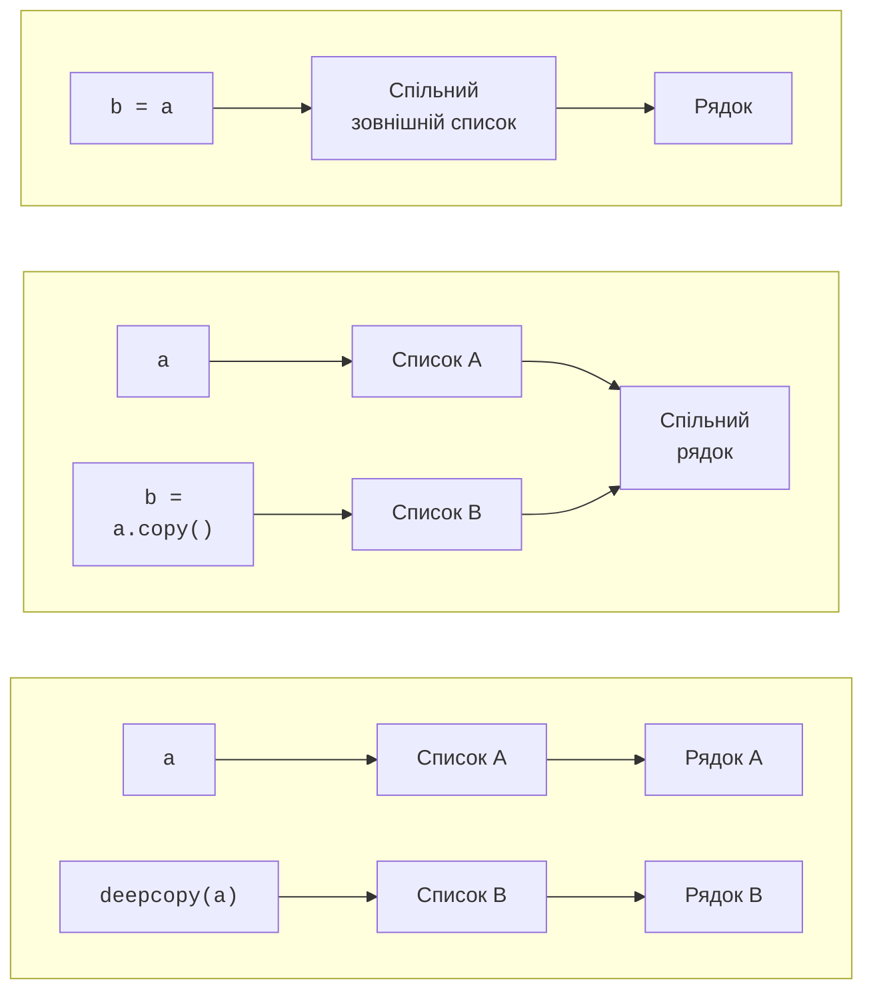

# Включення та кортежі

## Включення та двовимірні списки

**Спискове включення** (*list comprehension*) коротко описує побудову нового списку: `[вираз for елемент in джерело if умова]`. Спочатку береться елемент, потім перевіряється умова, і лише для прийнятого елемента обчислюється вираз. Це зручно для перетворення й відбору, але не для прихованого друку чи запису даних.

```py
numbers = [-3, 0, 2, 5]
squares = [x * x for x in numbers if x > 0]
matrix = [[0 for _ in range(3)] for _ in range(2)]
matrix[0][1] = 7
flat = [value for row in matrix for value in row]
print(squares, matrix, flat)
```

Результат: `[4, 25] [[0, 7, 0], [0, 0, 0]] [0, 7, 0, 0, 0, 0]`. Підкреслення `_` тут є ім’ям для невикористаної змінної. Вкладені `for` читають зліва направо: для кожного рядка перебрати всі його значення. Якщо включення містить складні перевірки або понад два рівні вкладеності, звичайні цикли часто читабельніші.

**Двовимірний список** – список рядків, кожний із яких також є списком. Python не гарантує прямокутної форми: `[[1, 2], [3]]` дозволено. Алгоритм матриці повинен перевірити однакову довжину рядків. Запис `[[0] * 3] * 2` не створює двох незалежних рядків: зовнішнє повторення двічі копіює посилання на один рядок.

```py
bad = [[0] * 3] * 2
bad[0][1] = 7
print(bad)
print(bad[0] is bad[1])
```

Результат: `[[0, 7, 0], [0, 7, 0]]` та `True`. Для правильної матриці треба створювати новий рядок у кожній ітерації включення. Повторення `[0] * 3` усередині окремого рядка допустиме: число 0 незмінне, а присвоєння елементу змінює лише відповідне посилання.

### Присвоєння, поверхнева та глибока копії

`b = a` дає друге ім’я того самого списку. `a.copy()` і `a[:]` створюють **поверхневу копію** (*shallow copy*): новий зовнішній список із посиланнями на старі елементи. `copy.deepcopy(a)` рекурсивно копіює вкладені об’єкти з урахуванням уже скопійованих об’єктів (рис. 5.3). Документація: <https://docs.python.org/3.14/library/copy.html>.



Рис. 5.3. Спільні й незалежні вкладені об’єкти при копіюванні {.caption}

```py
from copy import deepcopy

a = [[1, 2], [3, 4]]
b = a.copy()
c = deepcopy(a)
b[0][0] = 9
c[1][1] = 8
print(a)
print(b)
print(c)
```

```text
[[9, 2], [3, 4]]
[[9, 2], [3, 4]]
[[1, 2], [3, 8]]
```

Для матриці з незмінних чисел достатньо `[row.copy() for row in a]`. Для вкладеності довільної глибини це не загальне рішення. Копіювання словника методом `copy()` так само поверхневе. Незалежний знімок великого стану потребує додаткової пам’яті.

## Кортежі та розпакування

Кортеж доречний для запису з фіксованим набором полів: координат, інтервалу або результату функції. Кортеж створює кома, а дужки групують запис. `(5,)` – кортеж з одним елементом; `(5)` – число. Порожній кортеж записують як `()`.

```py
def bounds(values: list[int]) -> tuple[int, int]:
    if not values:
        raise ValueError("Порожній список")
    return min(values), max(values)

first, *middle, last = (2, 4, 6, 8)
low, high = bounds([7, 2, 9])
low, high = high, low
print(first, middle, last)
print(low, high, (5,))
```

Результат: `2 [4, 6] 8` та `9 2 (5,)`. **Розпакування** (*unpacking*) зв’язує елементи з іменами. Зірочка збирає решту елементів у список, зокрема порожній. Без зірочки кількість імен і значень повинна збігатися. Повернення «двох значень» фактично повертає один кортеж, який викликач потім розпаковує.

Для `record = ("A", [1, 2])` виклик `record[1].append(3)` допустимий, але `record[0] = "B"` спричинить `TypeError`. Такий кортеж не можна використати ключем словника, адже список усередині нехешований.

### Іменовані поля

Коли `point[0]` важко відрізнити від `point[1]`, назви полів роблять запис зрозумілішим. `collections.namedtuple` створює тип кортежу з іменованими полями. Варіант `typing.NamedTuple` дозволяє записати також анотації. Нижче `class` лише описує поля іменованого запису; власні методи й наслідування розглядатимуться пізніше.

```py
from collections import namedtuple
from typing import NamedTuple

Point = namedtuple("Point", "x y")

class Product(NamedTuple):
    name: str
    price: int

point = Point(3, 4)
product = Product("pen", 20)
print(point.x, product.name, product.price)
```

Результат: `3 pen 20`. Анотації не перетворюють значення автоматично. Якщо поле має бути невід’ємним, перевірку роблять до створення запису. Обидва підходи зберігають властивості кортежу: індексування, розпакування і неможливість переприсвоїти поле.
