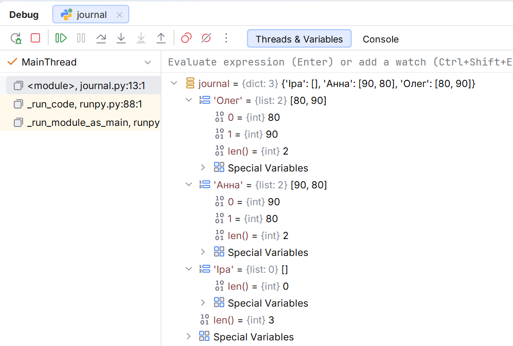

# Приклади програм і типові помилки

## Приклади програм

### Журнал оцінок групи

Зберегти списки оцінок, обчислити середній бал для кожного студента та надрукувати рейтинг. Порожній список означає відсутність оцінок, а не нульовий середній бал. Допустимі оцінки – цілі числа від 0 до 100. За однакового середнього імена впорядковують за звичайним порядком рядків Python. Дані прикладу задано в коді.

```py
def ranking(
    journal: dict[str, list[int]],
) -> list[tuple[str, float]]:
    result: list[tuple[str, float]] = []
    for name, marks in journal.items():
        if any(mark < 0 or mark > 100 for mark in marks):
            raise ValueError("Оцінка поза межами 0..100")
        if marks:
            result.append((name, sum(marks) / len(marks)))
    return sorted(result, key=lambda item: (-item[1], item[0]))


journal = {"Олег": [80, 90], "Анна": [90, 80], "Іра": []}
for number, (name, average) in enumerate(ranking(journal), 1):
    print(f"{number}. {name:<8} {average:6.2f}")
missing = sorted(name for name, marks in journal.items()
                 if not marks)
print("Без оцінок:", ", ".join(missing))
```

```text
1. Анна      85.00
2. Олег      85.00
Без оцінок: Іра
```

Вираз `lambda` задає функцію ключа, як у темі про функції. `any` перевіряє, чи є хоча б одна неправильна оцінка. Вираз `умова for елемент in джерело` без квадратних дужок є **генераторним виразом**: він подає результати по одному, не будуючи список. Тут його споживає `any`; механізм докладно вивчатиметься у темі 7. Функція не змінює `journal`, тому звіт можна повторити. Округлення відбувається лише при друці. Для порожнього журналу рейтинг порожній. Для `[0, 100]` середнє дорівнює 50; оцінка 101 відхиляється.

У PyCharm поставте точку зупину на циклі друку, запустіть *Debug* і розкрийте `journal` у *Threads & Variables*. Порівняйте довжину словника з довжинами вкладених списків (рис. 5.6).



Рис. 5.6. Вкладений словник списків у налагоджувачі PyCharm {.caption}

### Черга до лікаря

У навчальній моделі звичайні відвідувачі обслуговуються в порядку надходження, а термінові – перед ними. Менше число пріоритету означає раніше обслуговування; за однакового пріоритету першим іде той, хто надійшов раніше. Це модель структури даних. Черги не мають обмеження, яке губить записи.

```py
from collections import deque
from heapq import heappop, heappush


def service_order(
    regular: list[str], urgent: list[tuple[int, str]],
) -> list[str]:
    queue = deque(regular)
    heap: list[tuple[int, int, str]] = []
    for serial, (priority, name) in enumerate(urgent):
        if priority < 1:
            raise ValueError("Пріоритет має бути додатним")
        heappush(heap, (priority, serial, name))
    served: list[str] = []
    while heap or queue:
        if heap:
            _, _, name = heappop(heap)
        else:
            name = queue.popleft()
        served.append(name)
    return served


regular = ["Анна", "Олег"]
urgent = [(2, "Іра"), (1, "Юрій"), (1, "Богдан")]
print(" → ".join(service_order(regular, urgent)))
```

Результат: `Юрій → Богдан → Іра → Анна → Олег`. Номер `serial` не дає іменам визначати черговість за однакового пріоритету. Функція не спустошує списки викликача. За порожніх джерел повертає `[]`; без термінових зберігає порядок `regular`. Тут опрацьовується готова партія, без надходжень під час обслуговування.

### Спільні інтереси

Задано теги двох учасників і множину тем майбутніх зустрічей. Знайти спільні й відмінні інтереси та доступні теми для спільної зустрічі. Пробіли по краях і регістр не мають значення; порожні теги ігноруються. Для стабільного звіту результати сортують.

```py
def normalize(values: list[str]) -> set[str]:
    return {value.strip().casefold() for value in values
            if value.strip()}


first = normalize([" Python ", "Музика", "python", ""])
second = normalize(["PYTHON", "Шахи"])
available = normalize(["Python", "Спорт"])
print("Спільні:", ", ".join(sorted(first & second)))
print("Лише першого:", ", ".join(sorted(first - second)))
print("Відмінні:", ", ".join(sorted(first ^ second)))
print("Для зустрічі:", sorted(first & second & available))
```

```text
Спільні: python
Лише першого: музика
Відмінні: музика, шахи
Для зустрічі: ['python']
```

Об’єднання `first | second` дало б усі теми, які цікавлять хоча б одного учасника. Перетин потребує наявності в обох множинах. Нормалізація до утворення множини прибирає повтори, що відрізнялися регістром. Порожній список перетворюється на порожню множину.

### Складський облік

Надходження задано парами «назва – кількість», продажі – списком назв проданих одиниць. Згрупувати надходження, порахувати продажі й показати залишки. Нульові залишки залишаються у звіті. Невідомий проданий товар та продаж понад запас є помилкою. Кількості надходжень – додатні цілі числа.

```py
from collections import Counter, defaultdict


def balances(
    deliveries: list[tuple[str, int]], sold: list[str],
) -> dict[str, int]:
    stock: defaultdict[str, int] = defaultdict(int)
    for name, quantity in deliveries:
        if not name or quantity <= 0:
            raise ValueError("Некоректне надходження")
        stock[name] += quantity
    counts = Counter(sold)
    for name, quantity in counts.items():
        if quantity > stock.get(name, 0):
            raise ValueError(f"Недостатній запас: {name}")
    return {name: quantity - counts[name]
            for name, quantity in stock.items()}


deliveries = [("зошит", 5), ("ручка", 4), ("зошит", 2)]
sold = ["ручка", "зошит", "ручка"]
result = balances(deliveries, sold)
for name in sorted(result):
    print(f"{name:<8} {result[name]:>3}")
print("Усього:", sum(result.values()))
```

```text
зошит      6
ручка      2
Усього: 8
```

Перевірка через `stock.get` не створює ключа при помилці. Джерела залишаються незмінними. Для повністю проданого товару значення дорівнює 0; віднімання двох `Counter` прибрало б його. Порожні надходження та продажі дають `{}`.

## Типові помилки та перевірка рішення

Перевіряйте інваріанти – властивості, що мають залишатися істинними після кожної операції. У матриці рядки однакової довжини; у довіднику ключ однозначно визначає контакт; у черзі кожний прийнятий запис має бути оброблений рівно один раз.

- `result = values.sort()` дає `None`: застосуйте `sorted(values)` або виконайте `values.sort()` окремим оператором.
- `[[0] * width] * height` розділяє рядок між позиціями: створюйте рядки окремо через включення.
- `d[key]` може дати `KeyError`: визначте, чи відсутність означає помилку, чи допустиме запасне значення через `get`.
- `set([1, 1, 2])` втрачає кратність: для частот оберіть `Counter`.
- `a.copy()` не відокремлює вкладені списки: перевірте потрібну глибину копії контрольним присвоєнням.
- Видалення зі списку в циклі пропускає елементи: створіть новий результат або обробляйте знімок.
- `zip` без `strict=True` може приховати неповні дані: вирішіть, чи різна довжина допустима, і перевірте явно.

Перевірте порожню колекцію, один елемент, повторення, відсутній ключ і звичайний набір. Для сортування додайте нічию за першим критерієм; для матриці – непрямокутні дані; для черги – рівні пріоритети. Перевірте також, чи змінилося джерело: правильне число у звіті не виправдовує небажаний побічний ефект.
