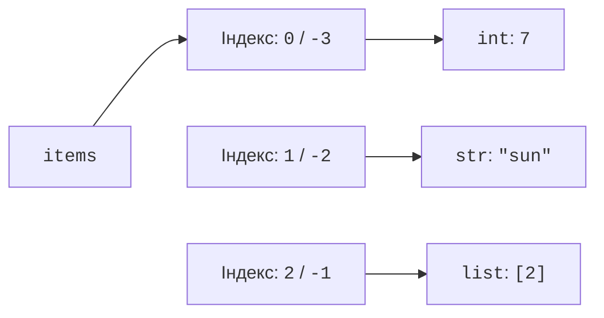
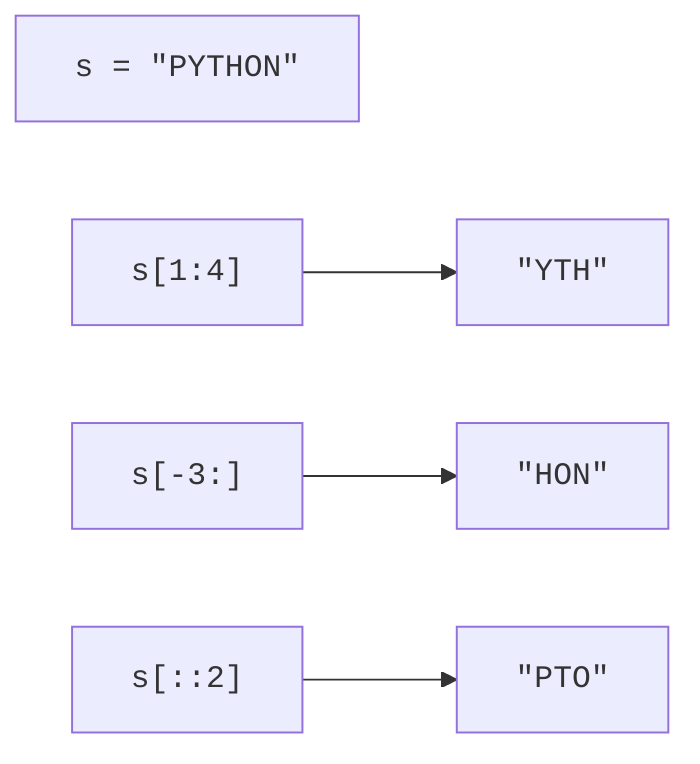

# Послідовності та списки

## Навіщо потрібні колекції

Одна змінна з оцінкою зручна, доки студент має лише одну оцінку. Для десяти оцінок не варто заводити десять окремих імен: програмі потрібно перебирати їх, шукати найменшу та обчислювати середнє. **Колекція** (*collection*) зберігає групу об’єктів і визначає спосіб доступу до них. Вибір залежить від операцій, потрібних програмі.

**Список** (*list*) – змінювана послідовність. **Кортеж** (*tuple*) – незмінювана послідовність. **Множина** (*set*) зберігає унікальні хешовані елементи. **Словник** (*dictionary*) встановлює відповідність між унікальними ключами та значеннями. Огляд із прикладами: <https://docs.python.org/3.14/tutorial/datastructures.html>.

```py
scores: list[int] = [82, 95, 82]
point: tuple[int, int] = (3, 4)
tags: set[str] = {"python", "oop", "python"}
prices: dict[str, int] = {"pen": 20, "book": 150}
print(scores, point)
print(sorted(tags), prices["pen"])
```

Результат: `[82, 95, 82] (3, 4)` та `['oop', 'python'] 20`. Список залишив повтори; множина прибрала повторений тег. Для відтворюваного виведення множину відсортовано. Словник відповів на запит за змістовним ключем, а не за позицією.

**Порядок** (*order*) означає, чи має структура визначений порядок перебору. Список і кортеж зберігають позиції; словник зберігає порядок вставлення ключів. Множина не обіцяє порядку елементів і не підтримує індексування. Порядок вставлення не означає сортування за ключами.

**Змінюваність** (*mutability*) стосується самого об’єкта. Для списку дозволені додавання і заміна елементів. Для кортежу замінити елемент не можна, хоча об’єкт усередині кортежу може бути змінюваним. Анотація `list[int]` повідомляє читачеві й аналізатору про намір зберігати цілі числа; інтерпретатор не перевіряє її при кожному додаванні. Перевірки введення залишаються в програмі.

### Список містить посилання

Список зберігає посилання на об’єкти (рис. 5.1). Тому один список технічно може містити число, рядок та інший список. У прикладній програмі однорідний `list[int]` зручніший: кожний елемент можна обробляти однаковим способом. Присвоєння не створює копій об’єктів.



Рис. 5.1. Позиції списку та об’єкти, на які вони посилаються {.caption}

Два елементи можуть посилатися на один змінюваний об’єкт. Це пояснює неочікувані зміни вкладених списків. Перед вибором `copy()` треба з’ясувати, чи потрібен тільки новий зовнішній контейнер, чи також незалежні вкладені об’єкти.

## Послідовності: індекси та зрізи

**Послідовність** (*sequence*) підтримує звертання за індексом. Перший індекс дорівнює нулю. Для списку довжини `n` останній додатний індекс – `n - 1`, від’ємний `-1` позначає останній елемент. Від’ємні індекси не утворюють циклічного доступу: надто малий індекс так само спричиняє `IndexError`.

```py
values = [10, 20, 30, 40, 50]
print(values[0], values[-1], len(values))
print(values[1:4], values[-3:], values[::2])
print(values[::-1], values[9:20])
```

```text
10 50 5
[20, 30, 40] [30, 40, 50] [10, 30, 50]
[50, 40, 30, 20, 10] []
```

**Зріз** (*slice*) `a[start:stop:step]` вибирає позиції від `start` до `stop`, не включаючи `stop`, із кроком `step`. Пропущені межі залежать від напряму обходу: `a[::-1]` іде від кінця до початку. Нульовий крок заборонений. Межі зрізу, які виходять за довжину, обрізаються; на відміну від одиночного індексу, це не помилка. У прикладі рис. 5.2 ті самі правила застосовано до рядка.



Рис. 5.2. Зрізи з невключною правою межею та різним кроком {.caption}

Операція `x in values` перевіряє наявність значення, `+` з’єднує послідовності сумісного типу, `*` повторює їх елементи. Функції `sum`, `min`, `max` працюють із придатними для них значеннями. Сума порожнього числового списку дорівнює 0, але `min([])` та `max([])` без запасного значення спричиняють `ValueError`. Для порожньої вибірки можна написати `min(values, default=None)`. Перед обчисленням середнього обов’язково перевіряють довжину.

Порівняння списків і кортежів лексикографічне: спочатку порівнюють першу пару різних елементів. `(2, 9) < (3, 0)` є істинним. Елементи мають підтримувати потрібне порівняння: суміш чисел і рядків не стає придатною для сортування автоматично. Правила послідовностей: <https://docs.python.org/3.14/library/stdtypes.html#sequence-types-list-tuple-range>.

## Змінювання списків і впорядкування

`append(x)` додає один об’єкт; `extend(iterable)` додає кожний елемент джерела. `append([3, 4])` додає один вкладений список, а `extend([3, 4])` – два числа. `insert(i, x)` вставляє об’єкт перед позицією `i`. Вставлення на початок довгого списку потребує зсуву решти посилань і не підходить для інтенсивної роботи черги.

```py
values = [1, 2]
values.append(3)
values.extend([4, 5])
values.insert(0, 0)
last = values.pop()
values.remove(2)
values[1:3] = [10, 20, 30]
del values[-1]
print(values, last)
print(values.index(20), values.count(10))
```

Результат: `[0, 10, 20, 30] 5` та `2 1`. `pop()` вилучає і повертає останній елемент, а `pop(i)` – елемент за індексом. `remove(x)` вилучає перший елемент, рівний `x`; відсутність значення спричиняє `ValueError`. `index(x)` також повідомляє `ValueError`, якщо збігу немає. `count(x)` повертає кількість збігів, зокрема нуль.

Присвоєння звичайному зрізу може змінити довжину списку. Для розширеного зрізу з кроком, відмінним від 1, кількість нових елементів повинна дорівнювати кількості вибраних позицій. `del` видаляє елемент або зріз, а `clear()` очищає список. Видалення не знищує об’єкт, якщо на нього залишилися інші посилання.

### sort і sorted

`values.sort()` змінює наявний список і повертає `None`. `sorted(values)` повертає новий список, залишаючи джерело незмінним. `reverse()` змінює порядок елементів на протилежний, але не сортує за значенням. Аргумент `reverse=True` у сортуванні обирає спадання.

```py
words = ["pear", "fig", "apple", "plum"]
ordered = sorted(words, key=len)
print(ordered)
result = words.sort(reverse=True)
print(words, result)
```

```text
['fig', 'pear', 'plum', 'apple']
['plum', 'pear', 'fig', 'apple'] None
```

Функція `key` обчислює значення для порівняння. Сортування **стабільне** (*stable*): рівні ключі зберігають початковий взаємний порядок. Тому `pear` залишилося перед `plum`. Для кількох критеріїв функція повертає кортеж: спочатку порівнюється його перше поле, за рівності – друге. У рейтингу зі спаданням бала і зростанням імені зручно використати ключ `(-score, name)`. Загальний `reverse=True` змінив би напрям обох критеріїв, що часто не відповідає умові.
