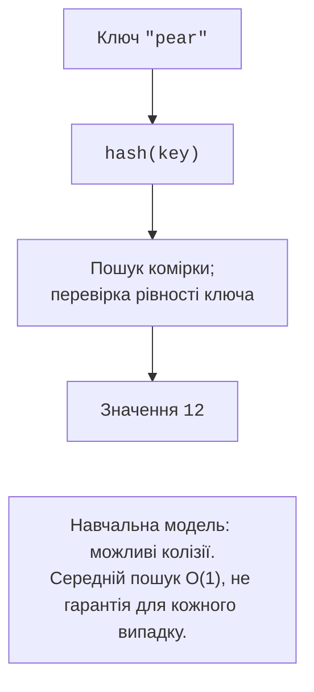

# Множини та словники

## Множини та хешованість

**Хешованість** (*hashability*) означає, що об’єкт має хеш, незмінний протягом його життя, та узгоджене з ним порівняння: рівні об’єкти повинні мати однаковий хеш. Це необхідно для ключів словника та елементів множини. Числа, рядки і кортежі лише з хешованих елементів підходять; списки, словники та звичайні множини – ні.

Порожню множину створюють як `set()`: `{}` створює словник. Метод `add` додає елемент; `discard` прибирає його, якщо він є, а за відсутності нічого не робить. `remove` за відсутності повідомляє `KeyError`. Не використовуйте `pop()` множини для випадкового вибору: він вилучає довільний елемент, але не забезпечує рівномірного розподілу.

```py
a = {"python", "music", "sport"}
b = {"python", "art"}
print(sorted(a & b))
print(sorted(a | b))
print(sorted(a - b))
print(sorted(a ^ b))
print({"python"} <= a, a.isdisjoint({"math"}))
```

```text
['python']
['art', 'music', 'python', 'sport']
['music', 'sport']
['art', 'music', 'sport']
True True
```

`&` утворює перетин, `|` – об’єднання, `-` – різницю, `^` – симетричну різницю: елементи лише однієї з двох множин. `a <= b` перевіряє підмножину, включаючи рівність; `a < b` – власну підмножину. `isdisjoint` перевіряє відсутність спільних елементів. Різниця несиметрична: `a - b` і `b - a` мають різний зміст.

Включення `{word.casefold() for word in words}` нормалізує текст і прибирає повтори. Воно доречне для тегів без урахування регістру, але не для даних, де регістр має значення. `frozenset` – незмінна множина. Вона може бути ключем словника, наприклад для пари команд без визначеного порядку. Множина не зберігає кількість повторів; для частот потрібен `Counter`.

## Словники: ключі, значення та обхід

Ключ унікальний: повторне присвоєння замінює значення. У `dict[str, list[int]]` ключ – рядок, а значення – список цілих. Це природна модель журналу оцінок. Хеш-таблиця допомагає знаходити ключ без послідовного перегляду всіх пар (рис. 5.4). Однакові хеші різних ключів можливі; словник перевіряє також рівність.



Рис. 5.4. Спрощена модель пошуку у словнику {.caption}

```py
scores: dict[str, list[int]] = {"Анна": [80, 90]}
scores.setdefault("Олег", []).append(70)
print(scores.get("Іра", []))
print("Анна" in scores)
for name, marks in scores.items():
    print(name, marks)
```

```text
[]
True
Анна [80, 90]
Олег [70]
```

`d[key]` спричиняє `KeyError`, якщо ключ відсутній. `get(key, default)` повертає запасне значення, нічого не вставляючи. `setdefault` повертає наявне значення або вставляє і повертає запасне. Його аргумент обчислюється при кожному виклику, навіть коли ключ уже існує. Пишіть `key in d`, якщо треба відрізняти відсутній ключ від `None`.

`keys()`, `values()` та `items()` повертають **представлення** (*views*), які відображають поточний стан словника. Це не незалежні копії. `pop(key, default)` вилучає значення та повертає його або запасне. `update` змінює словник, а `left | right` створює новий: за спільного ключа виграє праве значення. Це поверхневе об’єднання; вкладені словники не зливаються рекурсивно.

```py
settings = {"theme": "light", "size": 12}
merged = settings | {"size": 14}
settings.update({"theme": "dark"})
print(settings, merged)
lengths = {name: len(name) for name in ["Анна", "Олег"]}
print(lengths)
```

Результат: `{'theme': 'dark', 'size': 12}` і `{'theme': 'light', 'size': 14}` у першому рядку; `{'Анна': 4, 'Олег': 4}` у другому. Оновлення значення не переміщує ключ; видалення і нове вставлення переміщують ключ у кінець. За повторного ключа у включенні залишиться останнє значення. Для зворотного телефонного довідника треба спочатку визначити, чи можуть кілька людей мати спільний номер.

### Нумерація, синхронний обхід і зміни

`enumerate(values, start=1)` дає пари «номер – елемент». `zip(a, b, strict=True)` поєднує відповідні елементи та повідомляє `ValueError`, якщо довжини різні. Перевірка відбувається під час обходу: до помилки частина пар уже могла бути оброблена. Без `strict=True` обхід закінчується на найкоротшому джерелі. `reversed(values)` перебирає послідовність у зворотному порядку без створення нового списку.

```py
names = ["Анна", "Олег"]
marks = [90, 85]
for number, (name, mark) in enumerate(
    zip(names, marks, strict=True), start=1
):
    print(number, name, mark)
```

Результат: `1 Анна 90` та `2 Олег 85`. Розпакування вкладеної пари відображає структуру даних, створену двома функціями. Якщо потрібна атомарність операції, спочатку перевірте довжини або сформуйте всі пари, а вже потім змінюйте стан.

Не видаляйте елементи списку під час його прямого обходу: після зсуву наступний елемент може бути пропущений. Побудуйте новий список `positive = [x for x in values if x > 0]`. Не додавайте й не вилучайте ключі словника під час обходу його представлень. Для видалення використайте знімок `list(d)` або спочатку зберіть ключі окремо. Зміна значень за наявними ключами не є зміною розміру словника, але потребує зрозумілої логіки.
