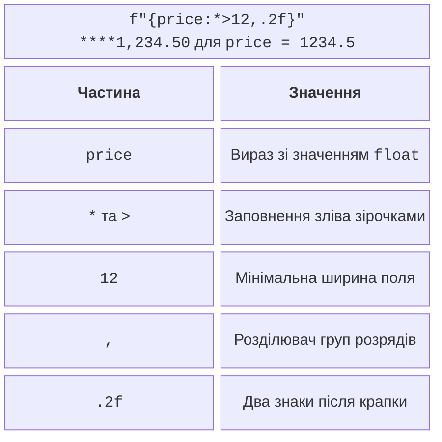
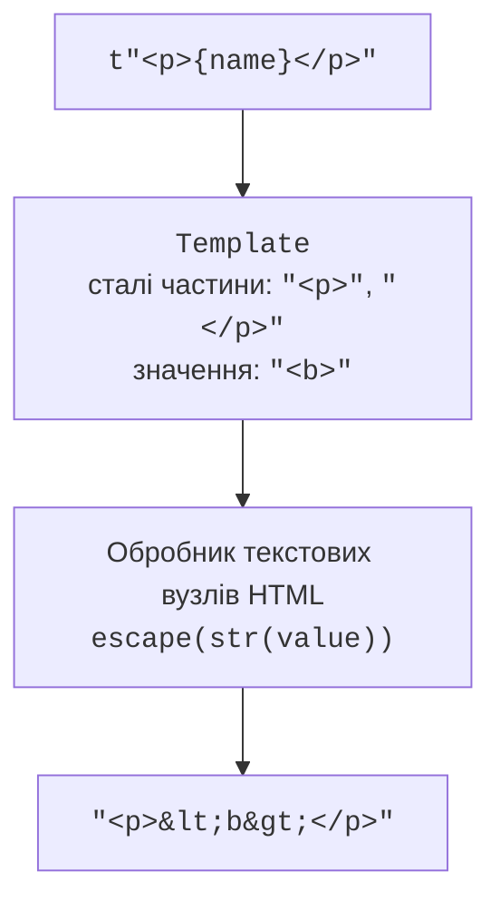

# f-рядки та шаблонні рядки

## Форматування за допомогою f-рядків

**Форматований рядковий літерал** (*formatted string literal*, f-рядок) обчислює вирази у фігурних дужках і відразу утворює `str`. `f"Сума: {total:.2f}"` означає: взяти `total` та вивести два знаки після крапки. Фігурні дужки в готовому тексті подвоюють: <code v-pre>&#123;&#123;</code> і `}}`. Специфікацію формату наведено в <https://docs.python.org/3.14/library/string.html#format-specification-mini-language>.

### Ширина, вирівнювання й точність

Після двокрапки записують специфікацію. Знак `<` вирівнює ліворуч, `>` – праворуч, `^` – по центру. Попередній символ задає заповнення; ширина є мінімальною, тому довший текст не обрізається. Для числа `1234.5` запис `f"{price:*>12,.2f}"` дає `****1,234.50` (рис. 6.2). Тут не слід додавати `!r`: перетворення на рядок перед числовим форматом `.2f` спричинить `ValueError`.



Рис. 6.2. Частини специфікації формату числового поля {.caption}

```py
price = 1234.5
share = 0.125
width = 8
print(f"{price:*>12,.2f}")
print(f"{share:.1%}")
print(f"{255:08b} {255:04x}")
print(f"{'Код':^{width}}|")
```

Результат:

```
****1,234.50
12.5%
11111111 00ff
  Код   |
```

Тип `f` позначає фіксовану кількість знаків після крапки, `e` – експоненційний запис, `%` множить значення на 100 і додає знак відсотка. Типи `b` та `x` застосовують до цілих чисел. Кома й підкреслення групують розряди за правилами формату, а не за мовою операційної системи. Для українського показу можна окремо визначити правило заміни десяткової крапки на кому. Не робіть таку заміну у машинному файлі, якщо його формат вимагає крапку.

Поля ширини можуть містити вирази, як `{width}` у прикладі. Водночас ширина рахується не в пікселях: емодзі, комбіновані знаки й деякі писемності порушують просте вирівнювання термінальної таблиці. У навчальних таблицях використовуємо короткі звичайні назви.

### Перетворення й вирази

`!s` викликає `str`, `!r` – `repr`, `!a` – ASCII-подання через `ascii`. Позначення `{value=}` додає текст виразу разом зі значенням, що зручно під час налагодження. Це не заміна структурованого журналу: перед друком слід перевірити, чи немає в значенні пароля або інших даних, які не потрібно показувати.

```py
from datetime import date

word = " рядок\n"
amount = 7
print(f"{word!r}")
print(f"{amount=}")
print(f"{date(2026, 9, 17):%d.%m.%Y}")
item = {"name": "Зошит"}
print(f"Товар: {item["name"]}")
```

Результат: `' рядок\n'`, `amount=7`, `17.09.2026`, `Товар: Зошит`. Повторне використання тих самих лапок усередині виразу дозволене сучасним синтаксисом f-рядків (PEP 701, починаючи з Python 3.12). Для читабельності складне обчислення краще винести перед f-рядком, навіть якщо граматика дозволяє записати його всередині поля.

Метод `str.format` підставляє передані аргументи в поля шаблону; оператор `%` трапляється у старому коді. У нових прикладах цієї теми використовуємо f-рядки. Важливо відрізняти форматування значення від перевірки його коректності: `.2f` не перевіряє діапазон і не усуває похибок двійкових обчислень.

## Шаблонні рядки Python 3.14

**Шаблонний рядковий літерал** (*template string literal*, t-рядок) має префікс `t`. Він утворює об’єкт `string.templatelib.Template`, а не готовий `str`. Опис і приклади: <https://docs.python.org/3.14/library/string.templatelib.html>. Його призначення – зберегти межу між сталим текстом програми та значеннями, щоб окремий обробник міг застосувати потрібні правила.

```py
name = "<b>Оля</b>"
template = t"Вітаємо, {name}!"
print(type(template).__name__)
print(template.strings)
field = template.interpolations[0]
print(field.value, field.expression)
print(field.conversion, repr(field.format_spec))
```

Результат:

```
Template
('Вітаємо, ', '!')
<b>Оля</b> name
None ''
```

Кортеж `strings` містить сталі фрагменти, а `interpolations` – об’єкти підстановок. Кількість сталих фрагментів на один більша. Значення `value` обчислюється під час створення t-рядка, тому зміна змінної `name` пізніше не переобчислить збережений шаблон. `expression` зберігає текст виразу для діагностики; його не потрібно виконувати через `eval`. Перетворення `conversion` і специфікація `format_spec` є даними, які інтерпретує обробник.

::: info Знімок екрана
Python 3.14 REPL: inspect template.strings and interpolations.
:::

Рис. 6.3. Перегляд частин шаблонного рядка в Python REPL {.caption}

### Межі відповідальності обробника

Сам префікс `t` не гарантує екранування. Обробник має визначити, які сталі частини дозволені, де можуть стояти підстановки та які перетворення підтримуються. У прикладі HTML нижче підстановки дозволені лише в тексті елемента, а розмітка є довіреним літералом програми (рис. 6.4). Для URL, JavaScript, CSS або довільних атрибутів потрібні інші правила; один `html.escape` не є універсальним захистом для всіх цих контекстів.



Рис. 6.4. Відокремлення структури HTML від текстового значення {.caption}

Модуль `string` також містить інший клас `Template`, який використовує позначки `$name`. Це давно наявний механізм підстановки в звичайний рядок; він не пов’язаний з новим типом `string.templatelib.Template`. Метод `substitute` повідомляє про відсутній ключ, а `safe_substitute` залишає нерозв’язані позначки. Слово «safe» тут не означає захист HTML або SQL. Щоб не плутати класи, використовуйте псевдонім імпорту.

```py
from string import Template as DollarTemplate

pattern = DollarTemplate("Вітаємо, $name! Ціна: $$10")
print(pattern.substitute(name="Оля"))
```

Результат: `Вітаємо, Оля! Ціна: $10`.

### Параметри SQL як окрема структура

Не формуйте SQL вставленням користувацьких значень у f-рядок. У навчальному обробнику t-рядка можна повертати пару «текст з маркерами – значення». Наведена нижче програма нічого не виконує в базі даних; вона показує контракт для майбутнього виклику драйвера. Для `sqlite3` значення передають другим аргументом `execute`. Назви таблиць, стовпців і SQL-оператори не є такими параметрами.

```py
from string.templatelib import Template


def parameters(template: Template) -> tuple[str, list[object]]:
    values: list[object] = []
    pieces = [template.strings[0]]
    for index, field in enumerate(template.interpolations):
        if field.conversion or field.format_spec:
            raise ValueError("Форматування SQL-значень заборонене")
        pieces.extend(("?", template.strings[index + 1]))
        values.append(field.value)
    return "".join(pieces), values


name = "O'Neil"
query, values = parameters(t"SELECT id FROM users WHERE name={name}")
print(query)
print(values)
```

Результат: `SELECT id FROM users WHERE name=?`, потім `["O'Neil"]`. У цьому вузькому контракті підстановка завжди займає місце одного значення й не береться в SQL-лапки; сталі частини пише автор програми. Обробник не розбирає SQL, тому застосовувати його до довільного користувацького шаблону не можна. Робота з драйвером буде в темі 12.
