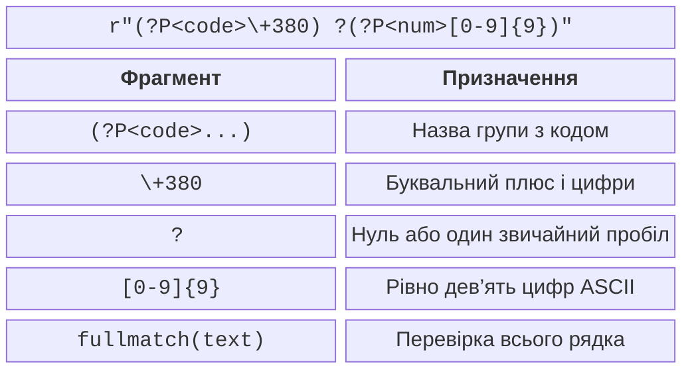

# Регулярні вирази

## Синтаксис регулярних виразів

**Регулярний вираз** (*regular expression*, regex) описує множину рядків за структурою. Модуль `re` належить до стандартної бібліотеки: <https://docs.python.org/3.14/library/re.html>. Спочатку сформулюйте допустимі приклади словами, потім побудуйте вираз і перевірте його на правильних та неправильних рядках.

Звичайні літери означають самі себе. Крапка означає будь-який символ, крім переносу рядка за замовчуванням; `\.` означає буквальну крапку. Квадратні дужки задають один символ із набору: `[0-9]`, `[ABC]`. Запис `[^0-9]` – один символ поза набором цифр ASCII. Дефіс у середині класу може задавати діапазон, тому буквальний дефіс слід екранувати або розташовувати на краю.

### Класи, повторення та альтернативи

`\d` відповідає десятковій цифрі Unicode, `\w` – літері, цифрі або підкресленню, `\s` – пробільному символу. Це ширші множини, ніж цифри ASCII або звичайний пробіл. Для телефонного номера, записаного цифрами 0–9, явно пишіть `[0-9]`. Для українського алфавіту набір `[а-я]` неповний: потрібні також «і», «ї», «є», «ґ»; у ньому є й літери, що не належать до українського алфавіту. Точний алфавіт краще задати явно або перевірити множиною дозволених літер.

Квантифікатор `*` означає нуль або більше повторень, `+` – одне або більше, `?` – нуль або одне, `{m,n}` – від m до n включно. Вони стосуються попереднього атома: символу, класу чи групи. `ab+` – літера `a` та одна або кілька `b`; `(ab)+` – повторення пари. Альтернатива `cat|dog` обирає один із двох варіантів.

Якір `^` позначає початок рядка, `$` – кінець або позицію перед кінцевим переносом. Тому для строгої перевірки всього введення зручніше `fullmatch`, а не поєднання `match` із `$`. Межа слова `\b` визначається переходом між `\w` і `\W`, а не словником української мови: апостроф може створити межу всередині слова.

### Жадібні й ліниві повторення

За замовчуванням повторення **жадібне** (*greedy*): воно намагається охопити якомога більше, залишаючи можливість решті виразу збігтися. Додатковий `?` робить повторення лінивим. Але жоден із цих режимів не перетворює regex на повний аналізатор вкладеної розмітки.

```py
import re

text = "<b>Оля</b><i>Іван</i>"
print(re.findall(r"<.*>", text))
print(re.findall(r"<.*?>", text))
```

Перший результат – список з усім рядком, другий – `['<b>', '</b>', '<i>', '</i>']`. Для тегів із лапками, вкладених елементів і пошкодженого HTML потрібен спеціалізований парсер. Навчальна демонстрація різниці квантифікаторів не є HTML-конвертером.

## Групи, прапорці та об’єкт Match

Звичайні круглі дужки запам’ятовують фрагмент. Іменована група `(?P<name>...)` дозволяє звертатися до нього за назвою; незахоплювальна `(?:...)` групує вираз без окремого результату. Повторно використати вже знайдений текст можна через зворотне посилання `\1` або `(?P=name)`.

```py
import re

pattern = re.compile(r"(?P<code>\+380) ?(?P<num>[0-9]{9})")
match = pattern.fullmatch("+380 671234567")
if match is not None:
    print(match.group("code"), match.group("num"))
    print(match.span("num"))
print(pattern.fullmatch("+380 671234567\n") is None)
```

Результат: `+380 671234567`, далі `(5, 14)` і `True`. Метод `span` повертає напіввідкритий інтервал: початок включено, кінець не включено. `group(0)` містить увесь збіг, `groups()` – кортеж звичайних груп, `groupdict()` – словник іменованих. Перед зверненням до груп треба перевірити, чи результат не `None`.



Рис. 6.5. Складові виразу для навчального формату номера {.caption}

### Перегляд уперед і назад

Перевірки `(?=...)` та `(?!...)` вимагають наявності або відсутності фрагмента далі, але не споживають його. Наприклад, `(?=.*[0-9])` перевіряє, чи є цифра далі в тому самому рядку. Аналогічні `(?<=...)` та `(?<!...)` перевіряють попередній текст. У модулі `re` шаблон перегляду назад має мати фіксовану довжину: довільне `(?<=a+)` не допускається. Для кількох правил валідації часто зручніше виконати кілька зрозумілих перевірок і пояснити кожну помилку, ніж складати один довгий вираз.

`re.IGNORECASE` вимикає врахування регістру; `re.MULTILINE` змінює значення `^` та `$` на початки й кінці рядків. Він не дозволяє крапці охоплювати перенос – для цього є `re.DOTALL`. `re.VERBOSE` дозволяє розбити вираз на рядки й додати коментарі; звичайні пробіли поза класами тоді ігноруються. Щоб вимагати пробіл, використовуйте `[ ]` або екранування.

::: info Знімок екрана
Cursor in re.compile pattern, Alt+Enter, Check RegExp.
:::

Рис. 6.6. Перевірка навчального регулярного виразу у PyCharm {.caption}

## Пошук, витяг і перетворення даних

`re.match` перевіряє початок тексту, `re.search` шукає перший збіг у будь-якій позиції, `re.fullmatch` – весь текст. `finditer` повертає ітератор об’єктів `Match`, зручний для груп та позицій. `findall` повертає список, форма елементів якого залежить від кількості захоплювальних груп: увесь збіг, одна група або кортеж груп.

```py
import re

text = "A12 B7 C305"
print(re.findall(r"[A-Z][0-9]+", text))
print(re.findall(r"([A-Z])([0-9]+)", text))
print(re.split(r"[;,]\s*", "один, два;три"))
```

Результат:

```
['A12', 'B7', 'C305']
[('A', '12'), ('B', '7'), ('C', '305')]
['один', 'два', 'три']
```

Якщо дужки потрібні лише для альтернативи, використовуйте `(?:...)`, щоб не змінити результат `findall`. У `re.split` захоплювальні групи додають розділювачі до результату – це корисно для аналізатора, але може здивувати під час простого розбиття тексту.

### Заміна зі збереженням змісту

`re.sub` приймає рядок заміни або функцію, яка отримує `Match` і повертає новий текст. Посилання на групу в рядку заміни Python має вигляд `\g<name>` або `\g<1>`. Не плутайте його із синтаксисом `$1` у вікні заміни редактора. Функція-замінник дозволяє перетворити тип, обчислити значення та перевірити семантику.

```py
import re

def double(match: re.Match[str]) -> str:
    return str(int(match.group()) * 2)

print(re.sub(r"[0-9]+", double, "Шафа 12, стіл 3"))
print(re.sub(r"([A-Z])([0-9]+)", r"\g<2>-\g<1>", "A12"))
```

Результат: `Шафа 24, стіл 6` та `12-A`. Дата виду `31.02.2026` відповідає простому шаблону цифр, але не існує в календарі. Після перевірки форми потрібно викликати `datetime.date` і перехопити `ValueError`. Аналогічно regex не підтверджує існування поштової скриньки чи доступність телефонного номера.

::: info Знімок екрана
Ctrl+R; enable Regex; search date groups; replacement `$3-$2-$1`.
:::

Рис. 6.7. Попередній перегляд заміни формату дати в редакторі {.caption}

У PyCharm спочатку перевірте один збіг, потім перегляньте всі заміни, і лише після цього виконайте їх. Вікно редактора може мати інший рушій regex, ніж `re` у Python; остаточна перевірка програми завжди виконується її інтерпретатором. Довідка: <https://www.jetbrains.com/help/pycharm/regular-expressions.html>.
