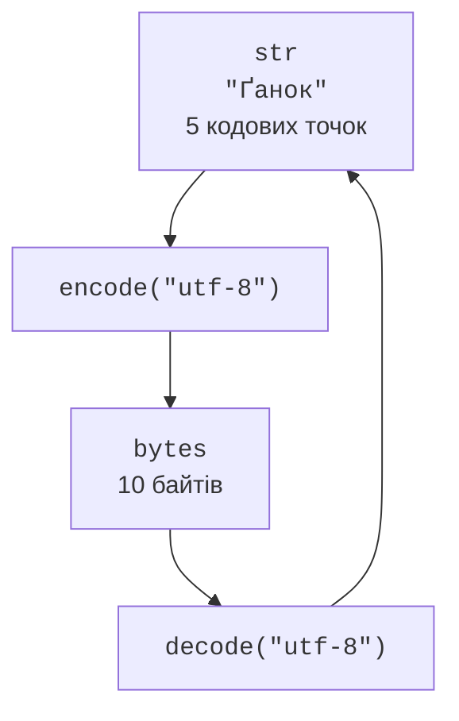

# Рядки та Unicode

## Рядки та кодові точки Unicode

Тип `str` представляє **текстовий рядок** (*string*) – незмінну послідовність кодових точок Unicode. Кодова точка є числовим позначенням елемента стандарту Unicode. Це не обов’язково один видимий знак: літера з комбінованим наголосом може складатися з кількох кодових точок. Відповідно, `len(text)` не вимірює ширину на екрані й не завжди дорівнює кількості видимих знаків.

Офіційний опис операцій над рядками: <https://docs.python.org/3.14/library/stdtypes.html#text-sequence-type-str>. Для тексту використовують одинарні або подвійні лапки. Потрійні лапки дозволяють записати кілька рядків; переноси й відступи всередині такого літерала стають частиною значення.

```py
city = "Лондон"
message = 'Слово "Python" записано латиницею.'
lines = "Перший рядок\nДругий рядок"
print(city[0], city[-1], len(city))
print(lines)
```

Програма виводить `Л н 6`, а потім два окремі рядки. Індекс починається з нуля; від’ємні індекси відраховуються з кінця. Спроба звернутися до `city[100]` спричинить `IndexError`. Зріз `city[100:]` поверне порожній рядок: зрізи допускають межі за кінцем послідовності.

### Незмінність і побудова нового рядка

Присвоєння `text[0] = "А"` заборонено: рядок незмінний. Методи `replace`, `upper`, `strip` повертають нове значення. Якщо результат потрібен далі, його зберігають: `text = text.strip()`. Сам виклик `text.strip()` без використання результату не очищає змінну.

```py
text = "  Рим  "
clean = text.strip()
changed = "Л" + clean[1:]
print(repr(text), repr(clean), changed)
parts = ["Python", "3.14", "і", "Unicode"]
print(" ".join(parts))
```

Результат першого друку: `'  Рим  ' 'Рим' Лим`. Другий друк об’єднує елементи списку в `Python 3.14 і Unicode`. Метод `join` викликають на розділювачі, а його аргументом є послідовність рядків. Якщо у списку є число, його потрібно явно перетворити функцією `str`. Для багатьох фрагментів накопичення у списку й один `join` краще виражають намір, ніж багаторазове додавання до рядка в циклі.

### Керувальні послідовності та сирі літерали

Записи `\n`, `\t`, `\\` позначають перенос рядка, табуляцію та зворотну скісну риску. Функція `repr` допомагає побачити ці символи як літерал, а не як керування терміналом. `ord("Ґ")` повертає 1168, а `chr(1168)` – літеру «Ґ». `ord` приймає рядок з однієї кодової точки.

**Сирий рядок** (*raw string*) із префіксом `r` зручний для регулярних виразів: у `r"\d+"` Python залишає риску для модуля `re`. Сирий літерал не може закінчуватися непарною кількістю зворотних рисок перед закривальною лапкою. Він також не скасовує правила регулярних виразів – лише змінює обробку самого літерала Python.

## Методи опрацювання тексту

Починайте з найпростішої операції, яка точно відповідає умові. Для префікса достатньо `startswith`, для розділення за крапкою з комою – `split(";")`. Регулярний вираз потрібен, коли структура має повторення, альтернативи або кілька взаємопов’язаних частин.

### Поділ і з’єднання

`split()` без аргументу об’єднує послідовності пробільних символів і не залишає порожніх елементів на початку та в кінці. Натомість `split(" ")` працює з кожним звичайним пробілом окремо. У таблиці з розділювачами порожнє поле може бути важливим, тому ці два виклики не є взаємозамінними.

```py
print("  a   b\tс  ".split())
print("a;;c;".split(";"))
print("key=value=extra".split("=", maxsplit=1))
print("a\nb\n".splitlines())
```

Результат:

```
['a', 'b', 'с']
['a', '', 'c', '']
['key', 'value=extra']
['a', 'b']
```

Аргумент `maxsplit` обмежує кількість розділень. `rsplit` починає з правого краю, тому зручний для відокремлення останньої частини. `partition("=")` завжди повертає три рядки: до розділювача, сам розділювач і решту. Якщо розділювача немає, останні два рядки порожні. Це дозволяє перевіряти формат без звернення до невідомого індексу списку. `splitlines` розпізнає межі рядків, зокрема `\r\n`.

### Очищення й заміна

`strip(chars)` видаляє з обох кінців будь-які символи з набору `chars`, а не задане слово. Наприклад, `"abba".strip("ab")` дає порожній рядок. Для точного префікса є `removeprefix`, для суфікса – `removesuffix`. `lstrip` і `rstrip` працюють лише з одним краєм; `replace(old, new, count)` замінює підрядок.

```py
name = "report.txt"
print(name.removesuffix(".txt"))
key, separator, value = "mode = fast".partition("=")
if separator:
    print(key.strip(), value.strip())
text = "П'ємонт, м’ята"
print(text.replace("'", "’"))
```

Виведення: `report`, далі `mode fast`, потім `П’ємонт, м’ята`. Уніфікація апострофів – окреме правило застосунку. Unicode-нормалізація не зобов’язана перетворювати прямий апостроф на типографічний. Не видаляйте пунктуацію безумовно, якщо вона має зміст у даних.

Методи `find` і `index` знаходять позицію підрядка. Якщо збігу немає, `find` повертає −1, а `index` генерує `ValueError`. Перевірка `if text.find(word):` помилкова: збіг на позиції нуль є хибним, а −1 є істинним значенням. Для перевірки наявності пишіть `if word in text:`; для позиції порівнюйте результат із −1.

### Регістр і властивості символів

`upper`, `lower`, `title` змінюють регістр за правилами Unicode. `title` не знає правил написання власних назв: автоматична обробка ПІБ цим методом може спотворити очікуваний запис. Для порівняння без урахування регістру призначений `casefold`, який може змінювати кількість кодових точок: `"Straße".casefold()` дає `"strasse"`.

`isalpha` перевіряє літери, `isdecimal` – десяткові цифри Unicode, `isdigit` охоплює ширше коло знаків, зокрема надрядкову цифру `²`. Тому `"²".isdigit()` є істинним, але `int("²")` завершується помилкою. Жоден із цих методів не перевіряє повний запис від’ємного чи дробового числа. Числове введення перетворюють через `int` або `float` із перехопленням відповідних винятків та перевіркою діапазону.

Для заміни багатьох окремих символів використовують `str.maketrans` і `translate`. Таблиця замін задає відповідність кодових точок, а значення `None` у таблиці означає видалення. Цей механізм зручний для навчального шифру або уніфікації пунктуації; він не замінює контекстні мовні правила транслітерації.

## Текст, байти та нормалізація

Тип `bytes` представляє послідовність байтів, а не текст. Метод `encode("utf-8")` перетворює `str` на `bytes`, а `decode("utf-8")` виконує зворотне перетворення (рис. 6.1). Один байт має значення від 0 до 255; індексація `bytes` повертає ціле число. У UTF-8 кодова точка займає від одного до чотирьох байтів.



Рис. 6.1. Кодування тексту та декодування байтів {.caption}

```py
text = "Ґанок"
data = text.encode("utf-8")
print(len(text), len(data), data[0])
print(data.decode("utf-8"))
try:
    b"\xff".decode("utf-8")
except UnicodeDecodeError:
    print("Послідовність не є коректним UTF-8.")
```

Результат: `5 10 210`, потім `Ґанок` і повідомлення про помилку. Кодування має відповідати домовленості між джерелом та одержувачем. `str(data)` показує подання об’єкта байтів, а не декодує текст. Режими `errors="ignore"` або `"replace"` можуть приховати втрату даних; для перевірки вхідного документа краще залишити строгий режим і пояснити помилку. Повний опис: <https://docs.python.org/3.14/howto/unicode.html>.

### Канонічно еквівалентні записи

Однаково видимі написи можуть мати різний склад. Наприклад, «ї» можна представити готовою кодовою точкою або літерою «і» з комбінованим діакритичним знаком. Функція `unicodedata.normalize` приводить канонічно еквівалентні записи до спільної форми: <https://docs.python.org/3.14/library/unicodedata.html>.

```py
import unicodedata

first = "ї"
second = "і\u0308"
print(first == second, len(first), len(second))
print(unicodedata.normalize("NFC", second) == first)
```

Виведення: `False 1 2` та `True`. NFC поєднує кодові точки там, де існує канонічна складена форма. Нормалізація не робить латинську `a` кириличною «а» і не виправляє орфографію. Для ключа порівняння можна спочатку застосувати `casefold`, потім NFC; оригінальний напис слід зберігати окремо для показу користувачу.
