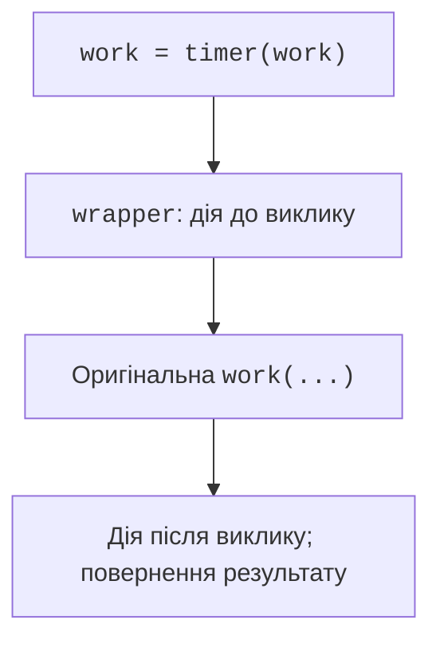

# Лямбда-вирази та декоратори

## Лямбда-вирази та функції вищого порядку

`lambda parameters: expression` створює функцію з одного виразу. Вона доречна для короткого ключа сортування, але не для складної логіки з багатьма умовами. Для багаторазового використання краще іменована `def` із docstring та анотаціями. Присвоєння лямбди змінній зазвичай погіршує діагностику й суперечить стилю PEP 8: <https://peps.python.org/pep-0008/>.

`sorted(records, key=...)` обчислює ключ для кожного запису. Кортеж ключів задає послідовність критеріїв. Знак мінус перед числовим балом дозволяє сортувати бал за спаданням, а ім’я – за зростанням. `itemgetter` повертає функцію читання елемента; `attrgetter` так само читає атрибут об’єкта, який стане звичним після теми 8. Довідка: <https://docs.python.org/3.14/library/operator.html>.

### Приклад. Рейтинг студентів

```py
from functools import partial, reduce
from operator import add, itemgetter

students = [("Олена", 90), ("Ігор", 75), ("Анна", 90)]
ranked = sorted(students, key=lambda row: (-row[1], row[0]))
print(ranked)
scores = list(map(itemgetter(1), students))
passed = list(filter(lambda score: score >= 80, scores))
print(scores, passed)
print(reduce(add, scores, 0))
round_one = partial(round, ndigits=1)
print(list(map(round_one, [2.34, 5.67])))
```

```
[('Анна', 90), ('Олена', 90), ('Ігор', 75)]
[90, 75, 90] [90, 90]
255
[2.3, 5.7]
```

`map` і `filter` повертають ліниві ітератори. Включення часто легше читати: `[row[1] for row in students]` явно називає перетворення. `reduce(add, scores, 0)` демонструє згортку, але для суми простіше `sum(scores)`. Початкове значення робить результат визначеним і для порожнього набору. `partial` фіксує частину аргументів, створюючи новий об’єкт виклику.

### Пізнє зв’язування в циклі

Замикання читає значення змінної під час виклику, а не робить автоматичну копію на кожній ітерації. Тому три функції, які звертаються до одного `i`, можуть повернути однакове останнє значення. Зафіксувати поточне значення можна аргументом за замовчуванням або окремим викликом фабрики функцій.

```py
wrong = [lambda: i for i in range(3)]
right = [lambda i=i: i for i in range(3)]
print([func() for func in wrong])
print([func() for func in right])
```

```
[2, 2, 2]
[0, 1, 2]
```

Перший рядок навмисно показує помилку. Так само можуть поводитися функції `def`, створені у циклі: причина в області видимості, а не в особливій «неправильності» лямбд.

## Декоратор як обгортка функції

**Декоратор** (*decorator*) отримує функцію й повертає об’єкт, який замінює її в місці визначення. Для звичайної обгортки це інша функція. Запис `@timer` перед `def work` відповідає `work = timer(work)`. Декоратор застосовується один раз під час визначення, а тіло обгортки – на кожному виклику (рис. 7.5). <https://peps.python.org/pep-0318/>.



Рис. 7.5. Заміна функції обгорткою {.caption}

Обгортка має передати аргументи, повернути результат і не приховувати несподівані помилки. `functools.wraps` переносить ім’я, документацію та інші метадані, а `__wrapped__` дає доступ до оригіналу. Без цього журнал і документація можуть показувати `wrapper` для всіх різних функцій.

Для універсальної типізації використаємо `ParamSpec`: він позначає весь список параметрів оригіналу, а `TypeVar` – тип результату. Це короткий огляд; докладна типізація буде в темі 16. Старий запис через фабрики тут явно показує роль параметрів типу.

```py
from collections.abc import Callable
from functools import wraps
from typing import ParamSpec, TypeVar

P = ParamSpec("P")
R = TypeVar("R")


def announce(func: Callable[P, R]) -> Callable[P, R]:
    @wraps(func)
    def wrapper(*args: P.args, **kwargs: P.kwargs) -> R:
        print("Виклик:", func.__name__)
        return func(*args, **kwargs)
    return wrapper


@announce
def square(value: int) -> int:
    """Квадрат цілого числа."""
    return value * value


print(square(4), square.__name__)
```

```
Виклик: square
16 square
```

Метадані не дорівнюють поведінці: `wraps` не перевіряє правильність передавання параметрів. Якщо обгортка забуде `return`, користувач отримає `None`. Якщо викликати `func` двічі, подвоїться побічний ефект. У тесті перевіряйте і результат, і число реальних викликів.
