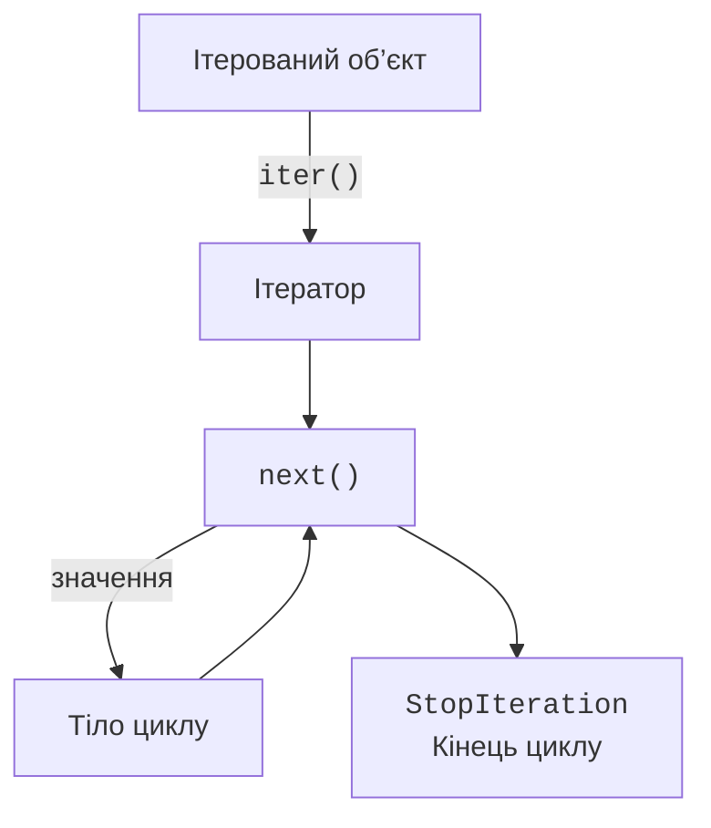
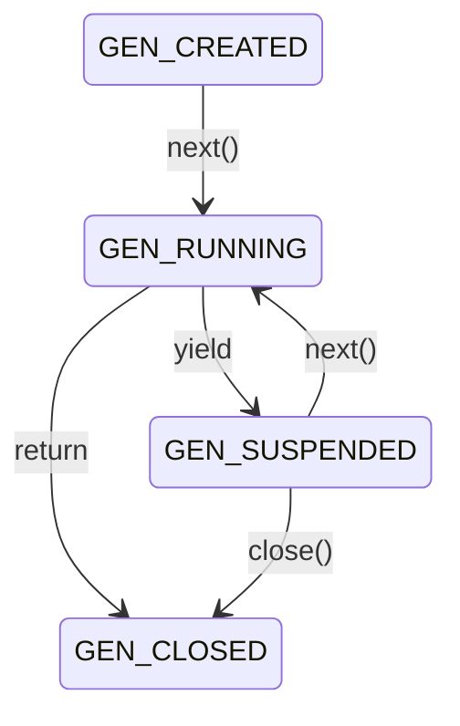

# Ітератори та генераторні функції

## Ітерований об’єкт та ітератор

**Ітерований об’єкт** (*iterable*) уміє надати ітератор. **Ітератор** (*iterator*) пам’ятає позицію обходу та надає наступний елемент. Список можна обійти повторно: кожний `iter(values)` створює новий стан обходу. Сам ітератор зазвичай одноразовий; `iter(iterator)` повертає його самого. Значення можуть створюватися під час обходу, тому ітератор не обов’язково має довжину чи доступ за індексом. <https://docs.python.org/3.14/glossary.html#term-iterator>.

```py
values = [10, 20]
iterator = iter(values)
print(next(iterator))
print(next(iterator))
print(next(iterator, "кінець"))
print(list(iterator))
print(list(values))
```

```
10
20
кінець
[]
[10, 20]
```

Без другого аргументу останній `next` підняв би `StopIteration`. Це штатний сигнал завершення протоколу, а не збій даних. Цикл `for` сам отримує ітератор, повторює `next` і завершується при цьому сигналі (рис. 7.1). Інші винятки не приховуються. Власний клас-ітератор і методи `__iter__` та `__next__` реалізуємо в темі 10; зараз вистачає готових об’єктів і генераторних функцій.



Рис. 7.1. Отримання елементів циклом `for` {.caption}

Форма `iter(callable, sentinel)` викликає функцію без аргументів, доки результат не стане рівним значенню-маркеру. Маркер у послідовність не входить. Наприклад, під час читання рядків порожній рядок може означати кінець файла. Вибирайте маркер, який не плутається зі звичайними даними. Для ручного завершення консольного введення потрібно окремо визначити, чи порожній рядок дозволено як значення.

```py
source = iter(["12", "7", "STOP", "99"])
for text in iter(source.__next__, "STOP"):
    print(int(text) * 2)
print(next(source))
```

```
24
14
99
```

Це скінченна демонстрація форми з маркером. Якщо джерело вичерпається до маркера, його `StopIteration` теж завершить обхід. Механізм не перетворює довільну функцію на нескінченне джерело даних.

## Генераторна функція та `yield`

Функція, у тілі якої є `yield`, є **генераторною**. Її виклик створює генератор, але ще не виконує тіло. Перший `next` починає виконання, `yield` повертає чергове значення й призупиняє функцію. Локальні імена та місце продовження зберігаються до наступного запиту. Це принципово відрізняється від повернення готового списку.

```py
from collections.abc import Iterator
from inspect import getgeneratorstate


def countdown(start: int) -> Iterator[int]:
    if start < 0:
        raise ValueError("start має бути невід’ємним")
    while start > 0:
        yield start
        start -= 1


gen = countdown(2)
print(getgeneratorstate(gen))
print(next(gen))
print(getgeneratorstate(gen))
print(list(gen))
print(getgeneratorstate(gen))
```

```
GEN_CREATED
2
GEN_SUSPENDED
[1]
GEN_CLOSED
```

Анотація `Iterator[int]` описує потік цілих значень, а не список. Важлива деталь: перевірка `start` виконується під час першого споживання. Саме створення `countdown(-1)` винятку ще не дає. Якщо перевірка повинна бути негайною, зовнішня звичайна функція перевіряє аргументи та повертає внутрішній генератор.



Рис. 7.2. Основні стани генератора {.caption}

Під час виконання стан – `GEN_RUNNING`; зовнішній код зазвичай спостерігає створений, призупинений або завершений генератор. `return` у його тілі завершує послідовність. Не слід вручну піднімати `StopIteration` у генераторі: такий вихід перетворюється на `RuntimeError`. Для звичайного завершення використовуйте `return` або досягнення кінця тіла.

### Нескінченний генератор: числа Фібоначчі

Генератор може не мати природного кінця. Тоді відповідальність за межу переходить до споживача: число елементів, часовий горизонт або умова зупинки мають бути визначені перед запуском. Перетворювати нескінченний генератор у список не можна.

```py
from collections.abc import Iterator
from itertools import islice, takewhile


def fibonacci() -> Iterator[int]:
    a, b = 0, 1
    while True:
        yield a
        a, b = b, a + b


print(list(islice(fibonacci(), 8)))
print(list(takewhile(lambda x: x < 20, fibonacci())))
```

```
[0, 1, 1, 2, 3, 5, 8, 13]
[0, 1, 1, 2, 3, 5, 8, 13]
```

Обидва споживачі отримують окремий генератор. Якби передати той самий об’єкт, другий продовжив би обхід із поточної позиції. `takewhile` читає також перший елемент, що не задовольнив умову, але не повертає його. Тому після зупинки його вже немає в джерелі. Це істотно, якщо далі потрібна решта потоку.

::: info Знімок екрана
Debug fibonacci consumed by islice; breakpoint at yield; show a,b and caller.
:::

Рис. 7.3. Призупинення генератора в налагоджувачі {.caption}

### Делегування через `yield from`

`yield from source` передає споживачу значення іншого ітерованого об’єкта. Це зручний спосіб поєднати кілька джерел або рекурсивно обходити вкладені дані. Для простого потоку ефект відповідає циклу з `yield`, але повний протокол делегування також передає `send`, `throw` і `close` підгенератору.

```py
from collections.abc import Iterable, Iterator


def sections(groups: Iterable[Iterable[int]]) -> Iterator[int]:
    for group in groups:
        yield from group


print(list(sections([[1, 2], [], [3]])))
```

```
[1, 2, 3]
```

`send(value)` не лише просить наступне значення, а передає його як результат призупиненого виразу `yield`. Новий генератор спочатку треба запустити через `next` або `send(None)`. `close()` завершує генератор із виконанням `finally`; після нього обхід не відновлюється. Для звичайних потокових обчислень достатньо `next` і `for`. Розширені корутини не потрібно застосовувати там, де простий цикл ясно виражає задачу.
