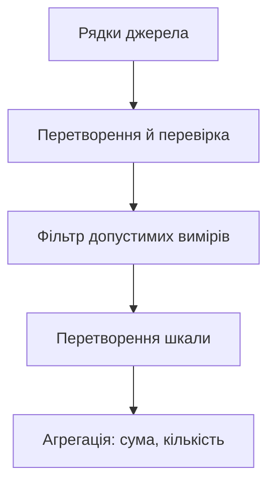

# Ліниві обчислення та itertools

## Вирази-генератори та ліниві обчислення

Вираз `(transform(x) for x in data if condition(x))` створює генератор. Спискове включення із квадратними дужками відразу обчислює всі елементи. Обидва записи мають своє призначення: список дозволяє повторний обхід і індекси, генератор – один послідовний прохід без накопичення всіх результатів.

```py
values = [2, -1, 5, 0]
squares = (x * x for x in values if x > 0)
print(sum(squares))
print(sum(squares))
print(any(x < 0 for x in values))
print(all(x >= 0 for x in []))
print(max((x for x in values if x > 9), default=None))
```

```
29
0
True
True
None
```

Повторна сума дорівнює нулю, бо генератор уже порожній. Це не кеш попередніх значень. Для двох проходів створіть новий генератор або явно матеріалізуйте список. `any` і `all` можуть зупинятися раніше кінця; решта генератора залишиться невичитаною. `all` для порожньої послідовності істинний, тому перевірка «усі оцінки допустимі» не доводить, що оцінки взагалі є.

`sys.getsizeof` вимірює розмір конкретного об’єкта, але не всю пам’ять об’єктів, на які він посилається. Малий розмір генератора не доводить, що весь конвеєр використовує сталу пам’ять: він може утримувати великий початковий список, а `sorted` усе одно накопичує дані. Значення байтів залежать від реалізації й платформи. Коректне порівняння враховує джерело, буфери та матеріалізацію.

## Готові будівельні блоки `itertools`

Модуль `itertools` надає ітератори для типових схем обходу: <https://docs.python.org/3.14/library/itertools.html>. `count(start, step)` створює арифметичну послідовність, `cycle(values)` повторює значення, `repeat(value, times)` повторює один об’єкт. Без кількості `repeat` нескінченний. `cycle` запам’ятовує перший обхід джерела, тому не є інструментом без пам’яті для нескінченного первинного потоку.

`islice` обмежує обхід; на відміну від зрізу списку, він споживає елементи й не підтримує від’ємні індекси. `chain` послідовно з’єднує джерела, а `chain.from_iterable` приймає потік самих джерел. `takewhile` бере початкову придатну ділянку, `dropwhile` пропускає початкову придатну ділянку. Після першої хибної умови `dropwhile` більше її не перевіряє, тому це не заміна `filter`.

```py
from itertools import chain, count, cycle, dropwhile
from itertools import islice, repeat

print(list(islice(count(3, 2), 4)))
print(list(islice(cycle("AB"), 5)))
print(list(chain(repeat(0, 2), [1, 2])))
print(list(dropwhile(lambda x: x < 3, [1, 2, 4, 1])))
```

```
[3, 5, 7, 9]
['A', 'B', 'A', 'B', 'A']
[0, 0, 1, 2]
[4, 1]
```

### Сусіди, пакети та накопичення

`pairwise` утворює сусідні пари, тому для `n` елементів маємо `max(n - 1, 0)` пар. Це підходить для перепадів температур, проміжків часу й довжин відрізків маршруту. `batched(data, n)` видає кортежі до `n` елементів; останній може бути коротшим. У Python 3.14 доступний `strict=True`: неповний останній пакет дає `ValueError` під час споживання. Розмір пакета має бути додатним.

```py
from itertools import accumulate, batched, pairwise

print(list(pairwise([4, 7, 6])))
print(list(batched(range(5), 2)))
print(list(accumulate([5, -2, 4], initial=10)))
```

```
[(4, 7), (7, 6)]
[(0, 1), (2, 3), (4,)]
[10, 15, 13, 17]
```

`accumulate` за замовчуванням видає проміжні суми. Початкове значення `initial` теж входить у результат, тому результат довший на один елемент. Іншою функцією можна обчислювати накопичений максимум або добуток. Не плутайте з `reduce`, який повертає лише кінцеве накопичення.

### Групування сусідніх елементів

`groupby` об’єднує **сусідні** однакові ключі. Для груп за містом незалежно від порядку вхідних записів спершу сортуйте за містом. Для серій однакових станів сортування, навпаки, зруйнує часовий порядок, тому там групують початковий потік без сортування. Кожна група – ітератор, спільний із зовнішнім джерелом; обробіть її до переходу до наступної або збережіть потрібні значення.

```py
from itertools import groupby

words = ["A", "B", "A", "A"]
print([(key, len(list(group)))
       for key, group in groupby(words)])
print([(key, len(list(group)))
       for key, group in groupby(sorted(words))])
```

```
[('A', 1), ('B', 1), ('A', 2)]
[('A', 3), ('B', 1)]
```

### Комбінаторні ітератори

`product` відповідає вкладеним циклам, `permutations` враховує порядок вибраних позицій, `combinations` – ні. Елементи вважаються різними за позицією, тому повторювані вхідні значення можуть давати однакові кортежі результатів. Для унікальних комбінацій значень спочатку визначте правила усунення повторів.

```py
from itertools import combinations, permutations, product

print(list(product("AB", repeat=2)))
print(list(permutations("AB", 2)))
print(list(combinations("ABC", 2)))
```

```
[('A', 'A'), ('A', 'B'), ('B', 'A'), ('B', 'B')]
[('A', 'B'), ('B', 'A')]
[('A', 'B'), ('A', 'C'), ('B', 'C')]
```

Лінива видача не робить експоненційний перебір дешевим. Навіть якщо не зберігати результати, їх кількість може бути величезною. Перед запуском обмежуйте алфавіт, довжину й кількість показаних результатів; генерація навчальних PIN у лабораторній не повинна звертатися до справжньої системи автентифікації.

## Конвеєр: журнал температур

Дані проходять етапи читання, перевірки, фільтрування, перетворення та агрегації (рис. 7.4). Кожен етап має власний контракт: яке значення отримує, що повертає й що робить із помилкою. Відкидання помилкових записів без лічильника може приховати пошкодження джерела; у прикладі помилка формату є явною.



Рис. 7.4. Потокова обробка по одному запису {.caption}

```py
from collections.abc import Iterable, Iterator
from itertools import groupby, pairwise
from math import isfinite
from operator import itemgetter


def parse(lines: Iterable[str]) -> Iterator[tuple[str, float]]:
    for line in lines:
        city, text = line.split(";")
        value = float(text)
        if not city or not isfinite(value):
            raise ValueError("Некоректне вимірювання")
        yield city, value


lines = ["Мадрид;50", "Лондон;32", "Мадрид;68", "Лондон;50"]
valid = ((city, f) for city, f in parse(lines) if -40 <= f <= 140)
celsius = ((city, (f - 32) * 5 / 9) for city, f in valid)
ordered = sorted(celsius, key=itemgetter(0))
for city, group in groupby(ordered, key=itemgetter(0)):
    values = [value for _, value in group]
    changes = [round(b - a, 1) for a, b in pairwise(values)]
    print(city, f"{sum(values) / len(values):.1f}", changes)
```

```
Лондон 5.0 [10.0]
Мадрид 15.0 [10.0]
```

Вхідні числа – градуси Фаренгейта, результат – Цельсія. Сортування стабільне, тому порядок вимірів одного міста зберігся. У цьому прикладі `sorted` навмисно матеріалізує весь набір: не називайте весь алгоритм потоковим зі сталою пам’яттю. Для справді великого джерела можна вимагати попереднє впорядкування або вести словник накопичень, пам’ять якого залежить від кількості міст.
