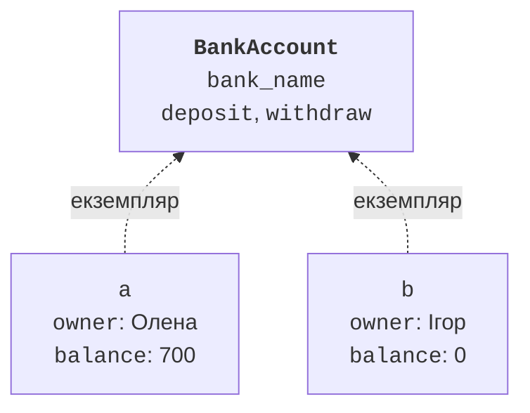
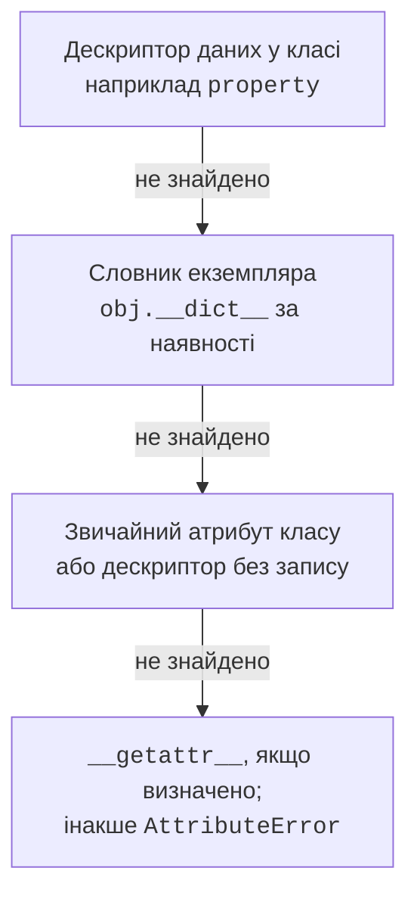

# Клас, ініціалізація та атрибути

## Об’єкт і клас

**Об’єкт** (*object*) має ідентичність, стан і доступну поведінку. **Клас** (*class*) визначає тип об’єктів та спільні правила. **Екземпляр** (*instance*) – конкретний об’єкт цього класу. Два рахунки мають однакові методи, але власних власників і баланси (рис. 8.1). Сам клас у Python теж є об’єктом: його можна передати функції, зберегти в колекції та дослідити під час виконання. Числа, рядки, функції та модулі також є об’єктами. <https://docs.python.org/3.14/tutorial/classes.html>.



Рис. 8.1. Один клас і незалежні екземпляри {.caption}

**Стан** зберігається в атрибутах. **Метод** – функція, доступна через клас або екземпляр. Не кожний атрибут обов’язково зберігає готове значення: властивість може обчислювати результат під час читання. Для користувача класу важливий публічний контракт, а не те, в якому саме полі зберігається інформація.

**Інваріант** (*invariant*) – умова, що має бути істинною для кожного коректного стану: баланс невід’ємний, сторона додатна, температура не нижча за абсолютний нуль. Перевіряти треба і початковий стан, і кожну операцію зміни. Якщо операція відхилена, попередній коректний стан бажано зберегти.

## Оголошення класу та ініціалізація

Оператор `class` виконує тіло й створює об’єкт класу. Виклик `Point(2, 3)` створює екземпляр. Метод `__new__` відповідає за створення, а `__init__` – за ініціалізацію вже створеного об’єкта. У звичайному початковому класі перевизначати `__new__` не потрібно. `__init__` має повертати `None`, а не сам екземпляр.

```py
class Point:
    def __init__(self, x: float, y: float) -> None:
        self.x = x
        self.y = y

    def move(self, dx: float, dy: float) -> None:
        self.x += dx
        self.y += dy


point = Point(2.0, 3.0)
point.move(1.0, -2.0)
print(point.x, point.y)
Point.move(point, 2.0, 0.0)
print(point.x, point.y)
```

```
3.0 1.0
5.0 1.0
```

`self` – параметр, що посилається на конкретний екземпляр. Назва є домовленістю, але її слід дотримуватися. У виклику `point.move(...)` Python передає екземпляр автоматично, тому користувач не пише його ще раз. У формі `Point.move(point, ...)` той самий аргумент указано явно. `x = x` у конструкторі лише переприсвоїв би локальний параметр; потрібен `self.x = x`.

Метод, отриманий через екземпляр, називають **зв’язаним** (*bound method*): він пам’ятає і функцію, і об’єкт. Його можна передати іншій функції як callback. Проте це посилання також утримує екземпляр живим; збереження великої кількості таких об’єктів може продовжити час життя їхнього стану.

### Анотації та початковий стан

Анотація атрибута допомагає читачеві й аналізатору, але не створює його значення. Запис `name: str` без присвоєння не гарантує, що `obj.name` доступний. У конструкторі встановлюйте всі обов’язкові атрибути. Для відсутнього значення використайте явний тип на зразок `str | None`, якщо це дозволяє контракт.

Не виконуйте `input` у конструкторі моделі. Інакше створення об’єкта з тесту або файла теж вимагатиме клавіатури. Інтерфейс читає дані, передає їх класу та перехоплює очікувані помилки. Модель перевіряє зміст і піднімає `ValueError` із зрозумілим поясненням, не вирішуючи, як саме його показати користувачеві.

## Атрибути класу та екземпляра

Присвоєння в тілі класу створює атрибут класу. Присвоєння `self.name` за звичайної поведінки створює атрибут екземпляра. Для звичайних атрибутів без дескрипторів значення екземпляра затіняє атрибут класу, але не змінює його для інших екземплярів.

```py
class Sensor:
    unit = "C"

    def __init__(self, value: float) -> None:
        self.value = value


a = Sensor(12.0)
b = Sensor(15.0)
a.unit = "F"
print(a.unit, b.unit, Sensor.unit)
print(vars(a))
```

```
F C C
{'value': 12.0, 'unit': 'F'}
```

Якщо атрибут класу містить змінюваний список, виклик `append` змінює саме спільний об’єкт. Це інша дія, ніж присвоєння нового значення. Списки позицій, оцінок або подій зазвичай мають бути окремими для кожного екземпляра й створюватися в `__init__`.

```py
class Team:
    def __init__(self, name: str) -> None:
        self.name = name
        self.players: list[str] = []


a = Team("A")
b = Team("B")
a.players.append("Олена")
print(a.players, b.players)
```

```
['Олена'] []
```

`__dict__` і `vars(obj)` показують словник атрибутів звичайного екземпляра. `getattr(obj, name, default)` читає атрибут за рядковим ім’ям; `setattr` записує, `hasattr` перевіряє доступність. Ці засоби виконують звичайний механізм доступу, тому властивість може запустити код. `hasattr` приховує `AttributeError`, але не будь-який виняток, і не є універсальною перевіркою без побічних дій.

### Реальний порядок пошуку

Спрощення «спочатку словник об’єкта, потім клас» придатне лише для звичайних атрибутів. Властивості є **дескрипторами даних** (*data descriptors*) і мають пріоритет над словником екземпляра. Схема рис. 8.2 показує основні етапи стандартного доступу; пошук у базових класах буде уточнений у темі 9. <https://docs.python.org/3.14/howto/descriptor.html>.



Рис. 8.2. Пріоритети стандартного читання атрибута {.caption}

Так само запис `obj.x = value` не завжди пише безпосередньо в `__dict__`: він може викликати сеттер властивості або дескриптор слота. Клас може перевизначити механізм доступу, але для цієї теми це зайве. Спершу використовуйте звичайні атрибути та `property`, доки немає конкретної потреби у складнішій поведінці.

### Обмеження атрибутів через `__slots__`

`__slots__` дозволяє вказати набір атрибутів і для простого класу не створювати звичайний `__dict__`. Це може зменшити витрати пам’яті й помітити випадкову друкарську помилку в назві. Проте це не механізм приватності й не автоматична перевірка типів. Успадкування зі слотами має додаткові правила.

```py
class Pixel:
    __slots__ = ("x", "y")

    def __init__(self, x: int, y: int) -> None:
        self.x = x
        self.y = y


pixel = Pixel(1, 2)
try:
    pixel.color = "black"
except AttributeError:
    print("Довільний атрибут заборонено")
print(hasattr(pixel, "__dict__"))
```

```
Довільний атрибут заборонено
False
```

Не додавайте слоти до кожного першого класу без потреби: для навчання стану й властивостей звичайний словник прозоріший. Довідка про модель даних: <https://docs.python.org/3.14/reference/datamodel.html>.
