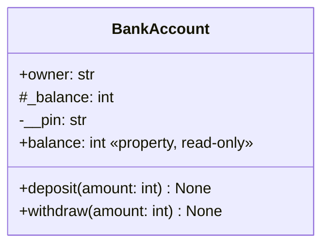

# Інкапсуляція та властивості

## Інкапсуляція та публічний інтерфейс

**Інкапсуляція** – організація доступу до стану через узгоджені операції. У Python ім’я без підкреслення зазвичай публічне, `_balance` означає внутрішню деталь за домовленістю. Подвійне початкове підкреслення `__pin` запускає **спотворення імені** (*name mangling*), наприклад `_BankAccount__pin`. Це зменшує випадкові конфлікти в підкласах, але не захищає секрет від читання.

Не плутайте такі імена зі спеціальними `__init__` або `__repr__`, які мають два підкреслення і на початку, і в кінці. Власні спеціальні імена вигадувати не потрібно. Не називайте `_x` «захищеним полем» у сенсі заборони мови: зовнішній код технічно може його змінити, але порушить домовлений інтерфейс.

### Приклад 1. Навчальний рахунок

Баланс зберігається в цілих копійках. Поповнення й списання мають бути додатними, списання не перевищує балансу. PIN тут лише демонструє спотворення імені; це не реалізація банківської автентифікації. Не зберігайте справжні секрети в навчальному коді.

```py
class BankAccount:
    bank_name = "Навчальний банк"

    def __init__(self, owner: str, pin: str) -> None:
        if not owner.strip() or not (len(pin) == 4
                and pin.isascii() and pin.isdecimal()):
            raise ValueError("Потрібні власник і PIN із 4 цифр")
        self.owner = owner.strip()
        self.__pin = pin
        self._balance = 0

    @property
    def balance(self) -> int:
        return self._balance

    def deposit(self, amount: int) -> None:
        if type(amount) is not int or amount <= 0:
            raise ValueError("Сума має бути додатною цілою")
        self._balance += amount

    def withdraw(self, amount: int) -> None:
        if type(amount) is not int or not 0 < amount <= self.balance:
            raise ValueError("Недопустима сума списання")
        self._balance -= amount

    def __repr__(self) -> str:
        return f"BankAccount({self.owner!r}, balance={self.balance})"


account = BankAccount("Олена", "1234")
account.deposit(1000)
account.withdraw(300)
print(account)
try:
    account.withdraw(800)
except ValueError:
    print("Відмовлено; баланс:", account.balance)
```

```
BankAccount('Олена', balance=700)
Відмовлено; баланс: 700
```

Перевірка виконується до зміни стану. `type(amount) is int` тут свідомо відхиляє `bool`, який є підтипом `int`, бо `True` не повинен означати суму платежу. Це локальна вимога грошового контракту, а не правило використовувати точну перевірку типу скрізь. Баланс читається через властивість без сеттера.



Рис. 8.3. Контракт навчального класу рахунку {.caption}

У UML верхній відсік містить ім’я класу, середній – атрибути, нижній – операції. Позначки `+`, `#`, `-` у цій навчальній схемі відображають публічний інтерфейс та угоди внутрішнього доступу Python, а не додаткові перевірки інтерпретатора. Для звіту лабораторної роботи UML-діаграма класів обов’язкова.

## Властивості: читання, запис і видалення

`@property` дозволяє надати обчислення як атрибут: `obj.balance`, а не `obj.balance()`. Сеттер, визначений через `@name.setter`, перевіряє нове значення. Усередині нього зберігайте дані під іншим ім’ям, наприклад `_celsius`. Присвоєння `self.celsius = value` у сеттері `celsius` викличе цей самий сеттер знову й приведе до нескінченної рекурсії. <https://docs.python.org/3.14/library/functions.html#property>.

### Приклад 2. Термометр

```py
from math import isfinite


class Thermometer:
    minimum = -273.15

    def __init__(self, celsius: float) -> None:
        self.celsius = celsius

    @property
    def celsius(self) -> float:
        return self._celsius

    @celsius.setter
    def celsius(self, value: float) -> None:
        if not isfinite(value) or value < self.minimum:
            raise ValueError("Температура нижча за допустиму")
        self._celsius = value

    @property
    def fahrenheit(self) -> float:
        return self.celsius * 9 / 5 + 32


sensor = Thermometer(0.0)
print(sensor.fahrenheit)
sensor.celsius = 100.0
print(sensor.fahrenheit)
try:
    sensor.celsius = -300.0
except ValueError:
    print("Збережено:", sensor.celsius)
```

```
32.0
212.0
Збережено: 100.0
```

Конструктор користується тим самим сеттером, тому немає двох різних правил перевірки. Обчислювана шкала не зберігається окремо: вона не може відстати від основного значення. Виняток при зміні не знищує останній коректний вимір.

Декоратор `@name.deleter` визначає поведінку `del obj.name`. Він потрібний лише тоді, коли видалення має зрозумілий сенс: наприклад, скидання необов’язкової примітки. Для балансу або сторони прямокутника видалення порушило б інваріант, тому його краще не дозволяти. Властивість може бути лише для читання, але це не робить незмінним весь об’єкт.

### Кешована властивість

`functools.cached_property` обчислює значення при першому читанні та зберігає його в словнику екземпляра. Наступні читання використовують збережене значення. Якщо вихідні дані змінюються, кеш може застаріти; видалення атрибута змушує обчислити його знову. Звичайний `property` обчислюється щоразу.

```py
from functools import cached_property


class Sample:
    def __init__(self, values: tuple[int, ...]) -> None:
        if not values:
            raise ValueError("Потрібна непорожня вибірка")
        self._values = values

    @cached_property
    def total(self) -> int:
        print("Обчислення")
        return sum(self._values)


sample = Sample((2, 3, 5))
print(sample.total)
print(sample.total)
del sample.total
print(sample.total)
```

```
Обчислення
10
10
Обчислення
10
```

Цей механізм потребує доступного змінюваного `__dict__`; із простим класом лише зі слотами він не працюватиме. Кешування не слід додавати до дешевого множення двох чисел: складність підтримання правильного стану може переважити користь.
