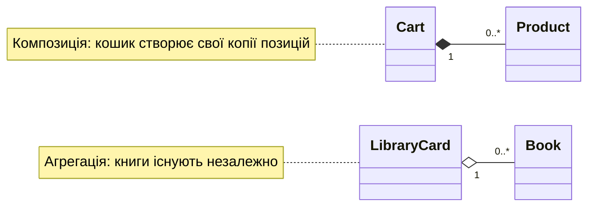

# Методи класу та рядкове подання

## Методи класу та статичні методи

Звичайний метод отримує `self`. `@classmethod` отримує клас як `cls`, тому придатний для альтернативного конструктора. `@staticmethod` не отримує автоматично ні клас, ні екземпляр; це допоміжна функція, логічно пов’язана з поняттям класу. Не робіть усі методи статичними: тоді клас перестає об’єднувати стан і поведінку й стає лише контейнером назв.

### Приклад 3. Прямокутник із рядка

```py
from math import isfinite
from typing import Self


class Rectangle:
    def __init__(self, width: float, height: float) -> None:
        if not self.valid_side(width) or not self.valid_side(height):
            raise ValueError("Сторони мають бути додатними")
        self._width = width
        self._height = height

    @staticmethod
    def valid_side(value: float) -> bool:
        return isfinite(value) and value > 0

    @classmethod
    def from_string(cls, text: str) -> Self:
        width, height = text.split("x")
        return cls(float(width), float(height))

    @property
    def area(self) -> float:
        return self._width * self._height

    def __str__(self) -> str:
        return f"{self._width:g} x {self._height:g}"


rectangle = Rectangle.from_string("3x4")
print(rectangle, rectangle.area)
print(Rectangle.valid_side(-1))
```

```
3 x 4 12.0
False
```

`Self` описує екземпляр поточного класу; деталі для підкласів будуть у наступній темі. Створення через `cls(...)`, а не жорстко записане `Rectangle(...)`, зберігає цей намір. Поганий формат, зайвий роздільник або недопустима сторона піднімають `ValueError`. Обробляйте його на межі інтерфейсу, а не повертайте напівініціалізований прямокутник.

Атрибут класу може рахувати число **створених** екземплярів: збільшення після успішної валідації дає коректну статистику. Не називайте цей лічильник числом **живих** об’єктів, якщо він ніколи не зменшується. Для окремих лічильників підкласів потрібна інша політика, яку слід визначити явно.

## Рядкове подання та зв’язки об’єктів

`__str__` призначений для зрозумілого користувачеві тексту, `__repr__` – для діагностики розробником. Обидва повертають рядок. Якщо `__str__` немає, Python може використати `__repr__`. Не включайте секрети до автоматичного подання: воно легко потрапляє до журналу або налагоджувача. Відтворюваний вираз створення корисний, але не завжди можливий або доречний.

**Асоціація** – загальний зв’язок об’єктів. **Агрегація** означає, що ціле посилається на частини, які існують незалежно. **Композиція** підкреслює володіння частинами та їх життєвим циклом у моделі. У Python це насамперед рішення дизайну, а не спеціальний оператор знищення (рис. 8.4).



Рис. 8.4. Володіння частинами та незалежні об’єкти {.caption}

### Приклад 4. Кошик із власними позиціями

Кошик створює `Product` із переданих значень, тому це навчальна композиція. Він не приймає спільний змінюваний список ззовні. Ціни – цілі копійки; сума зі знижкою повертається у копійках із відкиданням дробової частини за явно обраним правилом вправи.

```py
class Product:
    def __init__(self, name: str, price: int) -> None:
        if not name.strip() or type(price) is not int or price < 0:
            raise ValueError("Некоректна позиція")
        self.name = name.strip()
        self.price = price

    def __repr__(self) -> str:
        return f"Product({self.name!r}, {self.price})"


class Cart:
    def __init__(self, discount: int = 0) -> None:
        if not 0 <= discount <= 100:
            raise ValueError("Знижка поза 0..100")
        self.__discount = discount
        self._items: list[Product] = []

    def add(self, name: str, price: int) -> None:
        self._items.append(Product(name, price))

    @property
    def total(self) -> int:
        subtotal = sum(item.price for item in self._items)
        return subtotal * (100 - self.__discount) // 100

    def __repr__(self) -> str:
        return f"Cart(items={self._items!r}, total={self.total})"


cart = Cart(10)
cart.add("чай", 4000)
cart.add("хліб", 6000)
print(cart.total)
print(len(cart._items))  # лише демонстрація налагодження
```

```
9000
2
```

Пряме читання `_items` у кінці – діагностична демонстрація; прикладний клієнт мав би користуватися публічним методом або властивістю кількості. Якщо потрібно видати позиції назовні, повернення самого внутрішнього списку дозволить обійти перевірки. Навіть кортеж змінюваних `Product` не є глибоко незмінною копією: треба визначити, які зміни клієнту дозволено.
