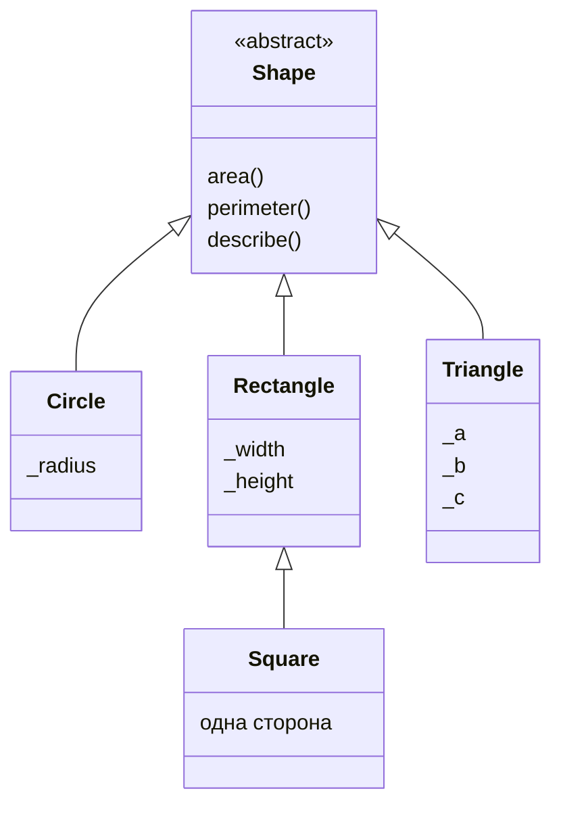

# Абстрактні класи та методи

## Абстрактні класи та методи

Абстрактний базовий клас (**ABC**) задає обов’язкові операції. Він може містити і готову спільну поведінку. У Python використовують `abc.ABC` та `@abstractmethod`: <https://docs.python.org/3.14/library/abc.html>. Неповний клас не можна створити, доки не реалізовано всі абстрактні методи й властивості; спроба дає `TypeError`.

Саме наслідування від `ABC` без абстрактних методів не забороняє створення. Тіло абстрактного методу може мати реалізацію, доступну через `super`, але похідний клас усе одно повинен виконати вимогу перевизначення. `raise NotImplementedError` без `abstractmethod` не створює такого контролю під час створення об’єкта.

### Приклад 1. Геометричні фігури

Усі розміри скінченні й додатні; для трикутника виконується нерівність трикутника. Розміри у цьому інтерфейсі після створення не змінюються публічними сеттерами. Тому `Square` можна використовувати як окремий спосіб створити прямокутник із рівними сторонами, не порушуючи обіцянок незалежної зміни ширини й висоти, яких цей контракт не має.



Рис. 9.1. Наслідування та спільні операції фігур {.caption}

```py
from abc import ABC, abstractmethod
from math import isfinite, pi, sqrt
from typing import override


class Shape(ABC):
    @abstractmethod
    def area(self) -> float:
        raise NotImplementedError

    @abstractmethod
    def perimeter(self) -> float:
        raise NotImplementedError

    def describe(self) -> str:
        return f"{type(self).__name__}: {self.area():.2f}"


def positive(*values: float) -> None:
    if not all(isfinite(v) and v > 0 for v in values):
        raise ValueError("Розміри мають бути додатними")


class Circle(Shape):
    def __init__(self, radius: float) -> None:
        positive(radius)
        self._radius = radius

    @override
    def area(self) -> float:
        return pi * self._radius ** 2

    @override
    def perimeter(self) -> float:
        return 2 * pi * self._radius


class Rectangle(Shape):
    def __init__(self, width: float, height: float) -> None:
        positive(width, height)
        self._width, self._height = width, height

    @override
    def area(self) -> float:
        return self._width * self._height

    @override
    def perimeter(self) -> float:
        return 2 * (self._width + self._height)


class Square(Rectangle):
    def __init__(self, side: float) -> None:
        super().__init__(side, side)


class Triangle(Shape):
    def __init__(self, a: float, b: float, c: float) -> None:
        positive(a, b, c)
        if 2 * max(a, b, c) >= a + b + c:
            raise ValueError("Порушено нерівність трикутника")
        self._a, self._b, self._c = a, b, c

    @override
    def perimeter(self) -> float:
        return self._a + self._b + self._c

    @override
    def area(self) -> float:
        s = self.perimeter() / 2
        return sqrt(s * (s-self._a) * (s-self._b) * (s-self._c))


shapes: list[Shape] = [Circle(1), Rectangle(2, 3),
                       Square(2), Triangle(3, 4, 5)]
for shape in sorted(shapes, key=lambda item: item.area()):
    print(shape.describe())
```

```
Circle: 3.14
Square: 4.00
Rectangle: 6.00
Triangle: 6.00
```

Метод `describe` базового класу викликає `self.area`, тобто реалізацію фактичного об’єкта. Додавання нового виду фігури не потребує зміни цього методу чи циклу звіту. Сортування стабільне: прямокутник і трикутник мають однакову площу, тому їх початковий порядок зберігся.

Приклад розрахований на звичайні навчальні розміри. Для майже вироджених трикутників або дуже великих чисел потрібен окремий аналіз числової стійкості формули Герона. Коректна ієрархія не усуває похибку арифметики з рухомою крапкою.

### Абстрактна властивість і шаблонний метод

Для абстрактної властивості зовнішнім декоратором є `property`, а внутрішнім – `abstractmethod`. **Шаблонний метод** задає послідовність кроків, частину яких уточнюють підкласи. Він допомагає зберегти загальну перевірку, заголовок чи формат.

```py
from abc import ABC, abstractmethod


class Report(ABC):
    @property
    @abstractmethod
    def title(self) -> str:
        raise NotImplementedError

    @abstractmethod
    def body(self) -> str:
        raise NotImplementedError

    def render(self) -> str:
        return f"{self.title}\n{self.body()}"


class ShortReport(Report):
    @property
    def title(self) -> str:
        return "Підсумок"

    def body(self) -> str:
        return "Записів: 3"


print(ShortReport().render())
try:
    Report()
except TypeError:
    print("Абстрактний клас не створюється")
```

```
Підсумок
Записів: 3
Абстрактний клас не створюється
```

Анотації не перевіряють усі семантичні обіцянки. Реалізація може повернути неправильний тип або пустий заголовок, якщо програміст порушив контракт. ABC гарантує наявність потрібного перевизначення, а не доводить правильність усього алгоритму.
