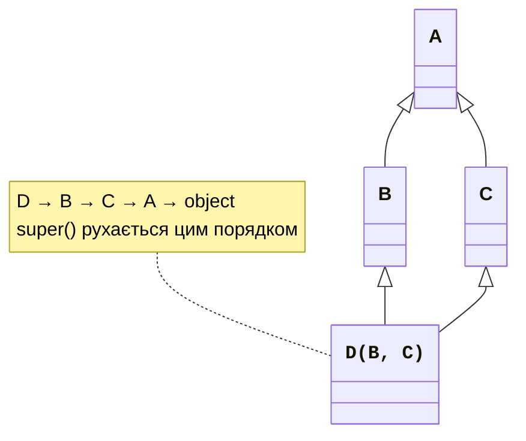
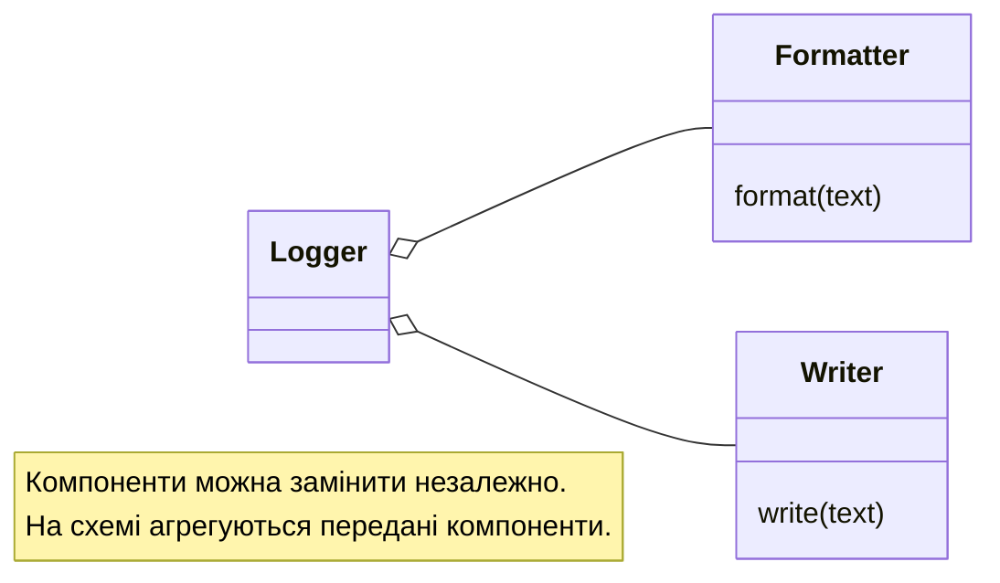

# Множинне наслідування та композиція

## Множинне наслідування, MRO та міксини

Клас може мати кілька баз. Python обчислює порядок розв’язання методів (**MRO**) алгоритмом C3, який узгоджує локальний порядок баз і порядок їхніх предків. Це не просто довільний пошук «спочатку ліворуч до кінця». Для несумісних вимог порядку визначення класу завершується `TypeError`. <https://docs.python.org/3.14/howto/mro.html>.



Рис. 9.3. Ромб і послідовність кооперативних викликів {.caption}

```py
class A:
    def chain(self) -> list[str]:
        return ["A"]


class B(A):
    def chain(self) -> list[str]:
        return ["B"] + super().chain()


class C(A):
    def chain(self) -> list[str]:
        return ["C"] + super().chain()


class D(B, C):
    def chain(self) -> list[str]:
        return ["D"] + super().chain()


print([cls.__name__ for cls in D.__mro__])
print(D().chain())
```

```
['D', 'B', 'C', 'A', 'object']
['D', 'B', 'C', 'A']
```

У методі `B` наступним для екземпляра `D` буде `C`, а не `A`. Кожний учасник викликає `super` один раз і має сумісну сигнатуру. Змішування прямих викликів баз і `super` може пропустити учасника або виконати спільну базу двічі. Особливо уважно проєктуйте кооперативні конструктори.

**Міксин** (*mixin*) додає невелику завершену можливість: серіалізацію, форматування чи перевірку. Зазвичай його не створюють як самостійну предметну сутність. Контракт міксина повинен явно називати методи, яких він очікує від іншої частини класу, і не покладатися на випадкові назви внутрішніх полів.

### Приклад 4. Міксини подання та ключа порівняння

```py
import json


class JsonMixin:
    def fields(self) -> dict[str, str | int]:
        raise NotImplementedError

    def to_json(self) -> str:
        return json.dumps(self.fields(), ensure_ascii=False)


class KeyMixin:
    def key(self) -> tuple[int, str]:
        raise NotImplementedError

    def comes_before(self, other: "KeyMixin") -> bool:
        return self.key() < other.key()


class Record(JsonMixin, KeyMixin):
    def __init__(self, name: str, score: int) -> None:
        self.name, self.score = name, score

    def fields(self) -> dict[str, str | int]:
        return {"name": self.name, "score": self.score}

    def key(self) -> tuple[int, str]:
        return -self.score, self.name


a, b = Record("Анна", 90), Record("Ігор", 80)
print(a.to_json())
print(a.comes_before(b))
print([cls.__name__ for cls in Record.__mro__])
```

```
{"name": "Анна", "score": 90}
True
['Record', 'JsonMixin', 'KeyMixin', 'object']
```

Ці міксини не мають власного конструктора, тому не створюють конфлікту ініціалізації. Вони викликають явно визначені `fields` і `key`. Спеціальні оператори порівняння реалізуємо в темі 10; тут іменований метод залишає контракт очевидним.

## Композиція та принцип підстановки

Наслідування доречне для відношення «є різновидом» у межах конкретного контракту. Композиція й делегування доречні, коли об’єкт **використовує** інший об’єкт для частини поведінки. Логер може отримати форматер і записувач замість утворення десятків підкласів для кожної комбінації способів виводу.



Рис. 9.4. Заміна компонентів без розростання ієрархії {.caption}

У загальному принципі «композиція замість наслідування» слово композиція часто означає збирання поведінки з компонентів. У строгій UML-термінології передані незалежні форматер і записувач є агрегацією, тому на схемі порожні ромби. Чорний ромб доречний, коли власник створює й контролює частину.

**Принцип підстановки Лісков** означає, що клієнт базового контракту повинен коректно працювати з похідним об’єктом. Підклас не має несподівано вимагати суворіші передумови, послаблювати обіцяний результат чи руйнувати інваріанти. Математичне відношення між поняттями не завжди означає вдале наслідування між змінюваними програмними об’єктами.

Клас змінюваного прямокутника може обіцяти незалежні сеттери ширини й висоти. Квадрат, що автоматично змінює обидві сторони, порушить очікування такого клієнта. Можливі рішення – спільний незмінюваний інтерфейс фігури, окремі типи без такого наслідування або контракт, який не обіцяє незалежного редагування сторін.

Інші принципи SOLID допомагають перевірити дизайн: одна відповідальність класу; додавання реалізації без зміни клієнта; вузькі інтерфейси; залежність від контрактів, а не конкретних способів роботи. Це орієнтири для обговорення компромісів, а не вимога створити абстракцію для кожної функції.

## UML, PyCharm та перевірка ієрархії

У UML суцільна лінія з порожнім трикутником вказує від похідного до базового класу. Пунктир до інтерфейсу показує реалізацію контракту. Абстрактність позначають курсивом або явним стереотипом. Для лабораторної роботи схема має збігатися з кодом: типи параметрів, методи, кратності й напрямки стрілок повинні бути перевірені після реалізації.

PyCharm показує значки перевизначення біля методів. *Override Methods* (**Ctrl+O**) допомагає створити перевизначення; *Implement Methods* (**Ctrl+I**) – потрібні реалізації. *Type Hierarchy* (**Ctrl+H**) показує ієрархію, а **Ctrl+Alt+B** переходить до реалізацій. Комбінації залежать від поточної *Keymap*; наведено стандартну Windows-розкладку. <https://www.jetbrains.com/help/pycharm/overriding-methods-of-a-superclass.html>.

::: info Знімок екрана
Circle.area overrides Shape.area; hover gutter icon.
:::

Рис. 9.5. Позначка реалізації методу фігури {.caption}

::: info Знімок екрана
New Triangle(Shape), Ctrl+I; select area and perimeter.
:::

Рис. 9.6. Вибір абстрактних методів для реалізації {.caption}

::: info Знімок екрана
Shape, Ctrl+H; show Circle Rectangle Square Triangle.
:::

Рис. 9.7. Ієрархія Shape в інструментах IDE {.caption}

Перевірте, що базовий абстрактний клас не створюється, а кожний конкретний клас проходить однаковий набір контрактних перевірок. Для протоколу використайте два непов’язані класи. Для MRO надрукуйте порядок і доведіть одноразовість кожного кооперативного кроку. Не обмежуйте тест перевіркою `isinstance`: вона не доводить правильність результату.
