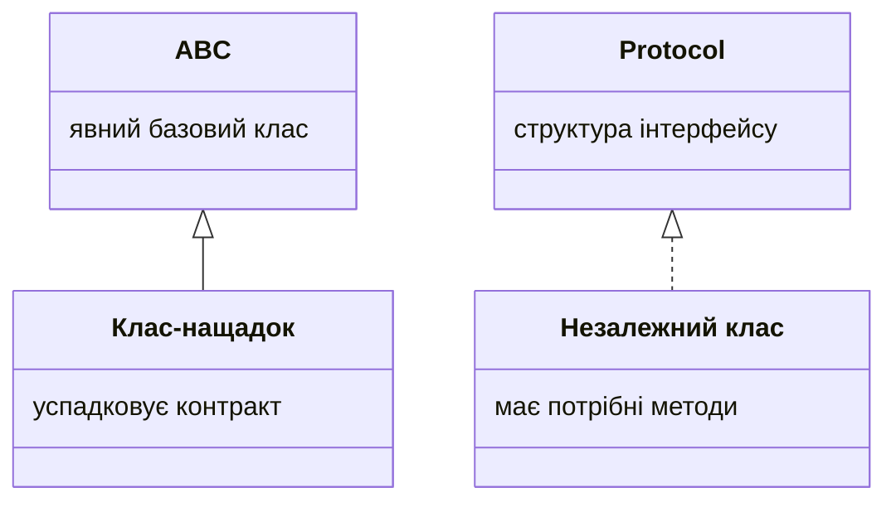

# super, протоколи та абстракції колекцій

## Розширення поведінки через `super`

Похідний клас часто додає власний стан, а спільний залишає базовому. Конструктори повинні узгодити параметри й не дублювати перевірки. Важливо відрізняти розширення від повної заміни: метод може спершу викликати `super().method()`, а потім додати свою частину результату.

### Приклад 2. Працівники

Суми нижче – цілі навчальні гривні, не розрахунок реальної заробітної плати. Погодинна оплата множить години на ставку, окладна повертає фіксований оклад. Усі класи обіцяють невід’ємне ціле значення за один навчальний період.

```py
from abc import ABC, abstractmethod
from typing import override


class Employee(ABC):
    def __init__(self, name: str) -> None:
        if not name.strip():
            raise ValueError("Потрібне ім’я")
        self.name = name.strip()

    @abstractmethod
    def pay(self) -> int:
        raise NotImplementedError


class Hourly(Employee):
    def __init__(self, name: str, hours: int, rate: int) -> None:
        super().__init__(name)
        if not 0 <= hours <= 200 or rate < 0:
            raise ValueError("Недопустимі години або ставка")
        self.hours, self.rate = hours, rate

    @override
    def pay(self) -> int:
        return self.hours * self.rate


class Salaried(Employee):
    def __init__(self, name: str, salary: int) -> None:
        super().__init__(name)
        if salary < 0:
            raise ValueError("Від’ємний оклад")
        self.salary = salary

    @override
    def pay(self) -> int:
        return self.salary


staff: list[Employee] = [Hourly("Олена", 10, 100),
                         Salaried("Ігор", 1500)]
for worker in staff:
    print(worker.name, worker.pay())
print("Разом:", sum(worker.pay() for worker in staff))
```

```
Олена 1000
Ігор 1500
Разом: 2500
```

`typing.override` повідомляє статичному аналізатору намір перевизначити метод базового класу. Якщо помилитися в назві, інструмент може це виявити. Сам інтерпретатор не забороняє помилкове перевизначення на підставі цього декоратора. `typing.final` аналогічно позначає клас або метод, який не слід успадковувати чи перевизначати, але це статичний контракт.

`Self` з теми 8 придатний для методів, що повертають екземпляр того самого фактичного класу, наприклад альтернативного конструктора. Він не означає «довільний об’єкт базового типу». Повна перевірка типізації та запуск аналізатора – тема 16. <https://docs.python.org/3.14/library/typing.html>.

## Протоколи та структурна типізація

ABC зазвичай задає явне походження від спільної основи. `typing.Protocol` задає **структуру**: які атрибути й методи потрібні споживачеві. Незалежний клас може відповідати протоколу, не записуючи його у списку баз. Це особливо зручно, коли клас зовнішній або спільна роль не означає спільну природу об’єктів. <https://typing.python.org/en/latest/spec/protocol.html>.



Рис. 9.2. Явне наслідування та структурний контракт {.caption}

### Приклад 3. Друк звітів незалежних класів

```py
from typing import Protocol, runtime_checkable


@runtime_checkable
class Printable(Protocol):
    def render(self) -> str: ...


class Receipt:
    def __init__(self, total: int) -> None:
        self.total = total

    def render(self) -> str:
        return f"До сплати: {self.total}"


class Notice:
    def __init__(self, text: str) -> None:
        self.text = text

    def render(self) -> str:
        return f"Увага: {self.text}"


def print_report(item: Printable) -> None:
    print(item.render())


items: list[Printable] = [Receipt(150), Notice("Збори о 12:00")]
for item in items:
    print_report(item)
print(isinstance(items[0], Printable))
```

```
До сплати: 150
Увага: Збори о 12:00
True
```

Клас `Receipt` не успадковує `Printable`, але має потрібний метод із сумісною сигнатурою. Типізований споживач бачить мінімальний контракт, а не всі деталі рахунка. Крапки в тілі методу протоколу позначають опис без реалізації для використання як звичайного об’єкта.

`@runtime_checkable` дозволяє простий `isinstance` із протоколом. Він перевіряє наявність потрібних членів, але не їхні типи, сигнатури чи правильність результату. Об’єкт із `render(x)` може пройти таку перевірку, хоча виклик `render()` зламається. Не використовуйте цей декоратор як повну валідацію плагіна. Без нього звичайний протокол не призначений для `isinstance`.

Дані протоколу мають додаткові обмеження для `issubclass`: перевірка класу не може загалом довести атрибути, що створюються лише в конструкторі. У цій темі використовуйте протоколи переважно як статичний контракт параметрів. `runtime_checkable` залишайте для простих перевірок можливостей із чітким розумінням їхніх меж.

## Абстракції стандартних колекцій

`collections.abc` містить ролі `Iterable`, `Sized`, `Sequence`, `Mapping` та інші: <https://docs.python.org/3.14/library/collections.abc.html>. Якщо функції потрібен лише обхід, анотуйте `Iterable[T]`, а не примушуйте клієнта створювати список. Якщо потрібні індекси й довжина, `Sequence[T]` описує точніший контракт. Якщо функція змінює колекцію, незмінної абстракції недостатньо.

```py
from collections.abc import Iterable, Mapping, Sized


def total(values: Iterable[int]) -> int:
    return sum(values)


print(total(x * x for x in range(4)))
print(isinstance([1, 2], Sized))
print(isinstance({"A": 1}, Mapping))
```

```
14
True
True
```

ABC може зареєструвати сторонній клас через `register` як віртуальний підклас. Це змінює результати `isinstance` та `issubclass`, але не додає методів і не вставляє ABC до MRO. Тому реєстрація не є способом «успадкувати реалізацію» й не перевіряє чесність оголошеного контракту.

```py
from abc import ABC, abstractmethod


class Named(ABC):
    @abstractmethod
    def name(self) -> str:
        raise NotImplementedError


class External:
    pass


Named.register(External)
item = External()
print(isinstance(item, Named))
print(hasattr(item, "name"))
```

```
True
False
```

Приклад навмисно показує небезпечну неправдиву реєстрацію. У готовій програмі реєструйте лише клас, поведінка якого перевірена. Для структурного опису часто прозоріший Protocol.
