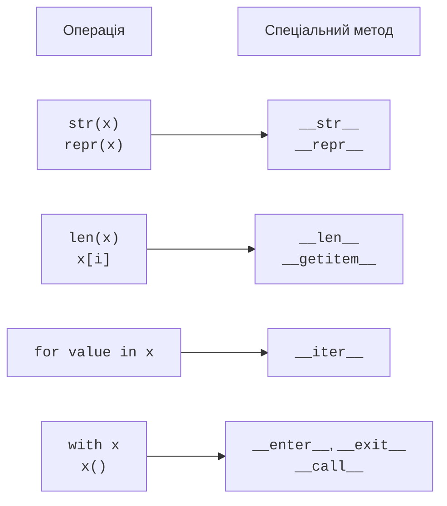
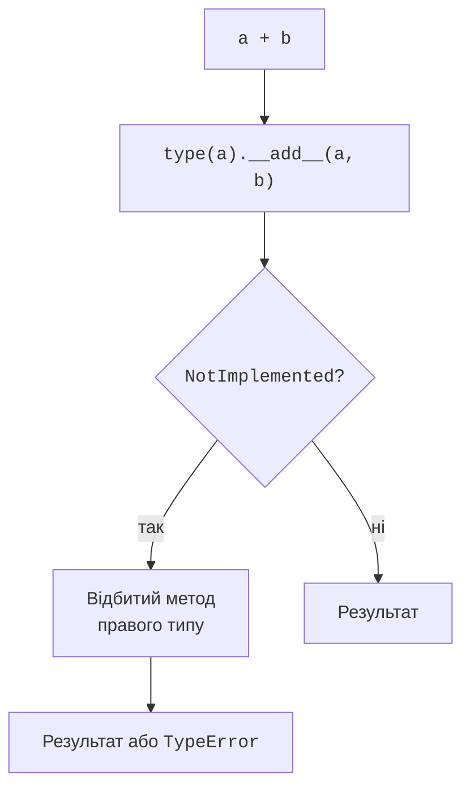

# Модель даних і арифметичні операції

## Модель даних і спеціальні методи

**Спеціальні методи** (*special methods*) мають по дві риски підкреслення з обох боків імені, наприклад `__len__`. Їх також називають *dunder methods*. Це не довільні прикраси імен: інтерпретатор шукає конкретні методи для конкретних операцій. `len(x)` звертається до протоколу довжини, `x[i]` – до протоколу індексування. Не вигадуйте нових назв із подвійними підкресленнями: звичайному предметному методу достатньо зрозумілого імені.

Для неявних операцій Python переважно шукає метод у типі, а не у словнику окремого екземпляра. Присвоєння `x.__len__ = ...` не є надійним способом навчити `len(x)` нової поведінки. Оголошуйте метод у класі. Опис моделі даних: <https://docs.python.org/3.14/reference/datamodel.html#special-method-names>.



Рис. 10.1. Протоколи поєднують знайомі операції з поведінкою класу. {.caption}

Контракт методу важливіший за саму назву. `__len__` має повертати невід’ємне ціле, `__str__` – рядок, `__bool__` – `bool`. Якщо `__bool__` відсутній, істинність може визначатися через `__len__`: порожній контейнер хибний. За відсутності обох методів звичайний екземпляр істинний. Не змінюйте стан під час перевірки істинності: `if x` має бути передбачуваним спостереженням.

## Подання об’єкта для людини та розробника

`__repr__` формує точне діагностичне подання, яке викликає `repr`. Для простих значень бажано, щоб воно нагадувало вираз створення об’єкта. `__str__` формує зручне подання для користувача та викликається через `str` і `print`. Якщо власного `__str__` немає, зазвичай використовується `__repr__`. Представлення не повинно містити паролі чи ключі доступу навіть у налагоджувальному вікні.

`__format__(self, spec)` обслуговує `format(x, spec)` і f-рядок `f"{x:spec}"`. Специфікація є рядком, а її зміст визначає клас. Для вектора зручно передати числову специфікацію обом координатам. Тоді `.2f` означає два десяткові знаки в кожному компоненті, а не точність зберігання самого вектора.

```py
from dataclasses import dataclass


@dataclass(frozen=True)
class Point:
    x: float
    y: float

    def __str__(self) -> str:
        return f"({self.x}; {self.y})"

    def __format__(self, spec: str) -> str:
        return f"({self.x:{spec}}; {self.y:{spec}})"


p = Point(1.25, 3.5)
print(repr(p))
print(p)
print(f"{p:.1f}")
```

```
Point(x=1.25, y=3.5)
(1.25; 3.5)
(1.2; 3.5)
```

Декоратор `dataclass` тут лише скорочує оголошення полів та службових методів; його правила розглянемо нижче. Округлення `1.25` до одного знака відповідає правилам форматування Python. Об’єкт і далі зберігає початкову координату. Непідтримувана специфікація має спричиняти зрозумілу помилку, а не мовчки ігнорувати бажаний користувачем формат.

## Арифметичні операції та NotImplemented

Метод `__add__` реалізує додавання, `__sub__` – віднімання, `__mul__` – множення, `__truediv__` – звичайне ділення. Для матричного добутку передбачений `__matmul__`, якому відповідає `@`. Операції `-x` та `abs(x)` використовують `__neg__` і `__abs__`. Потрібно визначити, чи операція повертає нове значення, чи змінює наявний об’єкт; для математичного вектора природніше повертати новий, залишаючи операнди незмінними.

Коли тип правого операнда не підтримується, бінарний метод повертає спеціальний об’єкт `NotImplemented`. Це дозволяє Python спробувати відбиту операцію іншого типу. Це **не** виняток `NotImplementedError`, який піднімають для ще не реалізованої поведінки. У Python 3.14 перевірка `bool(NotImplemented)` сама спричиняє `TypeError`; не використовуйте це значення як логічну відповідь.



Рис. 10.2. Спрощений шлях додавання для різних непов’язаних типів. {.caption}

Схема не описує всі правила диспетчеризації. Якщо правий тип є строгим підкласом лівого та перевизначає відбитий метод, він може мати пріоритет. Для операндів однакового типу відбитий метод не є другою спробою після власного `NotImplemented`. Остаточна відмова арифметичної операції дає `TypeError`.

`__iadd__` обслуговує `+=` і може змінити екземпляр на місці; повернуте значення повторно присвоюється імені ліворуч. Якщо цей метод відсутній або повернув `NotImplemented`, Python використовує звичайний механізм додавання. Тому `a += b` не гарантує збереження ідентичності. Для незмінного класу цілком нормально отримати новий екземпляр. Перевіряйте вплив на інші посилання на початковий об’єкт.

### Приклад 1. Двовимірний вектор

Вектор зберігає дві скінченні координати. Для стислості в цій версії конструктор приймає числові значення згідно з контрактом; перевірка скінченності виконується після створення. Додавати можна інший вектор, множити – на скінченне число. `bool` як множник відхиляємо, хоча технічно він є підтипом `int`.

```py
from dataclasses import dataclass
from math import hypot, isfinite
from types import NotImplementedType


@dataclass(frozen=True)
class Vector:
    x: float
    y: float

    def __post_init__(self) -> None:
        if not (isfinite(self.x) and isfinite(self.y)):
            raise ValueError("координати мають бути скінченними")

    def __add__(self, other: object) -> "Vector | NotImplementedType":
        if not isinstance(other, Vector):
            return NotImplemented
        return Vector(self.x + other.x, self.y + other.y)

    def __radd__(
        self, other: object
    ) -> "Vector | NotImplementedType":
        if type(other) is int and other == 0:
            return self
        return NotImplemented

    def __mul__(self, scale: object) -> "Vector | NotImplementedType":
        if type(scale) not in (int, float):
            return NotImplemented
        return Vector(self.x * scale, self.y * scale)

    def __abs__(self) -> float:
        return hypot(self.x, self.y)

    def __bool__(self) -> bool:
        return self.x != 0 or self.y != 0

    def __format__(self, spec: str) -> str:
        return f"({self.x:{spec}}; {self.y:{spec}})"


a = Vector(3, 4)
b = Vector(1, -2)
print(f"{a + b:.1f}", abs(a), bool(Vector(0, 0)))
print(f"{sum([a, b]):.1f}", f"{a * 2:.1f}")
```

```
(4.0; 2.0) 5.0 False
(4.0; 2.0) (6.0; 8.0)
```

`sum` починає з цілого нуля. Саме його приймає `__radd__`; довільний скаляр до вектора додавати не дозволено. Вираз `a + "x"` має завершитися `TypeError`. Відбитого множення немає, тому `2 * a` також не підтримується; його можна додати окремо, якщо цього вимагає контракт. Повернення нового вектора проходить ту саму перевірку скінченності, зокрема після переповнення.
