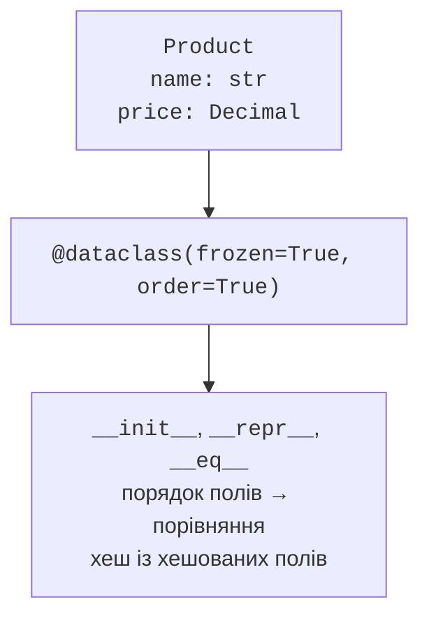
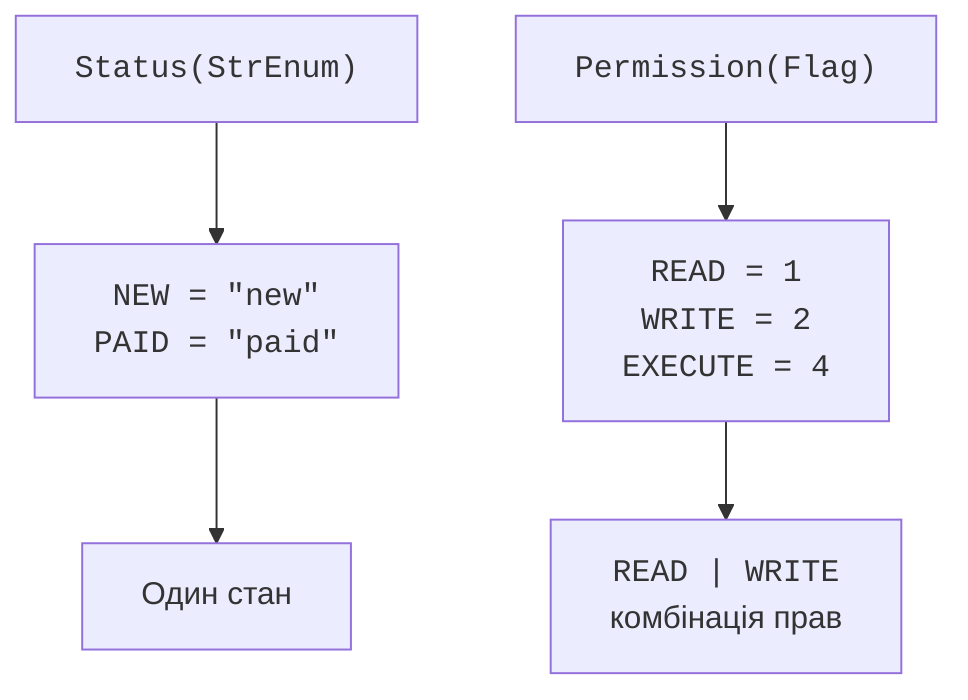

# Класи даних і переліки

## Класи даних і згенеровані методи

Декоратор `@dataclass` читає анотовані поля та генерує рутинні методи. Типово це `__init__`, `__repr__`, `__eq__`. Анотації не виконують автоматичну валідацію. Для неї служить `__post_init__`, який згенерований конструктор викликає після присвоєння полів. Якщо ви самі написали `__init__`, цей автоматичний виклик не виникає лише від наявності методу.



Рис. 10.3. Поля й параметри декоратора визначають службові методи. {.caption}

`order=True` генерує порівняння в порядку оголошення полів. Якщо спочатку оголосити ім’я, товари порівнюватимуться спочатку за ім’ям, а не за ціною. `frozen=True` забороняє звичайне переприсвоєння полів, але не робить вкладений список незмінним. `slots=True` прибирає звичайний словник полів у простому класі та обмежує додавання нових атрибутів. Це не засіб приховування даних від користувача й не заміна перевірок.

`kw_only=True` вимагає називати аргументи полів при створенні. Це допомагає уникнути переставлених ціни й кількості. `field` налаштовує окреме поле: `repr=False` приховує його з автоматичного подання, `compare=False` виключає з рівності та порядку, `default_factory=list` створює новий список для кожного об’єкта. Запис змінюваного списку як звичайного значення за замовчуванням відхиляється декоратором; фабрика має бути функцією без аргументів.

`asdict` перетворює dataclass на словник, рекурсивно опрацьовуючи вкладені класи даних; це не універсальний JSON-серіалізатор. `Decimal`, перелік або дата можуть потребувати окремої політики. `replace(obj, field=value)` створює новий екземпляр із заміненими полями й повторним проходженням конструктора та `__post_init__`. Довідка: <https://docs.python.org/3.14/library/dataclasses.html>.

::: info Знімок екрана
Ctrl+P у Product(; інспекція присвоєння frozen-полю.
:::

Рис. 10.4. Підказка згенерованих параметрів класу даних. {.caption}

`typing.NamedTuple` теж задає іменовані поля, але лишається кортежем: підтримує позиційний доступ і розпакування. Його рівність пов’язана з кортежними значеннями, тоді як dataclass зазвичай порівнює екземпляри однакового конкретного класу. Обирайте NamedTuple для природного кортежного запису, dataclass – коли важливі власні правила конструктора, поля та предметна поведінка.

## Переліки та прапорці

`Enum` задає скінченний набір іменованих значень. Член має `name` і `value`; `Color["RED"]` шукає за ім’ям, `Color(1)` – за значенням. Неправильне ім’я дає `KeyError`, неправильне значення – `ValueError`. Звичайний `Enum` не є рядком або числом, навіть якщо його значення такого типу. Це захищає від змішування різних предметних переліків.

`StrEnum` зручний для рядкових кодів статусів; `IntEnum` – для сумісності з числовими API. Така сумісність послаблює відокремлення типів, тому для внутрішньої предметної моделі звичайний `Enum` часто ясніший. `auto()` генерує значення за правилами типу: для `StrEnum` це нижній регістр імені, для `Flag` – окремі біти. `@unique` забороняє псевдоніми з однаковими значеннями.



Рис. 10.5. Перелік задає окремий стан, Flag дозволяє комбінацію ознак. {.caption}

`Flag` підтримує побітові `|`, `&`, `^`, `~` для набору ознак. Права читання й запису можуть бути ввімкнені одночасно, тому вони не є взаємовиключними статусами. `IntFlag` додатково сумісний із цілими. Для перевірки окремого права використовуйте належність або маску; сама істинність набору говорить лише, що він непорожній. Документація: <https://docs.python.org/3.14/library/enum.html>.

### Приклад 4. Товари й замовлення

Товар незмінний, ціна задається цілими копійками. Замовлення має окремий список товарів і статус. Зміна списку одного замовлення не впливає на інше завдяки `default_factory`. Порожній список дозволений для нового замовлення, але оплатити його не можна.

```py
from dataclasses import dataclass, field, replace
from enum import StrEnum, auto


class Status(StrEnum):
    NEW = auto()
    PAID = auto()


@dataclass(frozen=True, slots=True)
class Product:
    name: str
    cents: int

    def __post_init__(self) -> None:
        if not self.name.strip() or self.cents < 0:
            raise ValueError("неправильний товар")


@dataclass
class Order:
    products: list[Product] = field(default_factory=list)
    status: Status = Status.NEW

    def total(self) -> int:
        return sum(p.cents for p in self.products)

    def pay(self) -> None:
        if not self.products or self.status is not Status.NEW:
            raise ValueError("оплата недоступна")
        self.status = Status.PAID


book = Product("Книга", 12000)
first = Order([book, replace(book, cents=10000)])
second = Order()
first.pay()
print(first.total(), first.status.value)
print(len(second.products))
match first:
    case Order(status=Status.PAID):
        print("Можна передавати на доставку")
    case _:
        print("Очікуємо оплату")
```

```
22000 paid
0
Можна передавати на доставку
```

Операція `replace` не змінює `book`; друга ціна належить новому товару. Анотація `int` сама не забороняє `float` або `bool` у конструкторі: у цьому прикладі типи аргументів є контрактом виклику, а предметна валідація перевіряє назву та знак. На межі зовнішнього введення потрібно перевіряти також тип і формат до створення.

## Структурні шаблони класів

`case Point(x=0)` перевіряє тип і значення атрибута, а не викликає конструктор. Позиційний шаблон `Point(0, y)` використовує `__match_args__` – кортеж імен полів. Dataclass генерує його для полів, які допускають позиційні аргументи; `kw_only` поля до нього не входять. Іменовані шаблони краще витримують додавання нових полів.

Член переліку у шаблоні пишуть із назвою класу: `Status.PAID`. Окреме неповне ім’я зазвичай означає захоплення значення, а не порівняння з константою. Перевірки допустимих переходів статусу мають залишатися в предметних методах; сам `match` не забороняє перехід із оплаченого замовлення назад до нового.

## Перевірка типів-значень і типові помилки

Для арифметичного класу перевірте нейтральне значення, звичайні операнди, невідомий тип, відбиту операцію й незмінність початкових об’єктів. Для хешованого класу створіть два рівні незалежні екземпляри та переконайтеся, що множина об’єднує їх. Не порівнюйте саме числове значення хешу з константою: воно не є стабільним форматом збереження між запусками.

Для контейнера потрібні порожній стан, перший і останній елемент, від’ємний індекс, зріз і два незалежні обходи. Для менеджера контексту перевірте нормальний вихід і виняток у тілі. Для dataclass перевірте незалежність фабрик, заборону переприсвоєння frozen-поля та повторну валідацію під час `replace`.

- Повернення `False` для невідомого операнда заважає іншому типу виконати порівняння. Використовуйте `NotImplemented`.
- `frozen=True` зі списком усередині не дає глибокої незмінності. Для значень обирайте кортеж або інший незмінний складник.
- `order=True` сортує за порядком полів, а не за їх предметною важливістю. Задайте явний ключ сортування, якщо це інше правило.
- `__exit__` з істинним результатом приховує виняток. Повертайте `False`, якщо пригнічення не є задокументованою поведінкою.
- `__iter__`, що повертає той самий вичерпаний ітератор, робить наступний цикл порожнім. Створюйте новий обхід.
