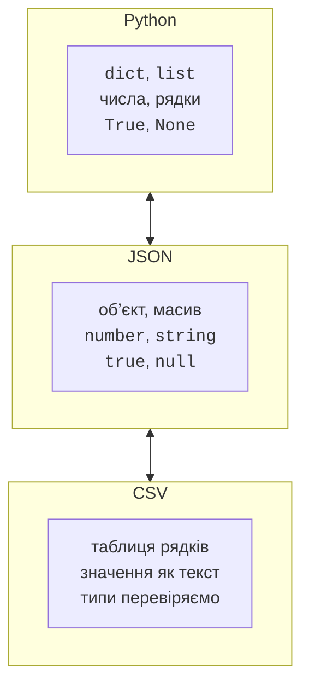

# JSON і CSV

## JSON і контракт збережених даних

JSON описує об’єкти, масиви, рядки, числа, логічні значення та `null`. У Python це здебільшого `dict`, `list`, `str`, `int`/ `float`, `bool`, `None`. Ключі JSON-об’єктів є рядками; кортеж після проходу через JSON стане списком. Клас не відновлюється автоматично з його назви: потрібно явно перевірити поля й створити екземпляр. Опис: <https://docs.python.org/3.14/library/json.html>.



Рис. 11.4. JSON зберігає структуру; у CSV типи полів задає контракт. {.caption}

`dumps` повертає рядок, `loads` читає рядок; `dump` і `load` працюють із файловим об’єктом. `ensure_ascii=False` залишає українські літери видимими, `indent=2` робить файл читабельним. `allow_nan=False` забороняє нестандартні NaN та нескінченності під час запису. На читанні предметні перевірки також потрібні: синтаксично правильний JSON може містити невідомі поля або неправильний тип суми.

### Приклад 2. Облік витрат

Файл `expenses.py` містить тип запису й дві функції збереження. Сума є додатним цілим числом копійок; `bool` не приймається як ціла сума. Завантаження повертає список лише після перевірки всіх записів. Файл із неправильними даними не виправляється мовчки. Ці функції використаємо в тестах далі.

```py
# expenses.py
import json
from dataclasses import asdict, dataclass
from pathlib import Path


@dataclass(frozen=True)
class Expense:
    category: str
    cents: int

    def __post_init__(self) -> None:
        if not isinstance(self.category, str):
            raise ValueError("категорія має бути рядком")
        if not self.category.strip():
            raise ValueError("категорія порожня")
        if type(self.cents) is not int or self.cents <= 0:
            raise ValueError("сума має бути додатним цілим")


def save(path: Path, items: list[Expense]) -> None:
    text = json.dumps([asdict(item) for item in items],
                      ensure_ascii=False, indent=2,
                      allow_nan=False)
    path.write_text(text, encoding="utf-8")


def load(path: Path) -> list[Expense]:
    data = json.loads(path.read_text(encoding="utf-8"))
    if not isinstance(data, list):
        raise ValueError("потрібен масив записів")
    result: list[Expense] = []
    for row in data:
        if not isinstance(row, dict):
            raise ValueError("запис має бути об’єктом")
        if set(row) != {"category", "cents"}:
            raise ValueError("неправильні поля запису")
        result.append(Expense(row["category"], row["cents"]))
    return result
```

Окремий файл `demo_expenses.py` запускає демонстрацію. Функції збереження не друкують повідомлень і не читають клавіатуру, тому можуть використовуватися і в іншому інтерфейсі.

```py
# demo_expenses.py
from pathlib import Path
from tempfile import TemporaryDirectory
from expenses import Expense, load, save


with TemporaryDirectory() as folder:
    path = Path(folder) / "expenses.json"
    save(path, [Expense("Транспорт", 3000), Expense("Їжа", 7500)])
    items = load(path)
    print(len(items), sum(item.cents for item in items))
```

```
2 10500
```

`JSONDecodeError` повідомляє про неправильний синтаксис, а наш `ValueError` – про порушення структури або предметних правил. Не перехоплюйте помилку лише для перезапису файла порожнім списком. Для робочого застосунку також продумують атомарну заміну файла: спочатку повністю записують тимчасовий файл поряд, потім замінюють ціль. Це захищає від часткового результату, але не розв’язує одночасне редагування кількома процесами.

## CSV як таблиця текстових полів

CSV є форматом рядків і полів із розділювачем та правилами екранування лапок. Не розбивайте його звичайним `split(";")`: поле може містити розділювач у лапках або навіть новий рядок. `csv.reader` повертає списки полів, `DictReader` використовує перший рядок як заголовки. Усі прочитані значення потребують явного перетворення типів.

Файл відкривайте з `newline=""`, щоб модуль CSV сам керував переводами рядків. Для обміну з деякими налаштуваннями Excel зручно використовувати `delimiter=";"` і `encoding="utf-8-sig"`: останнє додає або прибирає BOM. Це не гарантує однакове автоматичне визначення формату в усіх версіях Excel, тому параметри формату потрібно вказати в README. Довідка: <https://docs.python.org/3.14/library/csv.html>.

### Приклад 3. Відомість оцінок

Програма самостійно створює невелику відомість у тимчасовому каталозі, читає її та обчислює середній бал. Імена залишаються рядками, бали перетворюються на `int` із перевіркою 0..100. Перед обробкою рядків перевіряються точні заголовки.

```py
import csv
from pathlib import Path
from tempfile import TemporaryDirectory


with TemporaryDirectory() as folder:
    path = Path(folder) / "grades.csv"
    with path.open("w", encoding="utf-8-sig", newline="") as f:
        writer = csv.DictWriter(f, fieldnames=["name", "score"],
                                delimiter=";")
        writer.writeheader()
        writer.writerows([{"name": "Олена", "score": 80},
                          {"name": "Іван", "score": 90}])
    scores: list[int] = []
    with path.open(encoding="utf-8-sig", newline="") as f:
        reader = csv.DictReader(f, delimiter=";")
        if reader.fieldnames != ["name", "score"]:
            raise ValueError("неправильний заголовок")
        for row in reader:
            if None in row or not row["name"].strip():
                raise ValueError("неправильний рядок")
            score = int(row["score"])
            if not 0 <= score <= 100:
                raise ValueError("бал поза межами")
            scores.append(score)
    if not scores:
        raise ValueError("немає оцінок")
    print(f"Середній бал: {sum(scores) / len(scores):.2f}")
```

```
Середній бал: 85.00
```

Для зовнішнього файла перевіряйте також відсутні поля, дублікати ідентифікаторів і вибране правило порожніх рядків. Якщо поле `score` відсутнє, `DictReader` може дати `None`, тому до перетворення потрібна явна перевірка. У цьому самодостатньому прикладі файл створено з повною схемою; лабораторна робота вимагає валідувати сторонні вхідні дані.
