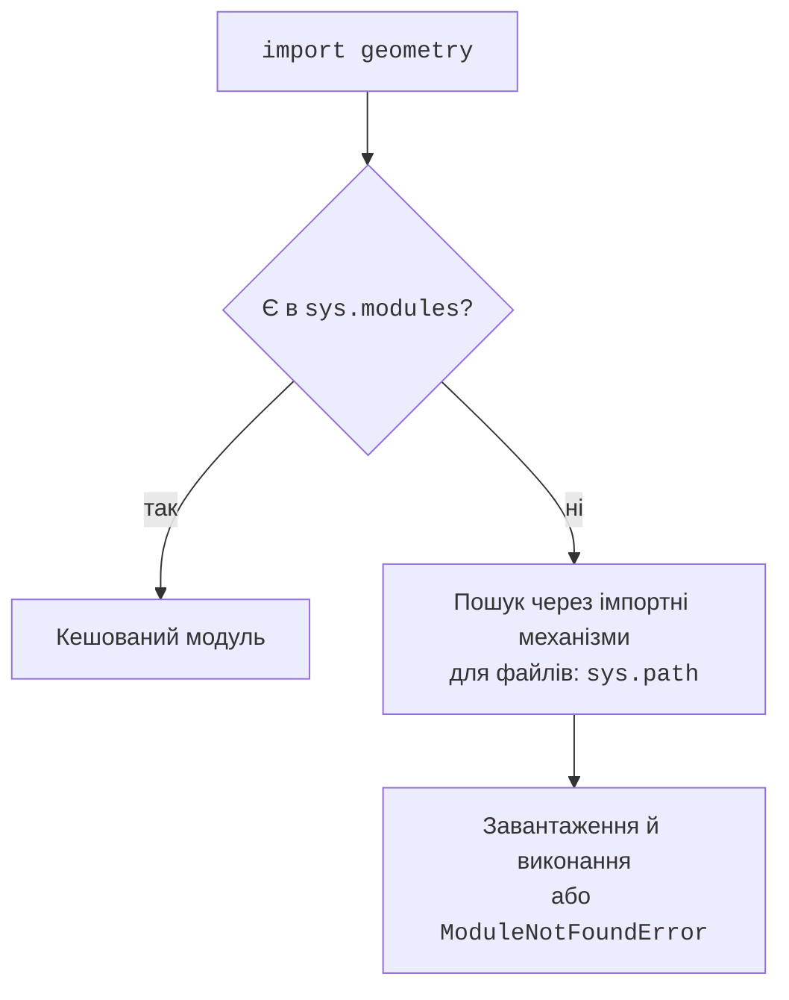
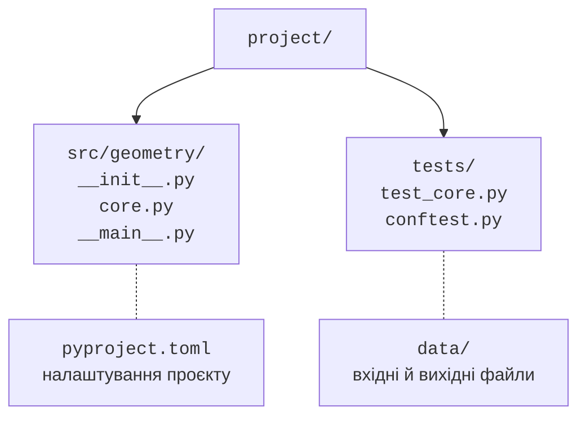

# Модулі, пакети й точка входу

## Модулі та імпорт

**Модуль** (*module*) – одиниця організації коду й простору імен. Звичайний файл `geometry.py` можна імпортувати як `geometry`. `import geometry` зв’язує ім’я модуля, а `from geometry import area` зв’язує конкретне ім’я `area`. Суфікс `.py` в імпорті не пишуть. `as` створює локальний псевдонім і не перейменовує файл. Документація: <https://docs.python.org/3.14/tutorial/modules.html>.

Перший імпорт виконує код верхнього рівня модуля. Наступні імпорти зазвичай повертають той самий об’єкт із `sys.modules`. Тому запити `input`, запис файлів і демонстраційні `print` на верхньому рівні бібліотеки є небажаними побічними ефектами. Винесіть запуск до `main()` і викликайте його під умовою `__name__ == "__main__"`. Під час звичайного імпорту `__name__` містить ім’я модуля.



Рис. 11.1. Спрощена схема імпорту без деталей користувацьких завантажувачів. {.caption}

`sys.path` містить каталоги пошуку файлових модулів. На нього впливають спосіб запуску, середовище та встановлені пакети. Вбудовані модулі й інші механізми імпорту не зводяться до простого перебирання папок. Не називайте свій файл `json.py`, `csv.py` або `pytest.py`: він може затінити бібліотеку й створити незрозумілу помилку «частково ініціалізований модуль».

Каталог `__pycache__` містить кеш байт-коду. Він пришвидшує завантаження, а не перетворює програму на незалежний виконуваний файл. Не додавайте його до репозиторію. `__all__` керує набором імен для `from module import *`, але не є механізмом захисту приватних атрибутів. У звичайному проєкті явні імпорти ясніші.

**Циклічний імпорт** виникає, коли модулі потребують один одного до завершення ініціалізації. Спільні типи або константи краще перенести до третього модуля нижчого рівня. Не лікуйте кожний цикл хаотичним перенесенням імпортів усередину функцій: спочатку перевірте напрям залежностей між частинами програми.

## Пакет і точка входу

Звичайний **пакет** (*package*) – каталог із `__init__.py`. Він може містити модулі й підпакети. Усередині пакета `from .core import area` означає відносний імпорт сусіднього модуля. `from geometry.core import area` – абсолютний. Пакети простору імен можуть не мати `__init__.py` і поєднувати частини з кількох місць, але для навчального застосунку обираємо звичайний пакет.

Файл `__main__.py` є точкою входу для `python -m geometry`. Такий запуск зберігає контекст пакета; прямий запуск `python geometry/__main__.py` може зламати відносні імпорти. Команда `-m` містить ім’я модуля, а не шлях до файла.



Рис. 11.2. Окремі каталоги коду, тестів, даних та конфігурації. {.caption}

Структура `src/` відокремлює імпортований пакет від кореня репозиторію. У готовому пакеті застосовується встановлення у середовище; докладне пакування розглядається в темі 16. Для короткого прикладу нижче пакет лежить безпосередньо в корені, тому запуск із цього кореня працює без додаткових налаштувань. Позначка *Sources Root* у PyCharm допомагає IDE, але сама по собі не встановлює пакет для звичайного термінала іншої людини.

::: info Знімок екрана
Project; src як Sources Root, tests як Test Sources Root.
:::

Рис. 11.3. Пакет, тести та налаштування в одному проєкті. {.caption}

### Приклад 1. Пакет geometry

Створіть папку `geometry` і порожній `geometry/__init__.py`. Наступний файл `geometry/core.py` містить лише обчислення. Він відхиляє нескінченний або недодатний радіус.

```py
# geometry/core.py
from math import isfinite, pi


def area(radius: float) -> float:
    if not isfinite(radius) or radius <= 0:
        raise ValueError("радіус має бути скінченним і додатним")
    result = pi * radius * radius
    if not isfinite(result):
        raise ValueError("площа завелика")
    return result
```

Другий файл – `geometry/__main__.py`. Разом із порожнім `__init__.py` і попереднім модулем це повна програма.

```py
# geometry/__main__.py
import argparse
from .core import area


def main() -> None:
    parser = argparse.ArgumentParser(description="Площа круга")
    parser.add_argument("radius", type=float)
    parser.add_argument("--digits", type=int, choices=range(5),
                        default=2)
    args = parser.parse_args()
    try:
        result = area(args.radius)
    except ValueError as error:
        parser.error(str(error))
    print(f"Площа: {result:.{args.digits}f}")


if __name__ == "__main__":
    main()
```

Виконайте з каталогу, що містить папку пакета:

```text
python -m geometry 2 --digits 3
```

```
Площа: 12.566
```

Модуль `argparse` автоматично формує довідку `--help`, перевіряє наявність позиційного аргументу та перетворює його на `float`. `choices` обмежує точність значеннями 0..4. Помилка аргументів завершує команду з кодом 2 та повідомленням у потік помилок. Предметна перевірка лишається в `area`, тому однаково працює при прямому виклику з іншої програми або тесту. Опис API: <https://docs.python.org/3.14/library/argparse.html>.
