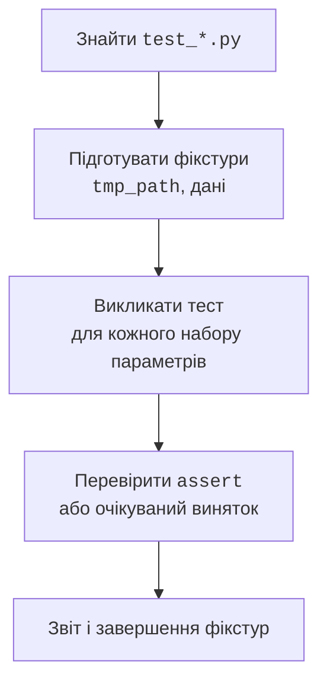

# Модульне тестування з pytest

## Модульні тести та pytest

**Модульний тест** перевіряє невелику поведінку за відомого входу. Тест складається з підготовки, дії та перевірки результату. Він має бути незалежним від порядку запуску й реальних даних користувача. Тести нижнього рівня доповнюються інтеграційними перевірками файлів і невеликою кількістю повних сценаріїв CLI. Це практичний зміст піраміди тестування, а не вимога рахувати суворе співвідношення різновидів тестів.

Встановіть pytest у середовище проєкту командою `python -m pip install pytest`. У проєкті, керованому uv, можна використати `uv add --dev pytest`. Зафіксуйте версію залежності; приклади перевірені з pytest 9.1.1. Запуск `python -m pytest -v` явно використовує pytest обраного інтерпретатора. Документація: <https://docs.pytest.org/en/stable/>.

Типові імена файлів – `test_*.py`, функцій – `test_...`. У тілі використовують звичайний `assert`; pytest показує значення частин невдалого виразу. `pytest.raises` перевіряє очікуваний виняток, `pytest.approx` – числовий результат із заданим допуском. Не округлюйте обидва числа до одного знака лише для того, щоб тест пройшов: допуск має випливати із задачі.



Рис. 11.5. Тест отримує ізольовані дані, виконує дію та перевіряє контракт. {.caption}

### Приклад 4. Тести обліку витрат

Поряд із `expenses.py` створіть `test_expenses.py`. Перший тест має три набори даних і тому виконається тричі. Другий перевіряє повний цикл збереження й читання. Фікстура `tmp_path` дає кожному виклику тесту власний тимчасовий каталог як `Path`.

```py
# test_expenses.py
from pathlib import Path
import pytest
from expenses import Expense, load, save


@pytest.mark.parametrize("amount", [0, -1, True])
def test_invalid_amount(amount: object) -> None:
    with pytest.raises(ValueError, match="додатним цілим"):
        Expense("Їжа", amount)


def test_round_trip(tmp_path: Path) -> None:
    expected = [Expense("Транспорт", 3000)]
    path = tmp_path / "expenses.json"
    save(path, expected)
    assert load(path) == expected
    assert "Транспорт" in path.read_text(encoding="utf-8")


def test_bad_shape(tmp_path: Path) -> None:
    path = tmp_path / "expenses.json"
    path.write_text('{"category": "Їжа"}', encoding="utf-8")
    with pytest.raises(ValueError, match="масив"):
        load(path)
```

Запуск `python -m pytest -q test_expenses.py` завершується п’ятьма успішними перевірками. Час у підсумку залежить від комп’ютера; значуща частина звіту – `5 passed`.

Тест неправильного типу навмисно передає значення, що суперечить анотації `int`: він перевіряє захист на межі зовнішніх даних. Статичний аналізатор може попередити про такий виклик; це не підстава прибирати перевірку. Тест має показати і нормальний контракт, і передбачену поведінку за його порушення.

## Фікстури, залежності й діагностика тестів

**Фікстура** (*fixture*) готує стан для тесту. Декоратор `@pytest.fixture` позначає функцію, а тест просить її результат параметром із таким самим ім’ям. Спільні фікстури розміщують у `conftest.py`; імпортувати цей файл у кожний тест не потрібно. Типова область життя – один тест. Надто широка область може ненавмисно зробити тести залежними від зміни спільного списку.

`capsys` захоплює стандартний вивід і потік помилок. `monkeypatch` тимчасово змінює атрибут, змінну середовища чи робочий каталог і відновлює їх після тесту. Підміняйте межу системи, наприклад `input`, а не внутрішню формулу, правильність якої збираєтеся довести. Інакше тест підтверджуватиме власну підміну замість поведінки програми.

```py
# test_console.py
import pytest


def greet() -> None:
    name = input("Ім’я: ").strip()
    print(f"Вітаю, {name}!")


def test_greet(monkeypatch: pytest.MonkeyPatch,
               capsys: pytest.CaptureFixture[str]) -> None:
    monkeypatch.setattr("builtins.input", lambda _: "Олена")
    greet()
    assert capsys.readouterr().out == "Вітаю, Олена!\n"


def test_approximation() -> None:
    assert 0.1 + 0.2 == pytest.approx(0.3, abs=1e-12)
```

Параметр `-k round_trip` відбирає тести за виразом імен, `-x` зупиняє запуск після першої відмови, `-v` показує окремі ідентифікатори. Повідомлення *FAILED* означає невдалу перевірку; *ERROR* може виникнути ще під час збору тестів або підготовки фікстури. Спочатку прочитайте першу причину, а не намагайтеся виправити всі рядки трасування одночасно.

::: info Знімок екрана
pytest -v; у копії тесту навмисно змінити очікування.
:::

Рис. 11.6. Параметризовані випадки та причина невдалої перевірки. {.caption}

## Налаштування проєкту й запуск у PyCharm

У `pyproject.toml` можна обмежити каталог тестів і ввімкнути явний режим імпорту. Для навчальної структури `src/` без встановлення пакета задаємо шлях лише для pytest:

```toml
[tool.pytest.ini_options]
testpaths = ["tests"]
pythonpath = ["src"]
addopts = "--import-mode=importlib"
```

Таке налаштування не змінює звичайний запуск `python -m package`. Для повного проєкту використовуйте встановлення пакета в середовище згідно з темою 16; не додавайте `sys.path.append` у кожний модуль. Для наведених коротких прикладів усі файли лежать у корені, тому конфігурація не потрібна.

У PyCharm виберіть pytest як засіб запуску тестів у налаштуваннях Python Integrated Tools. Запуск із позначки біля функції відкриває дерево результатів; можна повторити лише невдалі випадки. Перехід *Go to Test* за типової Windows-розкладки – Ctrl+Shift+T. Важливо, щоб IDE й термінал використовували те саме середовище. Офіційна інструкція: <https://www.jetbrains.com/help/pycharm/pytest.html>.

::: info Знімок екрана
Default test runner: pytest; перевірити інтерпретатор.
:::

Рис. 11.7. Вибір pytest у налаштуваннях Python Integrated Tools. {.caption}

::: info Знімок екрана
Run: test\_expenses.py, параметризовані ідентифікатори.
:::

Рис. 11.8. Окремі результати й деталі assertion у PyCharm. {.caption}

Покриття показує, які ділянки коду виконувалися під час тестів. Додатковий плагін `pytest-cov` може виміряти його, але сам відсоток не доводить правильність перевірок: тест може виконати функцію і не перевірити результат. Спочатку забезпечте змістовні випадки, потім використовуйте покриття для пошуку пропущених гілок. Цей плагін не є залежністю наведених прикладів.

## Типові помилки та завершення роботи

- Ім’я `json.py` затіняє стандартну бібліотеку. Перейменуйте власний модуль і перезапустіть інтерпретатор.
- Прямий запуск файла всередині пакета втрачає контекст відносних імпортів. Запускайте модуль через `-m` із правильного каталогу.
- Режим `w` обнуляє файл до запису. Не відкривайте справжню базу користувача в тесті; використовуйте `tmp_path`.
- Валідний JSON ще не означає валідний запис предметної області. Перевірте форму, ключі, типи та межі.
- `split` не реалізує правила CSV. Використовуйте модуль `csv` та перевіряйте заголовки й кількість полів.
- Тест залежить від попереднього тесту або поточної дати. Передайте залежність явно й створюйте окремий початковий стан.
