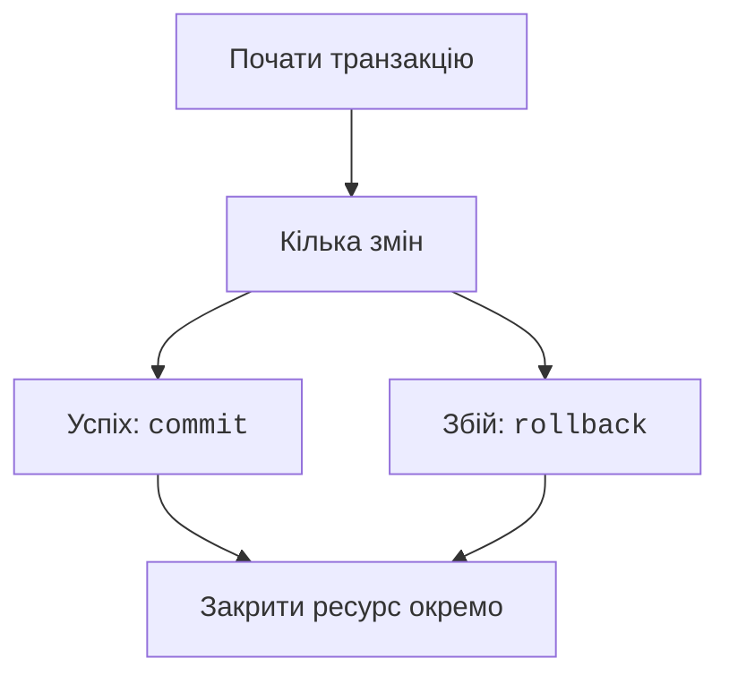

# Звіти та транзакції

## JOIN, агрегати й звіти

`INNER JOIN` повертає лише пари з відповідністю. `LEFT JOIN` зберігає всі рядки лівої таблиці, а за відсутності відповідності праві поля мають NULL. Умова на праву таблицю в `WHERE` може прибрати ці рядки; якщо потрібно зберегти ліві записи, уважно обирайте місце фільтра в `ON` або використовуйте явну перевірку NULL.

`COUNT`, `SUM`, `AVG`, `MIN`, `MAX` агрегують значення. `GROUP BY` задає групи, `HAVING` фільтрує вже отримані групи, а `WHERE` – початкові рядки. `COUNT(*)` рахує рядки, `COUNT(column)` – ненульові значення цього стовпця. Для учня без оцінок після `LEFT JOIN` це принципова різниця.

### Приклад 2. Облік успішності

Створимо студентів і оцінки, включивши студента без оцінок. Зовнішній ключ ввімкнений до транзакції. `LEFT JOIN` залишає всіх студентів, `COUNT(g.score)` дає нуль для відсутніх оцінок. Для сортування використовуємо ідентифікатор.

```py
import sqlite3
from contextlib import closing


with closing(sqlite3.connect(":memory:", autocommit=True)) as db:
    db.execute("PRAGMA foreign_keys=ON")
    db.autocommit = False
    with db:
        db.execute("""CREATE TABLE students (
            id INTEGER PRIMARY KEY, name TEXT NOT NULL)""")
        db.execute("""CREATE TABLE grades (
            student_id INTEGER NOT NULL REFERENCES students(id),
            score INTEGER NOT NULL CHECK(score BETWEEN 0 AND 100))""")
        db.executemany("INSERT INTO students VALUES(?,?)",
                       [(1, "Олена"), (2, "Іван"), (3, "Марія")])
        db.executemany("INSERT INTO grades VALUES(?,?)",
                       [(1, 80), (1, 100), (2, 70)])
    query = """SELECT s.name, COUNT(g.score), AVG(g.score)
        FROM students AS s
        LEFT JOIN grades AS g ON g.student_id=s.id
        GROUP BY s.id, s.name
        ORDER BY s.id"""
    for name, count, average in db.execute(query):
        text = "немає" if average is None else f"{average:.1f}"
        print(name, count, text)
```

```
Олена 2 90.0
Іван 1 70.0
Марія 0 немає
```

Для груп із середнім від 80 додайте `HAVING AVG(g.score)>=80` перед `ORDER BY`. Студент без оцінок не має середнього, а не має середній нуль. `CREATE VIEW` дозволяє дати ім’я повторюваному запиту; звичайне представлення зберігає запит, а не окрему копію всіх його результатів. Підзапит можна використати, наприклад, для порівняння оцінки із загальним середнім.

SQLite не має окремого універсального типу календарної дати. Для простих задач зберігайте `YYYY-MM-DD` як TEXT і перевіряйте через `date.fromisoformat` до запису. Не покладайтеся на застарілі типові адаптери дат `sqlite3`: від Python 3.12 їх оголошено застарілими. Формат та часовий пояс мають бути явною домовленістю.

## Транзакції та відновлення після помилки

**Транзакція** об’єднує кілька змін в одну логічну операцію. Або всі необхідні зміни підтверджуються, або жодна не залишається. Наприклад, імпорт десяти рядків із неправильним одинадцятим не повинен лишати невідомо яку частину імпорту. `commit` підтверджує, `rollback` відновлює попередній стан.



Рис. 12.6. Успіх і відмова мають різні транзакційні завершення. {.caption}

`IntegrityError` повідомляє про порушення обмеження, наприклад унікальності; `OperationalError` може означати неправильний SQL, відсутню таблицю або блокування. Не перехоплюйте помилку всередині `with db`, якщо хочете, щоб контекст автоматично відкотив зміни: перехоплена без повторного підняття помилка виглядатиме як успіх.

### Приклад 3. Атомарний імпорт замовлень

У цьому прикладі дані вже перевірені за формою й подані списком пар, як після читання CSV. Другий новий рядок повторює номер наявного замовлення. Обидва рядки нового пакета мають бути відкочені, хоча перший окремо допустимий.

```py
import sqlite3
from contextlib import closing


with closing(sqlite3.connect(":memory:", autocommit=False)) as db:
    with db:
        db.execute("""CREATE TABLE orders (
            id INTEGER PRIMARY KEY,
            cents INTEGER NOT NULL CHECK(cents > 0))""")
        db.execute("INSERT INTO orders VALUES(1,1000)")
    try:
        with db:
            db.executemany("INSERT INTO orders VALUES(?,?)",
                           [(2, 2000), (1, 3000)])
    except sqlite3.IntegrityError:
        print("Імпорт скасовано")
    rows = db.execute("SELECT id,cents FROM orders ORDER BY id")
    print(rows.fetchall())
```

```
Імпорт скасовано
[(1, 1000)]
```

Зовнішніх ключів тут немає, тому підключення може одразу використовувати `autocommit=False`. Для великого імпорту `executemany` не означає автоматичної атомарності саме по собі: її задає транзакційна межа. Після успішного імпорту перевіряйте підсумки, а після відмови – незмінність початкових рядків.
