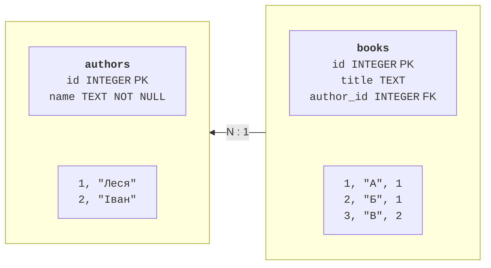
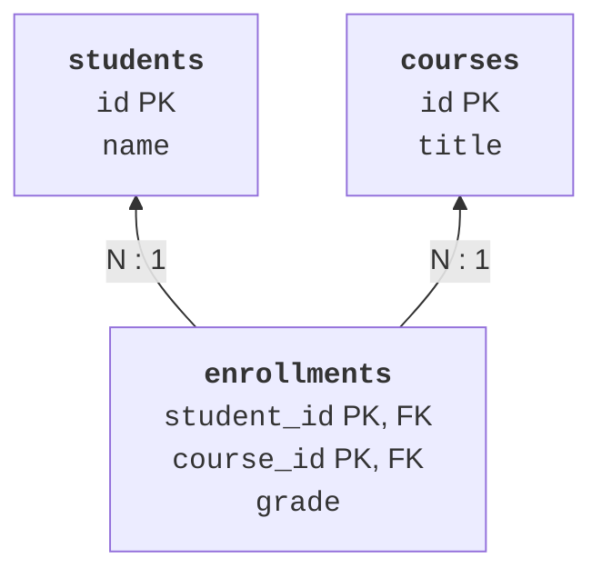

# Реляційна модель і SQL

## Реляційна модель і зв’язки

**Таблиця** описує записи одного виду; **рядок** – конкретний запис, **стовпець** – його властивість. **Первинний ключ** (*primary key*, PK) ідентифікує рядок. Ім’я людини не підходить як універсальний ключ: імена можуть повторюватися й змінюватися. **Зовнішній ключ** (*foreign key*, FK) посилається на ключ іншої таблиці та дозволяє перевіряти цілісність зв’язку.



Рис. 12.1. Один автор може мати багато книг; книга посилається на автора. {.caption}

Зв’язок 1:N реалізується зовнішнім ключем на боці багатьох. Для M:N потрібна проміжна таблиця: студент може вивчати багато дисциплін, дисципліна має багато студентів. Пара ключів у таблиці записів на курс може бути складеним первинним ключем; оцінка належить саме цьому зв’язку, а не студенту чи дисципліні окремо. Зв’язок 1:1 потребує додаткової унікальності зовнішнього ключа.



Рис. 12.2. Зв’язок M:N та оцінка як властивість запису на дисципліну. {.caption}

Нормалізація зменшує суперечливе дублювання. У першій нормальній формі поле не містить списку незалежних значень, який треба розбирати як окрему таблицю. У другій неключове поле залежить від усього складеного ключа, а не його частини. У третій усувають зайві транзитивні залежності неключових атрибутів. Тому ім’я викладача краще зберігати у таблиці викладачів, а в дисципліні – його ідентифікатор, а не повторюваний текст.

## SQLite та схема таблиць

SQLite працює як бібліотека в процесі застосунку й зазвичай зберігає базу у файлі. Окремий сервер для лабораторної не потрібний. Це зручно для локальних застосунків і тестів; велика кількість одночасних записувачів або централізований доступ багатьох клієнтів можуть вимагати серверної СКБД, наприклад PostgreSQL. У цій роботі всі обов’язкові приклади залишаються на SQLite. SQL-довідка: <https://sqlite.org/lang.html>.

Звичайна SQLite-таблиця має гнучку типізацію; значення належать класам зберігання NULL, INTEGER, REAL, TEXT, BLOB. Таблиця `STRICT` посилює перевірку допустимих типів стовпців і доступна від SQLite 3.37. Перевіряйте версію вбудованої бібліотеки через `sqlite3.sqlite_version`, а не лише номер Python. Опис: <https://sqlite.org/stricttables.html>.

Оператор `CREATE TABLE` задає схему. `NOT NULL` забороняє відсутнє значення, `UNIQUE` – повтор, `CHECK` – порушення умови, `DEFAULT` – значення при пропуску стовпця. `INTEGER PRIMARY KEY` у звичайній SQLite-таблиці пов’язаний із `rowid`; додаткове слово `AUTOINCREMENT` не потрібне лише для автоматичного номера.

```sql
CREATE TABLE contacts (
  id INTEGER PRIMARY KEY,
  name TEXT NOT NULL CHECK (length(trim(name)) > 0),
  phone TEXT NOT NULL UNIQUE
) STRICT;
```

Схема не є повною перевіркою введення: наприклад, унікальний телефон може все одно мати неправильний формат. Валідація на межі програми дає зручне повідомлення, а обмеження бази захищає дані від іншого клієнта або помилки в коді. Обидва рівні потрібні. `ALTER TABLE` змінює схему з можливостями конкретної СКБД, `DROP TABLE` видаляє таблицю разом із даними.

`CREATE INDEX` прискорює відповідні пошуки, але потребує місця й роботи при зміні рядків. Не індексуйте кожний стовпець без аналізу запитів. Зовнішні ключі в SQLite слід явно вмикати `PRAGMA foreign_keys=ON` для кожного з’єднання **поза транзакцією**. Перевірка: `PRAGMA foreign_keys` має повернути 1. Документація: <https://sqlite.org/foreignkeys.html>.

::: info Знімок екрана
sqlite3 school.db; .tables; .schema; .mode table.
:::

Рис. 12.3. Перегляд схеми й рядків у консолі SQLite. {.caption}

## Зміна даних і вибірки SQL

`INSERT` додає рядок, `UPDATE` змінює, `DELETE` видаляє. Перш ніж виконувати `UPDATE` або `DELETE`, перевірте умову `WHERE`: без неї дія стосується всіх рядків. `RETURNING` повертає дані змінених рядків у сучасній SQLite; для простого додавання одного рядка через Python також доступний `lastrowid`. `ON CONFLICT ... DO UPDATE` описує оновлення при конкретному конфлікті унікальності; це не універсальне ігнорування помилок.

`SELECT` задає потрібні стовпці. `WHERE` відбирає рядки, `ORDER BY` задає порядок, `LIMIT` і `OFFSET` – частину вибірки. Без `ORDER BY` порядок не гарантований. Для стабільної сторінки додайте унікальний ключ як останній критерій сортування. `DISTINCT` прибирає однакові результати вибраних стовпців.

Умови можуть містити `BETWEEN`, `IN`, `LIKE` та порівняння. `LIKE` використовує `%` для довільної послідовності та `_` для одного символу; це шаблон, а не регулярний вираз. Для відсутнього значення використовуйте `IS NULL`, а не `= NULL`: SQL має окрему логіку невідомого значення. Python `None` передається драйвером як SQL NULL.

```sql
SELECT id, name, phone
FROM contacts
WHERE name LIKE ?
ORDER BY name, id
LIMIT ? OFFSET ?;
```

Знаки `?` у цьому фрагменті є місцями параметрів Python. Якщо ви виконуєте запит вручну у GUI-консолі, її механізм параметрів може відрізнятися. Логіка вибірки лишається тією самою. Параметри не можуть замінити назву таблиці чи стовпця: для динамічного сортування оберіть назву з фіксованого дозволеного набору, а значення фільтра передавайте окремо.
