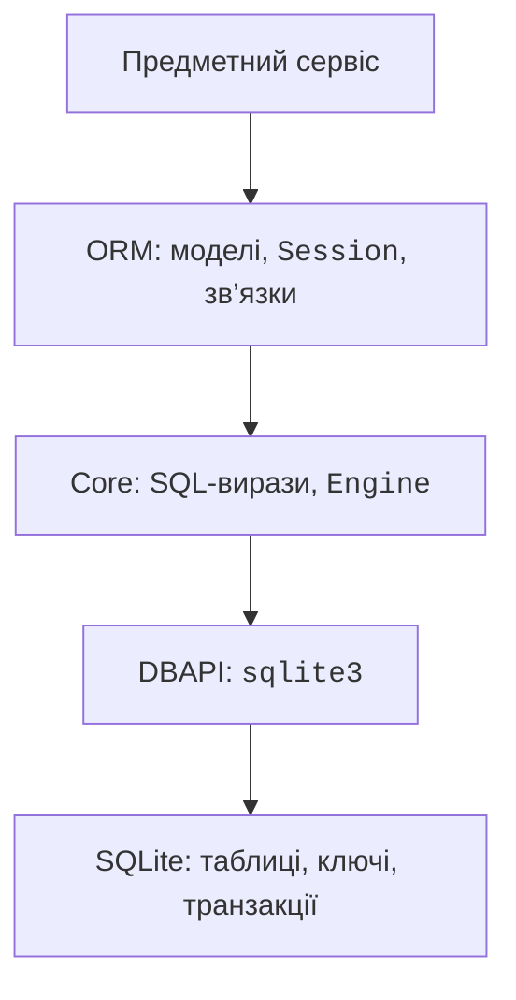
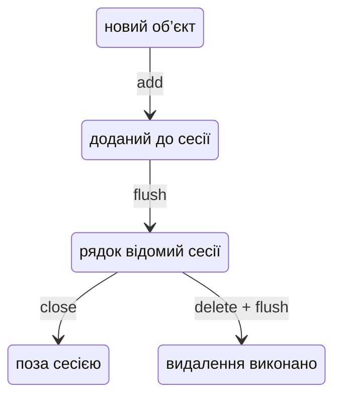

# ORM SQLAlchemy

## Перехід від SQL до SQLAlchemy

SQLAlchemy має два пов’язані рівні. **Core** будує SQL-вирази й працює з таблицями та з’єднаннями. **ORM** (*object-relational mapping*) відображає класи на таблиці, атрибути на стовпці, екземпляри на рядки. Це зменшує рутинне перетворення даних, але додає життєвий цикл сесії, правила завантаження та власні винятки. Виведений SQL потрібно вміти прочитати.



Рис. 12.7. ORM використовує Core і драйвер, а правила зберігання лишаються в СКБД. {.caption}

Приклади перевірені зі стабільною SQLAlchemy 2.0.54. Встановлення в середовище: `python -m pip install SQLAlchemy`. Використовуємо стиль 2.0: `DeclarativeBase`, `Mapped`, `mapped_column`, `select`, `Session.scalars`. Старий навчальний код із `session.query` не змішуємо з ним. Початковий посібник: <https://docs.sqlalchemy.org/en/20/orm/quickstart.html>.

`Engine` містить конфігурацію доступу до СКБД і керує з’єднаннями. URL `sqlite:///shop.db` позначає відносний файл, `sqlite://` у наших однопотокових прикладах – базу в пам’яті. `echo=True` показує SQL і допомагає розуміти запити; не вмикайте його бездумно для журналу з приватними параметрами. Для сирого SQL у Core використовуйте `text()` і параметри, не конкатенацію.

## Декларативні моделі й сесія

Клас-нащадок `DeclarativeBase` містить спільні метадані. У моделі `__tablename__` задає таблицю, `Mapped[int]` описує відображений атрибут, `mapped_column(primary_key=True)` – ключ. `Mapped[str | None]` за типовими правилами допускає NULL, `Mapped[str]` – ні. Обмеження `String(100)` не означає, що SQLite сама перевірить довжину 100: за потреби додайте `CHECK`.

`Base.metadata.create_all(engine)` створює відсутні таблиці. Ця команда не є системою міграцій: зміна класу не перетворить наявний стовпець автоматично. Для нової навчальної бази її достатньо; для збережених робочих даних потрібен контрольований план зміни схеми.

`Session` відстежує об’єкти й накопичує зміни. `add` додає об’єкт до одиниці роботи; `flush` надсилає необхідний SQL, але не підтверджує транзакцію. `commit` підтверджує, `rollback` скасовує. Контекст `with Session(engine) as session` закриває сесію, але сам по собі не обіцяє commit. Для чіткої межі використовуйте додатковий `with session.begin():`.



Рис. 12.8. Основні стани ORM-об’єкта; rollback може змінити цей шлях. {.caption}

Новий об’єкт має стан *transient*; після `add` – *pending*, після вставлення – *persistent*. Закриття сесії від’єднує об’єкти (*detached*). Карта ідентичності означає, що в одній сесії один ключ відповідає одному відстежуваному екземпляру; це не кеш усіх запитів між процесами.

За типовим `expire_on_commit=True` атрибути після commit можуть потребувати повторного завантаження. Звернення до ще не завантаженого зв’язку після закриття сесії може дати `DetachedInstanceError`. Читайте потрібні дані в межах сесії або явно завантажуйте їх і перетворюйте на окремі результати. Після невдалого flush потрібний rollback перед подальшим використанням цієї сесії.

## Зв’язки та запити ORM

`ForeignKey` задає обмеження на рівні таблиці, `relationship` описує навігацію між об’єктами. Це різні речі: атрибут `author` не замінює стовпець `author_id`. Пара `back_populates` узгоджує дві сторони. `cascade="all, delete-orphan"` описує керування дочірніми об’єктами в ORM і доречна лише при справжньому володінні. Вона не тотожна `ON DELETE CASCADE` у базі.

Для M:N використовуйте проміжну таблицю. Якщо зв’язок має кількість, оцінку чи дату, зручно відобразити його окремим асоціативним класом. Наприклад, `Enrollment` містить два зовнішні ключі й оцінку. Не зберігайте ідентифікатори списком у текстовому полі лише тому, що ORM дозволяє працювати зі списками в Python.

Запит `select(Book).where(Book.title == title)` є SQL-виразом. `session.scalars(stmt).all()` повертає список об’єктів, `session.execute(stmt)` – рядки результату, `session.get(Model,id)` шукає за первинним ключем. Для групування використовуються `func.count`, `func.sum`, `group_by`; `order_by` визначає порядок. Для SQL-логіки застосовуйте `and_`, `or_` або оператори виразів із правильними дужками, а не Python `and` і `or`.

### Приклад 4. Автори та книги через ORM

Повна програма нижче створює дві моделі й одну пару зв’язків. Подія підключення вмикає зовнішні ключі для кожного нового DBAPI-з’єднання, тимчасово виходячи з транзакційного режиму. Тип `ConnectionPoolEntry` описує другий аргумент події.

```py
# authors_orm.py
import sqlite3
from sqlalchemy import ForeignKey, create_engine, event, select
from sqlalchemy.orm import DeclarativeBase, Mapped, Session
from sqlalchemy.orm import mapped_column, relationship, selectinload
from sqlalchemy.pool import ConnectionPoolEntry


class Base(DeclarativeBase):
    pass


class Author(Base):
    __tablename__ = "authors"
    id: Mapped[int] = mapped_column(primary_key=True)
    name: Mapped[str]
    books: Mapped[list["Book"]] = relationship(
        back_populates="author", cascade="all, delete-orphan")


class Book(Base):
    __tablename__ = "books"
    id: Mapped[int] = mapped_column(primary_key=True)
    title: Mapped[str]
    author_id: Mapped[int] = mapped_column(ForeignKey("authors.id"))
    author: Mapped[Author] = relationship(back_populates="books")


engine = create_engine("sqlite://",
                       connect_args={"autocommit": False})


@event.listens_for(engine, "connect")
def foreign_keys(db: sqlite3.Connection,
                 record: ConnectionPoolEntry) -> None:
    previous = db.autocommit
    db.autocommit = True
    cursor = db.execute("PRAGMA foreign_keys=ON")
    cursor.close()
    db.autocommit = previous


Base.metadata.create_all(engine)
with Session(engine) as session:
    with session.begin():
        author = Author(name="Леся")
        author.books = [Book(title="Ліс"), Book(title="Місто")]
        session.add(author)
    query = select(Author).options(selectinload(Author.books))
    for author in session.scalars(query.order_by(Author.id)):
        titles = sorted(book.title for book in author.books)
        print(author.name, ", ".join(titles))
engine.dispose()
```

```
Леся Ліс, Місто
```

`selectinload` завантажує колекції додатковим груповим запитом. Без явної стратегії доступ до книг кожного автора може створити окремий запит: один запит авторів плюс N запитів книг, тобто проблему N+1. Для великої кількості рядків навіть групове завантаження може розбиватися на кілька запитів. `joinedload` завантажує через JOIN; для колекцій потрібно враховувати дублікати рядків і вимогу `unique()` в результаті. Опис: <https://docs.sqlalchemy.org/en/20/orm/queryguide/relationships.html>.

::: info Знімок екрана
У копії authors\_orm.py додати echo=True; показати INSERT і SELECT.
:::

Рис. 12.9. SQL, згенерований ORM для створення та завантаження зв’язку. {.caption}
