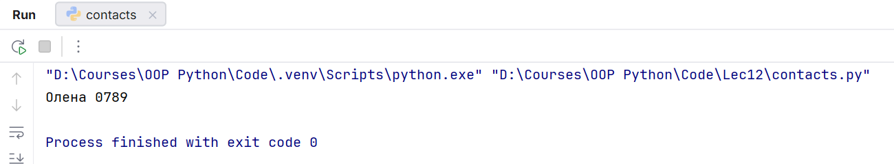
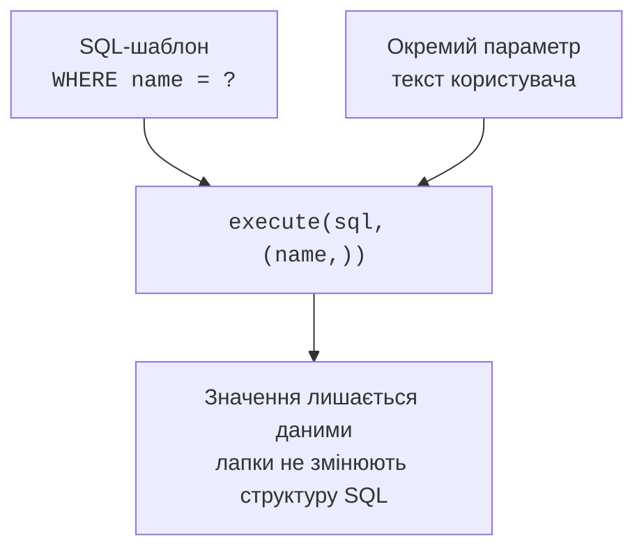

# Модуль sqlite3 і параметри запитів

## API sqlite3 та керування ресурсом

`connect` створює `Connection`, `execute` повертає `Cursor`. Із курсора можна читати один рядок `fetchone`, усі `fetchall` або перебирати результати циклом. `fetchone` повертає `None`, якщо рядка немає. `executemany` повторює один параметризований оператор для багатьох наборів параметрів. `executescript` призначений для фіксованого SQL-сценарію, не для введення користувача та не як заміна параметризації.

У Python 3.14 явно задаємо режим транзакцій. Значення `autocommit=False` підтримує відкриту транзакцію, а після `commit` або `rollback` починає нову. Для налаштування зовнішніх ключів спочатку підключаємося з `autocommit=True`, вмикаємо PRAGMA, потім переходимо до `False`. Не покладаємося на поточне типове значення `LEGACY_TRANSACTION_CONTROL`.

Контекст `with connection:` фіксує або відкочує транзакцію, але **не закриває з’єднання**. Зовнішній `contextlib.closing` закриває його при виході. Закриття не є способом підтвердження змін: невиконаний `commit` може втратити роботу. Довідка: <https://docs.python.org/3.14/library/sqlite3.html>.

### Приклад 1. Телефонний довідник

Невелика база в пам’яті демонструє додавання, читання, зміну й видалення. `sqlite3.Row` дозволяє звертатися до стовпців за іменами. Телефон зберігається рядком, щоб не втратити початковий нуль. Дані навчальні; база в пам’яті зникає після закриття.

```py
import sqlite3
from contextlib import closing


with closing(sqlite3.connect(":memory:", autocommit=True)) as db:
    db.execute("PRAGMA foreign_keys=ON")
    db.autocommit = False
    db.row_factory = sqlite3.Row
    with db:
        db.execute("""CREATE TABLE contacts (
            id INTEGER PRIMARY KEY,
            name TEXT NOT NULL CHECK(length(trim(name)) > 0),
            phone TEXT NOT NULL UNIQUE) STRICT""")
        db.executemany("INSERT INTO contacts(name,phone) VALUES(?,?)",
                       [("Олена", "0123"), ("Іван", "0456")])
    with db:
        db.execute("UPDATE contacts SET phone=? WHERE name=?",
                   ("0789", "Олена"))
        db.execute("DELETE FROM contacts WHERE name=?", ("Іван",))
    for row in db.execute("SELECT name,phone FROM contacts"):
        print(row["name"], row["phone"])
```

```
Олена 0789
```

Одноелементний набір параметрів записано `("Іван",)` із комою. Без коми це рядок, який драйвер не повинен трактувати як потрібний кортеж. Для збереження між запусками замініть `:memory:` на окремий файл, наприклад `contacts.db`, і відокремте створення схеми від повторного додавання демонстраційних даних.



Рис. 12.4. Параметризовані зміни та результат довідника. {.caption}

## Параметри та SQL-ін’єкція

SQL-ін’єкція виникає, коли введений текст стає частиною синтаксису команди. Фрагмент на кшталт `' OR '1'='1` у неправильно зібраному рядку може змінити умову. Не екрануйте його вручну й не вставляйте через f-рядок. Передайте SQL-шаблон та значення різними аргументами. Драйвер зв’яже параметр як дані, незалежно від наявності лапок.



Рис. 12.5. Структура запиту відокремлена від значення пошуку. {.caption}

Замість позиційних `?` можна використовувати іменовані параметри `:name` та словник. Обирайте один стиль у межах запиту. Параметризація не перевіряє предметні межі: від’ємна кількість є безпечним SQL-параметром, але неправильним замовленням. Для перевірки захисту додайте тест із лапкою в звичайному імені та з рядком, схожим на SQL: обидва мають лишатися текстом.
