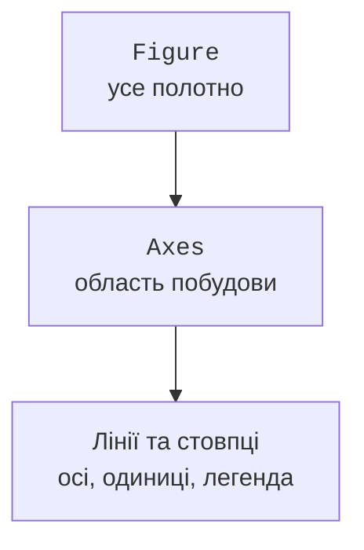

# Групування, часові ряди та графіки

## Групування, об’єднання та часові ряди

`groupby` ділить записи за ключем, після чого агрегування дає один підсумок для кожної групи. Використовуйте іменовані результати `agg`, щоб назви вихідних стовпців відповідали змісту. За замовчуванням пропущені ключі можуть не потрапляти в групи: оберіть правило `dropna` або відхиліть такі ключі раніше.

```py
import pandas as pd

frame = pd.DataFrame({"group": ["A", "B", "A"],
                      "score": [80, 90, 70]})
report = frame.groupby("group", as_index=False).agg(
    count=("score", "count"), mean=("score", "mean"))
for row in report.itertuples(index=False):
    print(f"{row.group}: {row.count}, {row.mean:.1f}")
```

Результат: `A: 2, 75.0`, `B: 1, 90.0`. `count` рахує непропущені значення стовпця, а `size` – кількість рядків. Різниця важлива, коли не всі значення виміряні. Для зведеної таблиці можна використати `pivot_table`, указавши індекс, стовпці, значення і функцію агрегування; її форма повинна бути передбачена контрактом звіту.

### Перевірка кратності merge

`merge` поєднує таблиці за ключами. Якщо ключ повторюється з обох боків, кількість рядків може зрости як добуток кількостей збігів. Для довідника з одним записом на ключ задайте `validate="many_to_one"`. Аргумент `indicator=True` допомагає виявити записи без відповідника. Повний опис: <https://pandas.pydata.org/docs/user_guide/merging.html>.

```py
import pandas as pd

orders = pd.DataFrame({"code": [1, 1, 2], "qty": [2, 3, 1]})
catalog = pd.DataFrame({"code": [1, 2], "name": ["A", "B"]})
joined = orders.merge(catalog, on="code", how="left",
                      validate="many_to_one", indicator=True)
assert joined["_merge"].eq("both").all()
print(joined["name"].tolist())
print(joined["qty"].sum())
```

Результат: `['A', 'A', 'B']`, потім `6`. Контроль кількості рядків та загальної кількості товару виявляє помилки, які не видно на одному фрагменті таблиці. pandas може зіставити пропущені ключі між собою – це відрізняється від звичних очікувань щодо SQL NULL. Тому ключі довідника перевіряють до merge.

### Час і частота

`pd.to_datetime` перетворює рядки на часові значення. Задавайте `format`, якщо відомий формат вхідного файлу; неоднозначний запис `01/02/2026` не повинен залежати від здогаду бібліотеки. Для вимірювань із часовими поясами узгодьте один пояс або UTC. У навчальних прикладах нижче ISO-час локальний і не має переходів на літній час – це явне спрощення даних, а не загальне правило.

Після встановлення `DatetimeIndex` метод `resample` групує за інтервалами часу. Вибір `sum`, `mean` чи останнього значення залежить від фізичного змісту: енергію за інтервали додають, температуру зазвичай усереднюють. Не додавайте накопичені показання лічильника; для витрати потрібна різниця сусідніх показань і перевірка скидання лічильника.

## Графіки Matplotlib

У об’єктному стилі **Figure** є полотном, а **Axes** – областю побудови (рис. 13.5). `plt.subplots` повертає ці об’єкти. Методи `ax.plot`, `ax.bar`, `ax.scatter`, `ax.hist` додають лінії, стовпці, точки або гістограму. Назва `Axes` тут позначає цілу область, а не одну координатну вісь.



Рис. 13.5. Об’єкти полотна та області побудови {.caption}

Обирайте форму за запитанням. Лінія показує зміну впорядкованого процесу; стовпці порівнюють категорії; діаграма розсіювання – пари спостережень; гістограма – розподіл одного показника за інтервалами. З’єднання невпорядкованих категорій лінією може створити хибне враження неперервного процесу.

Для кожного графіка вкажіть назви осей, одиниці, зміст серій і за потреби легенду. У друкованій методичці розрізняйте серії не лише кольором: використовуйте маркери, штрихи та штрихування. Стовпчики зазвичай починають від нуля; обрізана шкала має бути явно пояснена. Не додавайте об’ємні ефекти, які спотворюють порівняння довжин або площ.

### Збереження та робота без вікна

`fig.savefig` зберігає файл, `plt.show` запускає інтерактивний показ, `plt.close(fig)` звільняє ресурси полотна. Для автоматичного звіту й тестів використовуйте backend `Agg`, установлений до імпорту `pyplot`. Тоді програма записує PNG і не чекає закриття вікна. `layout="constrained"` допомагає розмістити підписи, але не звільняє від візуальної перевірки довгих назв.

```py
import matplotlib
matplotlib.use("Agg")
import matplotlib.pyplot as plt

fig, ax = plt.subplots(figsize=(5, 3), layout="constrained")
ax.bar(["A", "B"], [75, 90], color="0.75", edgecolor="black")
ax.set(xlabel="Група", ylabel="Середній бал", ylim=(0, 100))
fig.savefig("scores.png", dpi=160)
plt.close(fig)
print("Збережено scores.png")
```

Графік повинен бути висновком із перевірених даних. Нуль у порожній групі та відсутність групи мають різний зміст; підписи повинні відбивати обране правило. Кореляція двох показників не доводить причинного зв’язку, а маленька навчальна вибірка не є репрезентативним дослідженням населення.
