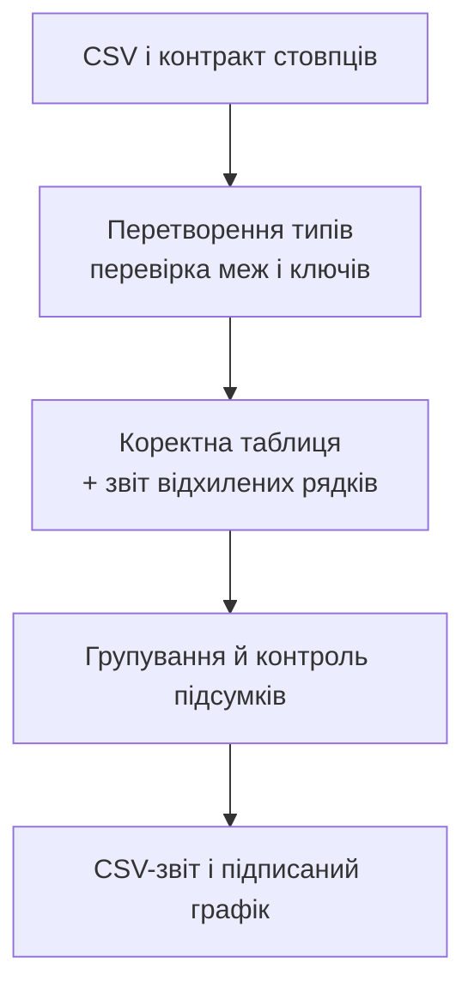

# Таблиці pandas і пропуски

## Таблиці pandas: підписи та позиції

`Series` представляє один стовпець із підписами, `DataFrame` – таблицю стовпців. У різних стовпцях можуть бути різні типи. **Індекс** (*index*) є набором міток рядків, а не обов’язково послідовністю 0, 1, 2. Ця відмінність пояснює різницю `.loc` (мітки) і `.iloc` (позиції).

```py
import pandas as pd

frame = pd.DataFrame({"group": ["A", "B", "A"],
                      "score": [80, 90, 70]}, index=[10, 20, 30])
print(frame.loc[20, "score"])
print(frame.iloc[1, 1])
print(frame.loc[frame["score"] >= 80, "group"].tolist())
```

Результат: `90`, `90`, `['A', 'B']`. Запис `frame["score"]` повертає `Series`, а `frame[["score"]]` – таблицю з одним стовпцем. У зрізі `.loc[10:20]` кінцева мітка включена за звичайного впорядкованого індексу; у `.iloc[0:2]` права позиція не включена. Щоб уникнути неочевидних припущень, для складних фільтрів на початку курсу використовуйте явні маски.

### Присвоєння та Copy-on-Write

У pandas 3 модель **Copy-on-Write** не дозволяє використовувати ланцюжок вибірок як спосіб зміни початкової таблиці. Замість `frame["score"][mask] = 0` пишіть `frame.loc[mask, "score"] = 0`. Документація: <https://pandas.pydata.org/docs/user_guide/copy_on_write.html>. Виділіть вибір і присвоєння в одну операцію та перевірте результат. Не вимикайте попередження, щоб приховати помилковий контракт.

```py
import pandas as pd

frame = pd.DataFrame({"score": [80, 90, 70]})
mask = frame["score"] < 75
frame.loc[mask, "score"] = 75
print(frame["score"].tolist())
print(frame.sort_values("score")["score"].tolist())
```

Результат: `[80, 90, 75]`, потім `[75, 80, 90]`. За замовчуванням `sort_values` повертає результат, який потрібно зберегти; сам виклик не означає зміну вихідної змінної. Операції між `Series` вирівнюються за мітками індексу, а не лише за позиціями. Якщо вони різні, можуть з’явитися пропуски – спочатку перевірте очікувані ключі.

## Введення, пропуски та контракт даних

Перед читанням CSV запишіть назви стовпців, розділювач, кодування, формати дат, допустимі одиниці й значення. `read_csv` може автоматично визначити типи, але для кодів із початковими нулями та навчальної валідації корисно спочатку прочитати текстові поля і виконати перетворення явно. Специфікація API: <https://pandas.pydata.org/docs/reference/api/pandas.read_csv.html>.

Пропуск не означає число нуль. `NaN`, `pd.NA` і `NaT` позначають відсутні дані в різних типах; перевіряйте їх через `isna`, а не рівність із `NaN`. `dropna` відкидає рядки чи стовпці, `fillna` заповнює пропуски за правилом. Обидві дії потребують пояснення: підставити нуль замість невідомого споживання – змінити зміст підсумку.

```py
from io import StringIO
import pandas as pd

source = "code;amount\n001;12\n002;bad\n003;\n"
frame = pd.read_csv(StringIO(source), sep=";", dtype="string")
frame["amount"] = pd.to_numeric(frame["amount"], errors="coerce")
bad = frame["amount"].isna()
print(frame.loc[bad, "code"].tolist())
print(frame.loc[~bad, "amount"].sum())
```

Результат: `['002', '003']`, потім `12`. `errors="coerce"` перетворює непридатне поле на пропуск, але не повідомляє сам по собі, які рядки були втрачені. Тому ми зберігаємо маску й формуємо звіт відхилення. Якщо навіть одна помилка має зупиняти імпорт, використовуйте строгий режим або явно генеруйте `ValueError`.



Рис. 13.3. Конвеєр аналізу з окремим обліком помилкових рядків {.caption}

### Перевірка меж, ключів і нескінченностей

Після перетворення чисел перевірте `isfinite`, нижню й верхню межі, цілісність там, де допускаються лише цілі. Бал 101 є числом, але неприпустимий для шкали 0–100. `duplicated` знаходить повтори за заданими стовпцями; рішення «залишити перший» не є нейтральним. Потрібно визначити, чи це копія запису, виправлення, чи окрема подія.

Порожній CSV, порожня таблиця після фільтра та відсутній обов’язковий стовпець є різними випадками. Повідомлення повинно називати причину. Перший рядок даних у файлі зазвичай має фізичний номер 2 через заголовок; не плутайте позицію `DataFrame` з номером рядка CSV. Якщо файл має багаторядкові поля в лапках, потрібен точніший контракт відстеження фізичних номерів – у наших задачах їх немає.

::: info Знімок екрана
Debug sales example after clean table creation; expand DataFrame.
:::

Рис. 13.4. Перегляд перевіреної таблиці у PyCharm {.caption}
