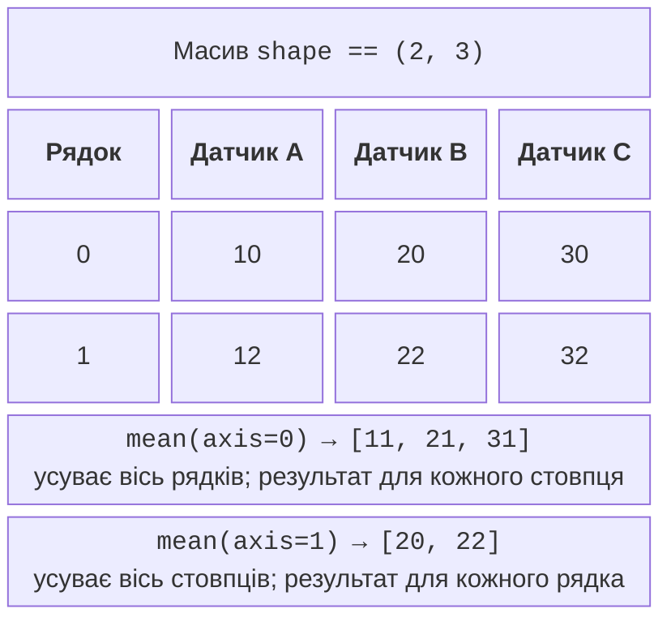
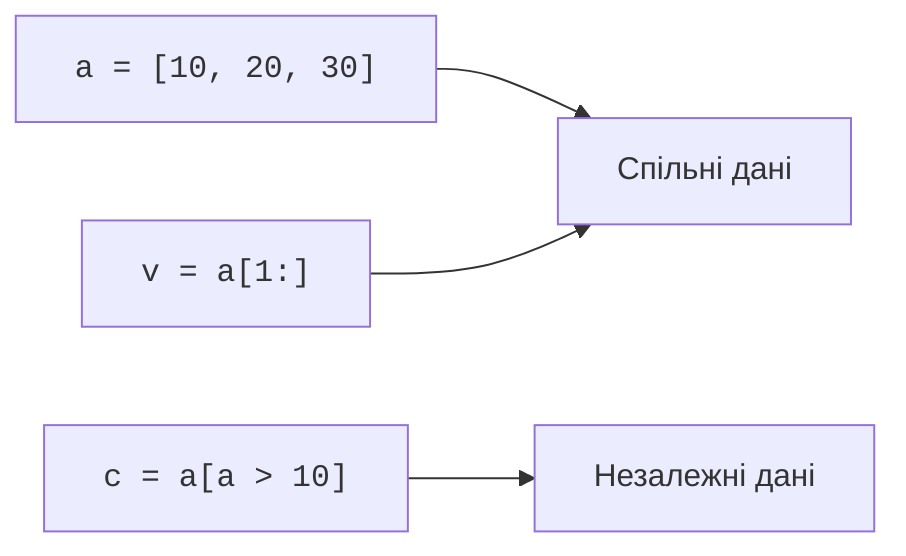

# Векторні операції та зрізи

## Векторні операції, осі та маски

**Векторизація** (*vectorization*) описує операцію відразу над усім масивом. `values + 2` додає два до кожного елемента, `values * values` множить поелементно. Оператор `@` виконує матричний добуток, тому його не слід плутати з `*`. Списки Python поводяться інакше: `[1, 2] * 2` повторює список.

```py
import numpy as np

celsius = np.array([0.0, 10.0, 20.0])
fahrenheit = celsius * 1.8 + 32
print(fahrenheit)
mask = (celsius >= 5) & (celsius <= 20)
print(mask)
print(celsius[mask])
```

Результат: `[32. 50. 68.]`, `[False True True]`, `[10. 20.]`. Порівняння повертає масив логічних значень – **маску** (*mask*). Для поелементного поєднання потрібні `&`, `|`, `~`, а не Python `and`, `or`, `not`; кожну умову беруть у дужки через пріоритети операторів. Запис `if array:` для масиву з кількох елементів не визначає, чи мається на увазі «хоча б один» або «всі». Використовуйте `mask.any()` чи `mask.all()` за змістом.

### Що усуває axis

`mean`, `sum`, `min`, `max` можуть обчислювати результат по всьому масиву або вздовж однієї осі. Аргумент `axis` називає вісь, яку потрібно згорнути. Для матриці вимірювання×датчик `axis=0` усуває вимірювання і дає результат для кожного датчика; `axis=1` усуває датчики й дає результат для кожного вимірювання (рис. 13.1).



Рис. 13.1. Осі матриці та форма результату агрегування {.caption}

```py
import numpy as np

data = np.array([[10, 20, 30], [12, 22, 32]], dtype=float)
print(data.mean(axis=0))
print(data.mean(axis=1))
print(data.sum())
print(data.mean(axis=1, keepdims=True).shape)
```

Результат: `[11. 21. 31.]`, `[20. 22.]`, `126.0`, `(2, 1)`. `keepdims=True` зберігає згорнуту вісь довжини один, що полегшує наступне віднімання середнього з кожного рядка. Порожні дані потрібно обробити до `min` або `mean`: універсального «правильного середнього» для порожньої вибірки немає.

## Зрізи, копії та поширення форми

Базовий зріз NumPy зазвичай створює **подання** (*view*), яке посилається на ті самі дані. Зміна такого подання може змінити оригінальний масив. Натомість індексація списком індексів або логічною маскою створює окремий масив (рис. 13.2). Поведінку NumPy не слід автоматично переносити на списки Python або таблиці pandas.



Рис. 13.2. Спільне сховище зрізу та незалежні дані вибірки {.caption}

```py
import numpy as np

a = np.array([10, 20, 30])
view = a[1:]
selected = a[a > 10]
view[0] = 99
selected[0] = -1
print(a.tolist())
print(selected.tolist())
print(np.shares_memory(a, view))
```

Результат: `[10, 99, 30]`, `[-1, 30]`, `True`. Коли функція повинна повернути незалежний результат, пишіть `a[1:].copy()`. Це не завжди найдешевша дія за пам’яттю, але робить контракт однозначним. Великі масиви не копіюють без потреби.

### Broadcasting

**Поширення форми** (*broadcasting*) дозволяє поєднати сумісні форми без ручного циклу. Розміри порівнюють справа наліво: вони повинні збігатися або один із них має дорівнювати одиниці. Відсутню початкову вісь трактують як одиничну. Правила наведені в <https://numpy.org/doc/stable/user/basics.broadcasting.html>.

```py
import numpy as np

measurements = np.array([[10., 20., 30.], [12., 22., 32.]])
offsets = np.array([1., -1., 2.])
corrected = measurements + offsets
centered = corrected - corrected.mean(axis=1, keepdims=True)
print(corrected)
print(np.allclose(centered.mean(axis=1), 0.0, atol=1e-10))
```

Результат:

```
[[11. 19. 32.]
 [13. 21. 34.]]
True
```

Форма `(2, 3)` сумісна з `(3,)`, але не з `(2,)`. Для окремого зсуву кожного рядка потрібен стовпець форми `(2, 1)`. Особливо уважно перевіряйте комбінацію `(n, 1)` і `(n,)`: вона утворює матрицю `(n, n)`, хоча автор міг очікувати n значень. Після кожного важливого кроку сформулюйте очікувану форму.

### Випадкові числа та наближена рівність

Для навчального генератора використовуйте `np.random.default_rng` із записаним початковим значенням. Той самий seed у тому самому середовищі дозволяє повторити експеримент. Для тривалого архівування зберігайте також самі дані та версії: seed не є універсальним форматом обміну між усіма майбутніми реалізаціями генератора. Цей генератор не призначений для паролів або токенів.

Для дійсних значень застосовують `np.isclose` та `np.allclose` із явно вибраними `atol` і `rtol`. Вони означають допустиму абсолютну й відносну похибки; їх обирають за одиницями задачі. Округлення лише для друку не повинно впливати на подальші обчислення. Відхилення вимірювання від середнього не є доказом несправності датчика без додаткової моделі й перевірки.
