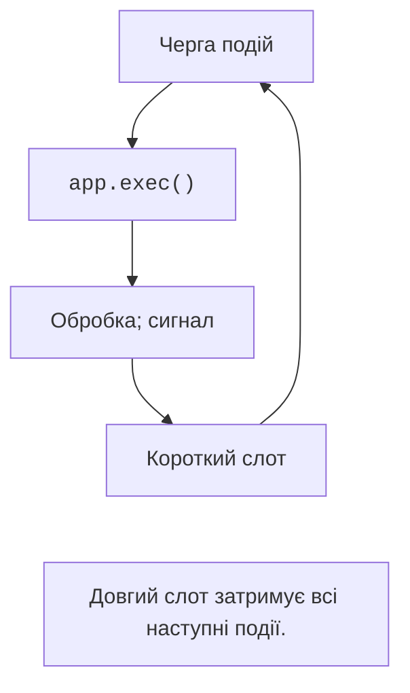

# Застосунок і цикл подій

## Від консольної програми до графічного застосунку

Консольна програма часто сама визначає порядок дій: читає дані, обчислює результат, завершується. У графічному застосунку користувач може редагувати будь-яке поле, натискати кнопки, змінювати розмір вікна. Тому програма реагує на **події** (*events*), а не очікує наступного `input`. Обчислювальні функції попередніх тем залишаються корисними: тепер їх викликають обробники подій.

**Qt** – набір бібліотек для графічних та інших застосунків. **Qt for Python** надає офіційні Python-прив’язки **PySide6**. У цій темі використовуємо **Qt Widgets**: звичайні настільні кнопки, поля, таблиці й вікна. Qt Quick/QML є іншим способом побудови інтерфейсів і в цій роботі не потрібний. <https://doc.qt.io/qtforpython-6/>.

Модуль `QtCore` містить об’єктну модель Qt, сигнали, таймери й базові типи; `QtGui` – дії, шрифти, зображення, валідатори; `QtWidgets` – віджети та компонування. `QAction` імпортується з `QtGui`, а не з `QtWidgets`. Не змішуйте імпорти PySide6 та PyQt6 в одному процесі. Це різні прив’язки Qt із власними правилами використання.

`tkinter` постачається зі стандартною бібліотекою Python і доречний для простих форм. PySide6 дає розвинену систему моделей, делегатів, Designer та багато готових компонентів. Підтримка кількох платформ не скасовує перевірки шрифтів, шляхів, гарячих клавіш і розмірів на цільовій операційній системі.

### Підготовка середовища

Станом на 17 вересня 2026 року перевірено PySide6 6.11.2: метадані пакета вказують Python від 3.10 до версії нижче 3.15, тож Python 3.14 підтримується. Відкрийте проєкт із власною `.venv` і встановіть пакет; версію залежності збережіть у файлі проєкту. <https://pypi.org/project/PySide6/>.

```powershell
uv add pyside6==6.11.2
uv run python -c "import PySide6; print(PySide6.__version__)"
```

Очікуваний результат перевірки – `6.11.2`. PyCharm повинен запускати інтерпретатор саме цього середовища. `ModuleNotFoundError` після встановлення найчастіше означає, що пакет і запуск використовують різні середовища. Офіційний початок роботи: <https://doc.qt.io/qtforpython-6/gettingstarted.html>.

PySide6 має відкриті ліцензійні варіанти, зокрема LGPLv3, а також комерційний шлях. Це не означає однакових умов для всіх модулів Qt та будь-якого способу розповсюдження. Перед публікацією продукту перевіряють умови обраних компонентів; для навчального коду зберігають відомості про залежності й авторство ресурсів. <https://doc.qt.io/qtforpython-6/licenses.html>.

## QApplication і цикл подій

У процесі створюють один `QApplication` перед віджетами. Він керує подіями, стилем і службами графічного застосунку. Вікно створюється окремо; `show()` робить його видимим, але саме `app.exec()` починає обробляти події. Без циклу подій вікно не працюватиме як інтерактивний застосунок.

```py
import sys
from PySide6.QtWidgets import (
    QApplication, QLabel, QPushButton, QVBoxLayout, QWidget,
)

if __name__ == "__main__":
    app = QApplication(sys.argv)
    window = QWidget()
    window.setWindowTitle("Привіт, Qt")
    layout = QVBoxLayout(window)
    layout.addWidget(QLabel("Мій перший застосунок"))
    close = QPushButton("Закрити")
    close.clicked.connect(window.close)
    layout.addWidget(close)
    window.show()
    raise SystemExit(app.exec())
```

Програма показує підпис і кнопку. Натискання «Закрити» закриває останнє вікно; за звичайних налаштувань цикл завершується. `raise SystemExit(...)` передає код завершення процесу. Вікно й об’єкт застосунку зберігаються у змінних протягом виконання.



Рис. 14.1. Обробка події та повернення до циклу Qt {.caption}

**Цикл подій** (*event loop*) отримує натискання, переміщення миші, сигнали таймерів і запити перемальовування. Він передає подію відповідному об’єкту. Якщо обробник виконує `time.sleep(5)` або довгий цикл, наступні події чекають: вікно перестає реагувати (рис. 14.1). Виклик `processEvents()` у випадкових місцях не є заміною правильної організації тривалої операції.

::: info Знімок екрана
Run the minimal program on Windows 11, light theme; show title, label and Close button.
:::

Рис. 14.2. Перше вікно PySide6 {.caption}
