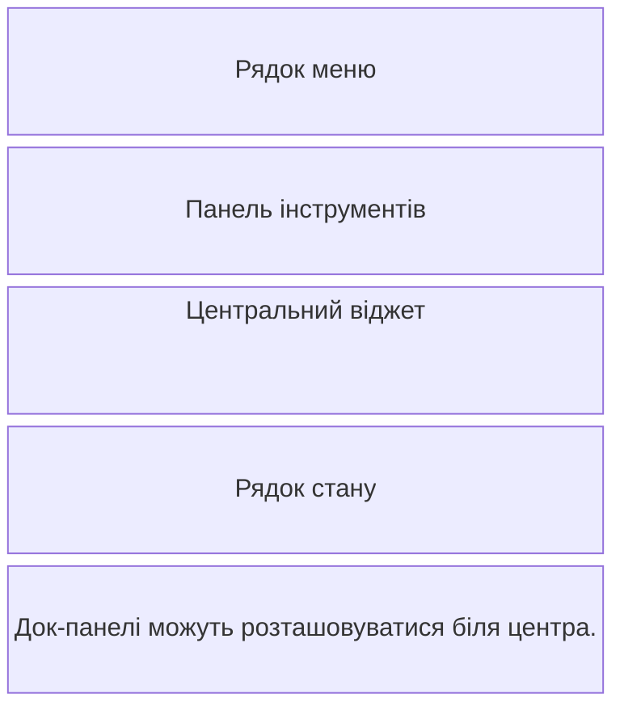

# Головне вікно, дії та таймери

## Головне вікно, меню і дії

`QMainWindow` уже має місця для меню, панелей інструментів, док-панелей та рядка стану. Власне компонування встановлюють на центральний `QWidget`, який передають у `setCentralWidget`, а не безпосередньо на `QMainWindow` (рис. 14.9).



Рис. 14.9. Області QMainWindow {.caption}

`QAction` представляє дію незалежно від її місця на екрані. Одна дія може бути в меню, на панелі та мати гарячу клавішу. Її стан enabled синхронний в усіх місцях. `QKeySequence.StandardKey` допомагає дотримуватися звичних платформних комбінацій. Рядок стану підходить для короткого результату дії та позиції курсора.

### Нотатник

Програма редагує звичайний текст і зберігає його у `note.txt` поточного каталогу в UTF-8. Це навчальний фіксований шлях; вибір файла діалогом буде в наступній темі. Закриття або новий документ запитує підтвердження, якщо є незбережені зміни. Помилка запису не скидає ознаку змін і не закриває вікно.

```py
import sys
from pathlib import Path
from PySide6.QtCore import Slot
from PySide6.QtGui import QAction, QCloseEvent, QKeySequence
from PySide6.QtWidgets import (
    QApplication, QMainWindow, QMessageBox, QPlainTextEdit,
)


class Notepad(QMainWindow):
    def __init__(self, path: Path) -> None:
        super().__init__()
        self.path = path
        self.setWindowTitle("Нотатник")
        self.editor = QPlainTextEdit()
        self.setCentralWidget(self.editor)
        menu = self.menuBar().addMenu("Файл")
        toolbar = self.addToolBar("Дії")
        for title, shortcut, handler in (
            ("Новий", QKeySequence.StandardKey.New, self.new),
            ("Зберегти", QKeySequence.StandardKey.Save, self.save),
            ("Вихід", QKeySequence.StandardKey.Quit, self.close),
        ):
            action = QAction(title, self)
            action.setShortcut(shortcut)
            action.triggered.connect(handler)
            menu.addAction(action)
            toolbar.addAction(action)
        self.editor.cursorPositionChanged.connect(self.position)
        self.resize(550, 360)
        self.position()

    def may_discard(self) -> bool:
        if not self.editor.document().isModified():
            return True
        answer = QMessageBox.question(
            self, "Незбережені зміни", "Відкинути зміни?",
            QMessageBox.StandardButton.Yes
            | QMessageBox.StandardButton.No,
            QMessageBox.StandardButton.No,
        )
        return answer == QMessageBox.StandardButton.Yes

    @Slot()
    def new(self) -> None:
        if self.may_discard():
            self.editor.clear()
            self.editor.document().setModified(False)

    @Slot()
    def save(self) -> None:
        try:
            self.path.write_text(
                self.editor.toPlainText(), encoding="utf-8"
            )
        except OSError as error:
            self.statusBar().showMessage(f"Помилка: {error}")
            return
        self.editor.document().setModified(False)
        self.statusBar().showMessage(f"Збережено: {self.path}")

    @Slot()
    def position(self) -> None:
        cursor = self.editor.textCursor()
        row = cursor.blockNumber() + 1
        column = cursor.positionInBlock() + 1
        message = f"Рядок {row}, стовпець {column}"
        self.statusBar().showMessage(message)

    def closeEvent(self, event: QCloseEvent) -> None:
        event.accept() if self.may_discard() else event.ignore()


if __name__ == "__main__":
    app = QApplication(sys.argv)
    window = Notepad(Path("note.txt"))
    window.show()
    raise SystemExit(app.exec())
```

Уведіть два рядки, поставте курсор на початок другого: рядок стану показує `Рядок 2, стовпець 1`. Після збереження файл має той самий текст. Відповідь No на запит відкидання залишає документ відкритим. Перевірте також недоступний каталог: помилка запису повинна залишити текст у редакторі.

::: info Знімок екрана
Open the File menu in Notepad; show New, Save, Exit shortcuts, toolbar and cursor position.
:::

Рис. 14.10. Нотатник із меню, панеллю дій і рядком стану {.caption}

## Таймери та швидкодія інтерфейсу

`QTimer` надсилає `timeout` через задані інтервали, якщо цикл подій працює. Створіть його з батьком, підключіть обробник і викличте `start(1000)` для орієнтовного інтервалу 1000 мс. `stop()` зупиняє повторення, `QTimer.singleShot` планує один виклик. <https://doc.qt.io/qtforpython-6/PySide6/QtCore/QTimer.html>.

Таймер не гарантує точний момент виконання: зайнята система або довгий слот затримує подію. Секундомір не повинен додавати «рівно 0.1 секунди» за кожний timeout. Правильно читати `time.perf_counter()` або `QElapsedTimer`, а таймером тільки оновлювати екран. При паузі накопичують фактичний інтервал.

Тривалу операцію ділять на короткі кроки або переносять до робочого об’єкта у `QThread`; результат передають сигналом. Віджети змінюють лише в GUI-потоці. Сам факт створення `QThread` не переносить довільний виклик функції до іншого потоку. У цій роботі достатньо коротких слотів та таймера без потоків.

### Форма реєстрації

Форма приймає ім’я, вік 16–100 і згоду з правилами. Кнопка активна лише для непорожнього імені та поставленого прапорця. Слот повторно перевіряє умови перед надсиланням `registered(str, int)`: стан кнопки є підказкою, а не єдиним захистом.

```py
import sys
from PySide6.QtCore import Signal, Slot
from PySide6.QtWidgets import (
    QApplication, QCheckBox, QFormLayout, QLabel, QLineEdit,
    QPushButton, QSpinBox, QWidget,
)


class Registration(QWidget):
    registered = Signal(str, int)

    def __init__(self) -> None:
        super().__init__()
        self.setWindowTitle("Форма реєстрації")
        self.name = QLineEdit()
        self.name.setPlaceholderText("Ім’я учасника")
        self.age = QSpinBox()
        self.age.setRange(16, 100)
        self.consent = QCheckBox("Погоджуюся з правилами")
        self.submit = QPushButton("Зареєструвати")
        self.result = QLabel()
        layout = QFormLayout(self)
        layout.addRow("Ім’я", self.name)
        layout.addRow("Вік", self.age)
        for widget in (self.consent, self.submit, self.result):
            layout.addRow(widget)
        self.name.textChanged.connect(self.validate)
        self.consent.toggled.connect(self.validate)
        self.submit.clicked.connect(self.send)
        self.validate()

    @Slot()
    def validate(self) -> None:
        valid = bool(self.name.text().strip())
        self.submit.setEnabled(valid and self.consent.isChecked())

    @Slot()
    def send(self) -> None:
        self.validate()
        if not self.submit.isEnabled():
            return
        name = self.name.text().strip()
        self.registered.emit(name, self.age.value())
        self.result.setText(f"Зареєстровано: {name}")


if __name__ == "__main__":
    app = QApplication(sys.argv)
    window = Registration()
    window.show()
    raise SystemExit(app.exec())
```

Спочатку кнопка вимкнена. Пробіли замість імені не активують її. Ім’я `Анна` та згода дозволяють реєстрацію й дають повідомлення `Зареєстровано: Анна`. Вік обмежує сам `QSpinBox`. За потреби суворої перевірки імпортованих даних її виконують окремо, навіть якщо графічне поле вже має діапазон.
