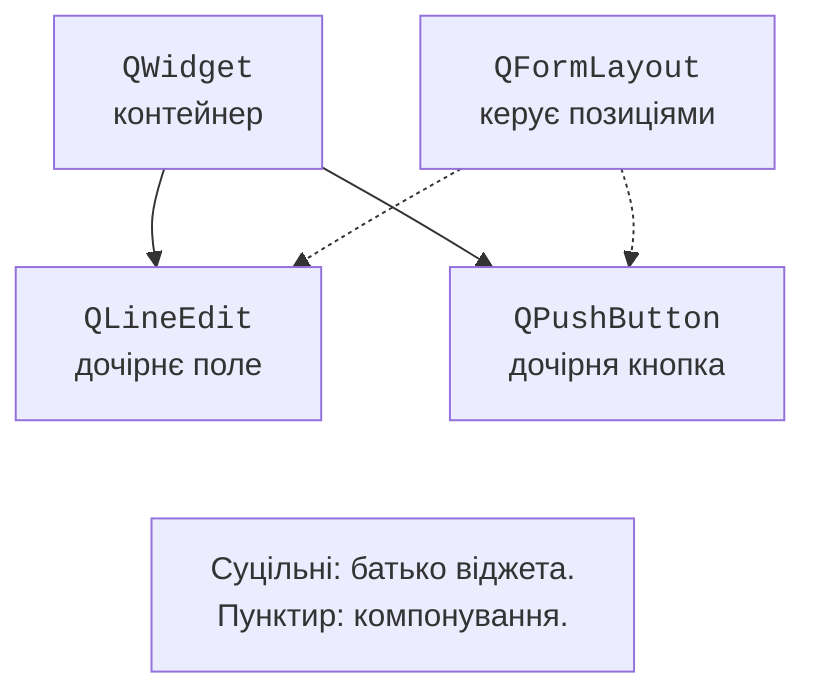
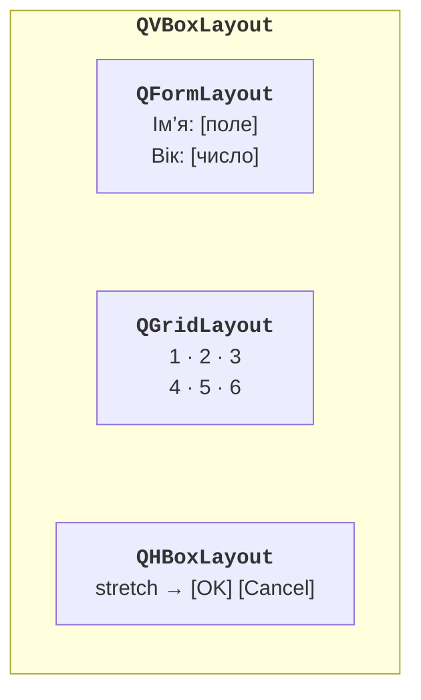
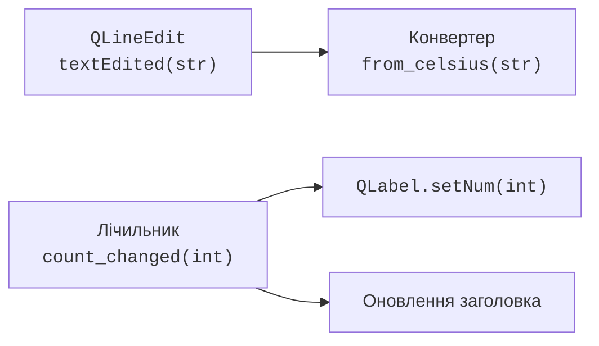

# Віджети, компонування та сигнали

## Віджети та дерево володіння

**Віджет** (*widget*) – елемент інтерфейсу: кнопка, поле або контейнер. `QWidget` без батьківського віджета зазвичай є окремим вікном. Батьківський об’єкт Qt володіє дочірніми та знищує їх разом із собою. Компонування розміщує віджети, але не треба плутати дерево компонувань із деревом фактичних батьків віджетів.

Наприклад, `QVBoxLayout(window)` встановлює компонування у `window`. Додані поля й кнопки стають дочірніми віджетами контейнера. Вкладений `QFormLayout` керує розміщенням, але не є батьківським віджетом полів. Схема рис. 14.3 розрізняє ці зв’язки.



Рис. 14.3. Володіння віджетами та керування їх розміщенням {.caption}

Зберігайте потрібні для подальших звертань віджети в `self.name`, `self.button` тощо. Локальний віджет без батька, створений усередині функції, може втратити Python-посилання після повернення і зникнути. Навіть якщо Qt володіє об’єктом, атрибут зручний для читання значення та перевірки стану. Не зберігайте посилання на вже видалений Qt-об’єкт.

### Основні елементи інтерфейсу

`QLabel` показує текст або зображення, `QPushButton` ініціює дію, `QLineEdit` редагує один рядок. `QPlainTextEdit` призначений для звичайного багаторядкового тексту; `QTextEdit` підтримує також форматований текст. Для введених користувачем рядків у підписах можна встановити `Qt.TextFormat.PlainText`, щоб HTML-подібний текст не сприймався як розмітка.

`QSpinBox` задає ціле число з діапазоном і кроком; `QDoubleSpinBox` – дійсне число з кількістю десяткових знаків. Значення читають через `value()`, а не через перетворення видимого тексту. `QCheckBox` задає незалежний прапорець. Для взаємовиключних варіантів підходять `QRadioButton` у `QButtonGroup`; перевіряйте, чи вибраний варіант.

`QComboBox` дає список варіантів. Технічне значення зручно передавати як дані елемента через `addItem("Українська", "uk")` і читати через `currentData()`, не порівнюючи перекладений напис. `QSlider` змінює ціле значення, `QProgressBar` показує прогрес. Відсоток виконання не слід вигадувати, коли обсяг роботи невідомий: невизначений режим задають діапазоном 0–0.

`QListWidget` зручний для невеликого списку елементів. Для великих даних і складного редагування потрібні моделі наступної теми. `QDateEdit` надає календарну дату; `QDate` є типом Qt, який можна перетворювати на Python-дату через `toPython()`.

::: info Знімок екрана
Create a small gallery in Designer: labelled LineEdit, SpinBox, DoubleSpinBox, CheckBox, exclusive RadioButtons, ComboBox, Slider, ProgressBar and DateEdit.
:::

Рис. 14.4. Типові поля, перемикачі й індикатори Qt {.caption}

## Компонування замість фіксованих координат

**Компонування** (*layout*) визначає взаємне розміщення й розміри. `QVBoxLayout` розміщує вертикально, `QHBoxLayout` – горизонтально, `QGridLayout` – у сітці, `QFormLayout` – рядками «підпис – поле». Вкладення дозволяє поєднати форму, таблицю та рядок кнопок. <https://doc.qt.io/qt-6/layout.html>.



Рис. 14.5. Вкладені компонування форми {.caption}

`addStretch()` додає гнучкий проміжок, наприклад перед кнопками, які мають залишатися справа. `setContentsMargins` визначає зовнішні відступи, `setSpacing` – відстані між елементами. У сітці можна розтягнути певний рядок або стовпець через коефіцієнти stretch. `QSizePolicy` повідомляє компонуванню, чи хоче віджет розширюватися.

Не викликайте `setLayout` двічі для одного контейнера. Для кількох частин створюйте вкладені компонування або `QGroupBox` з власним компонуванням. `resize` задає початковий розмір, а `setFixedSize` забороняє адаптацію й часто обрізає перекладені написи. Перевіряйте мінімальну ширину, масштаб системи та довгі назви.

::: info Знімок екрана
Run Registration below and capture narrow/wide window states, fields readable and no overlaps.
:::

Рис. 14.6. Форма реєстрації при різній ширині вікна {.caption}

## Сигнали та слоти

**Сигнал** (*signal*) повідомляє про подію або зміну стану. **Слот** (*slot*) – функція, яку викликають у відповідь. Запис `button.clicked.connect(self.save)` передає функцію, а `connect(self.save())` спочатку викликає її та передає результат. Останнє зазвичай є помилкою. <https://doc.qt.io/qt-6/signalsandslots.html>.



Рис. 14.7. Один сигнал може сповіщати кілька обробників {.caption}

`textChanged(str)` надсилається і при програмному `setText`, і при редагуванні користувачем. `textEdited(str)` – лише при редагуванні користувачем. `valueChanged` повідомляє нове число; `currentIndexChanged` – новий індекс елемента списку. `clicked` може передавати прапорець checked; слот без параметрів може прийняти лише сам факт натискання.

Декоратор `@Slot()` або `@Slot(int)` реєструє метод як слот Qt і робить очікувану сигнатуру явною. Лямбда зручна для короткого перехідного виклику. У циклі захоплюйте значення явно: `lambda checked=False, n=number: self.choose(n)`, інакше всі обробники можуть бачити останнє значення змінної. Для фіксації аргументів також підходить `functools.partial`.

Не створюйте повторних підключень при кожному оновленні вікна: одне натискання почне виконувати дію кілька разів. Підключення зазвичай роблять у конструкторі; за потреби `signal.disconnect(slot)` прибирає конкретний зв’язок. Відсутнє підключення не треба розривати навмання.

### Власний сигнал: лічильник кліків

Оголосимо `Signal(int)` на рівні класу-нащадка `QWidget`, а не в `__init__`. Після зміни лічильника викликаємо `emit`. Два незалежні слухачі оновлюють число і заголовок. Вікно не повинно знати, хто ще підписався на його зміну.

```py
import sys
from PySide6.QtCore import Signal, Slot
from PySide6.QtWidgets import (
    QApplication, QLabel, QPushButton, QVBoxLayout, QWidget,
)


class CounterWindow(QWidget):
    count_changed = Signal(int)

    def __init__(self) -> None:
        super().__init__()
        self.count = 0
        self.setWindowTitle("Лічильник кліків")
        self.label = QLabel("0")
        self.button = QPushButton("Додати")
        reset = QPushButton("Скинути")
        layout = QVBoxLayout(self)
        for widget in (self.label, self.button, reset):
            layout.addWidget(widget)
        self.button.clicked.connect(self.increment)
        reset.clicked.connect(self.reset)
        self.count_changed.connect(self.label.setNum)
        self.count_changed.connect(self.update_title)

    @Slot()
    def increment(self) -> None:
        self.count += 1
        self.count_changed.emit(self.count)

    @Slot()
    def reset(self) -> None:
        self.count = 0
        self.count_changed.emit(self.count)

    @Slot(int)
    def update_title(self, value: int) -> None:
        self.setWindowTitle(f"Кліків: {value}")


if __name__ == "__main__":
    app = QApplication(sys.argv)
    window = CounterWindow()
    window.show()
    raise SystemExit(app.exec())
```

Після трьох натискань підпис показує `3`, заголовок – `Кліків: 3`. «Скинути» повертає обидва значення до нуля. Тест перевіряє стан `count` і число сигналів, а не лише зображення кнопки. Власні сигнали так само можна оголосити в окремому нащадку `QObject`, якщо компонент не має графічного представлення.
