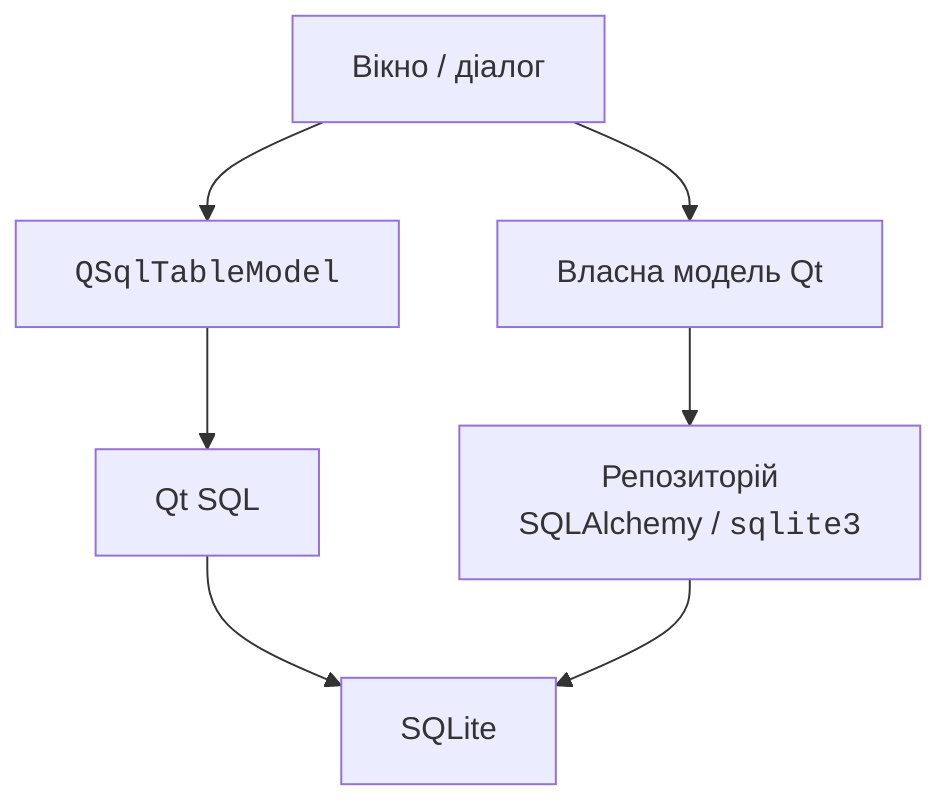

# Qt SQL, репозиторій і налаштування

## Qt SQL і збереження змін

У темі 12 SQL відокремлював таблиці від Python-об’єктів. Модуль `QtSql` дозволяє підключити SQL-дані до представлень Qt. `QSqlDatabase.addDatabase("QSQLITE", name)` створює іменоване з’єднання; задайте шлях, викличте `open` і перевірте результат. Невдале відкриття не можна ігнорувати. <https://doc.qt.io/qt-6/sql-programming.html>.

`QSqlQuery` виконує запити. Для введених користувачем значень застосовують `prepare` і `bindValue`, а не f-рядки SQL. Наприклад, підготуйте `INSERT INTO authors(name) VALUES (:name)`, прив’яжіть значення `:name` та перевірте `exec()`. Імена таблиць і стовпців параметрами не замінюють: їх вибирають із визначеного в коді набору.

`QSqlTableModel` пов’язана з однією таблицею. `setTable` задає її, `select` завантажує дані. `OnFieldChange` надсилає зміни рано, `OnRowChange` – при переході з рядка, `OnManualSubmit` накопичує їх до `submitAll`. Останній варіант дає зрозумілі кнопки «Зберегти» й «Скасувати» через `revertAll`.

Буфер моделі та транзакція бази – різні речі. `submitAll()` повертає bool; у разі невдачі треба прочитати `lastError`. Для атомарного пакета відкрийте транзакцію перед submit, зробіть commit після успіху або rollback при помилці. Після невдачі submit модель може залишити незбережений буфер, щоб користувач виправив дані; `revertAll` явно відкидає його.

`QSqlRelationalTableModel` додає відображення зовнішніх ключів: у базі зберігається author\_id, а користувач бачить ім’я автора. `QSqlRelation("authors", "id", "name")` описує зв’язок, `QSqlRelationalDelegate` дає редактор вибору. Обмеження зовнішнього ключа повинне діяти також у SQLite, а не лише в інтерфейсі.

### Приклад 3. Каталог книг

Застосунок створює окрему навчальну базу `books.sqlite` у поточному каталозі й таблиці авторів та книг, якщо їх немає. Ідентифікатор книги генерує SQLite. Книги додаються, редагуються і видаляються в буфері моделі; користувач явно зберігає або скасовує пакет. Незбережені зміни блокують закриття з поясненням.

```py
import sys
from PySide6.QtCore import QSettings
from PySide6.QtGui import QCloseEvent
from PySide6.QtSql import (
    QSqlDatabase, QSqlQuery, QSqlRelation, QSqlRelationalDelegate,
    QSqlRelationalTableModel, QSqlTableModel,
)
from PySide6.QtWidgets import (
    QApplication, QHBoxLayout, QLabel, QPushButton,
    QTableView, QVBoxLayout, QWidget,
)


def open_database(path: str, name: str) -> QSqlDatabase:
    db = QSqlDatabase.addDatabase("QSQLITE", name)
    db.setDatabaseName(path)
    if not db.open():
        raise RuntimeError(db.lastError().text())
    query = QSqlQuery(db)
    commands = [
        "PRAGMA foreign_keys=ON",
        "CREATE TABLE IF NOT EXISTS authors "
        "(id INTEGER PRIMARY KEY, name TEXT NOT NULL)",
        "CREATE TABLE IF NOT EXISTS books "
        "(id INTEGER PRIMARY KEY, title TEXT NOT NULL "
        "CHECK(length(trim(title))>0), author_id INTEGER "
        "NOT NULL REFERENCES authors(id))",
        "INSERT OR IGNORE INTO authors VALUES (1, 'Леся Українка')",
        "INSERT OR IGNORE INTO authors VALUES (2, 'Іван Франко')",
    ]
    for sql in commands:
        if not query.exec(sql):
            raise RuntimeError(query.lastError().text())
    return db


class BooksWindow(QWidget):
    def __init__(self, db: QSqlDatabase) -> None:
        super().__init__()
        self.db = db
        self.setWindowTitle("Каталог книг")
        self.settings = QSettings("CourseDemo", "Books15")
        geometry = self.settings.value("geometry")
        if geometry is not None:
            self.restoreGeometry(geometry)
        self.model = QSqlRelationalTableModel(self, db)
        self.model.setTable("books")
        relation = QSqlRelation("authors", "id", "name")
        self.model.setRelation(2, relation)
        strategy = QSqlTableModel.EditStrategy.OnManualSubmit
        self.model.setEditStrategy(strategy)
        if not self.model.select():
            raise RuntimeError(self.model.lastError().text())
        self.view = QTableView()
        self.view.setModel(self.model)
        self.view.setItemDelegate(QSqlRelationalDelegate(self.view))
        self.view.hideColumn(0)
        self.status = QLabel("Зміни ще не збережено")
        buttons = QHBoxLayout()
        for title, handler in (
            ("Додати", self.add), ("Видалити", self.remove),
            ("Зберегти", self.save), ("Скасувати", self.revert),
        ):
            button = QPushButton(title)
            button.clicked.connect(handler)
            buttons.addWidget(button)
        layout = QVBoxLayout(self)
        layout.addWidget(self.view)
        layout.addLayout(buttons)
        layout.addWidget(self.status)

    def add(self) -> None:
        record = self.model.record()
        record.setNull(0)
        record.setValue(1, "Нова книга")
        record.setValue(2, 1)
        if not self.model.insertRecord(-1, record):
            self.status.setText(self.model.lastError().text())

    def remove(self) -> None:
        index = self.view.currentIndex()
        if index.isValid():
            self.model.removeRow(index.row())

    def save(self) -> bool:
        if not self.db.transaction():
            self.status.setText(self.db.lastError().text())
            return False
        if not self.model.submitAll():
            message = self.model.lastError().text()
            self.db.rollback()
            self.status.setText(message)
            return False
        if not self.db.commit():
            message = self.db.lastError().text()
            self.db.rollback()
            self.model.select()
            self.status.setText(message)
            return False
        self.status.setText("Збережено")
        return True

    def revert(self) -> None:
        self.model.revertAll()
        self.model.select()
        self.status.setText("Незбережені зміни скасовано")

    def closeEvent(self, event: QCloseEvent) -> None:
        if self.model.isDirty():
            self.status.setText("Збережіть або скасуйте зміни")
            event.ignore()
            return
        self.settings.setValue("geometry", self.saveGeometry())
        event.accept()


if __name__ == "__main__":
    app = QApplication(sys.argv)
    database = open_database("books.sqlite", "books-demo")
    window = BooksWindow(database)
    window.show()
    code = app.exec()
    database.close()
    raise SystemExit(code)
```

Після «Додати» з’являється `Нова книга` з автором за замовчуванням. Змініть назву й автора через редактор; до «Зберегти» окремий SQL-запит не бачить нового запису. «Скасувати» прибирає незбережену позицію. Порожня назва порушує CHECK: пакет відкочується, попередні збережені дані залишаються. Помилка commit також потребує rollback; приклад після неї перечитує стан бази.

::: info Знімок екрана
Run BooksWindow on a fresh demo database, add a book, edit the author with the combo delegate; show Save/Revert and status.
:::

Рис. 15.10. Реляційний каталог книг із ручним збереженням {.caption}

Не викликайте `removeDatabase(name)`, доки існують моделі, запити або копії `QSqlDatabase`, що використовують з’єднання. Спочатку звільняють користувачів з’єднання, потім закривають і прибирають його. У короткому прикладі іменоване з’єднання закривається після циклу застосунку, процес завершується; видалення й повторне створення з тим самим ім’ям не виконуються.

## Власний репозиторій як альтернативний шлях

Модель над `sqlite3` або SQLAlchemy дозволяє відокремити правила предметної області від Qt. Вікно викликає метод моделі, модель – сервіс чи репозиторій, репозиторій виконує транзакцію (рис. 15.11). Це зручно, якщо ті самі операції потрібні також у CLI або автоматичних тестах без Qt.



Рис. 15.11. Два способи доступу до SQLite {.caption}

У такому підході не треба одночасно редагувати ті самі записи через незалежний `QSqlTableModel`: два буфери важко узгоджувати. Оберіть власника транзакції. Після успіху репозиторію оновіть кеш моделі й надішліть сигнали; після помилки залиште попередній кеш та покажіть пояснення. Лабораторний приклад працівників використовує SQLAlchemy з теми 12 та власну таблицю Qt.

Для великої бази не завантажують безмежний список у конструкторі: потрібні порції, `canFetchMore`/`fetchMore` або сторінки. Не виконуйте повільний SQL із `data`. Для фонової роботи використовують окреме з’єднання у відповідному потоці, а зміну моделі виконують у GUI-потоці після результату.

## Налаштування, CSV та перевірка

`QSettings` зберігає налаштування користувача, наприклад геометрію вікна, останній каталог або вибраний фільтр. `saveGeometry` і `restoreGeometry` працюють з QByteArray. Назви організації і застосунку відокремлюють простір налаштувань. Це не база бізнес-даних і не місце для секретів. У тестах використовуйте окремий тимчасовий INI-файл, щоб не змінювати особисті налаштування.

Для CSV явно задайте заголовки, кодування UTF-8, `newline=""`, типи й правила повторів. Обробляйте Cancel без повідомлення про помилку. Експорт має визначати, які дані він зберігає: усе джерело чи лише поточний фільтр; в інтерфейсі це підписують. Збереження у вибраний шлях може завершитися OSError, тому успішний діалог ще не означає успішного запису.

Перевіряйте модель незалежно від малювання: кількість рядків, ролі, відхилені значення, signals після додавання й видалення. Для проксі тестуйте пошук і видалення після сортування. Для діалогу – Accept та Cancel, для SQL – відкат пакета, повторний запуск і збереження зовнішніх ключів. `QAbstractItemModelTester` із QtTest допомагає перевіряти інваріанти власних моделей, але не замінює предметних тестів.

## Типові помилки

- Джерело змінено без begin/end або `dataChanged`: представлення не знає про новий стан. Надсилайте точні повідомлення.
- Для всіх ролей повертається текст: обробіть підтримувані, для решти поверніть `None`.
- Рядок проксі використано як рядок джерела: застосуйте `mapToSource`.
- `select()` викликано поверх незбережених змін: спочатку збережіть або явно погодьте відкидання.
- `submitAll` не перевіряється: показуйте помилку і керуйте транзакцією.
- Діалог змінює дані ще до OK: накопичуйте введення окремо.
- З’єднання видалено раніше за моделі: впорядкуйте час життя.
- CSV додається рядок за рядком до перевірки: спочатку перевірте весь набір, потім виконайте одну логічну операцію.
