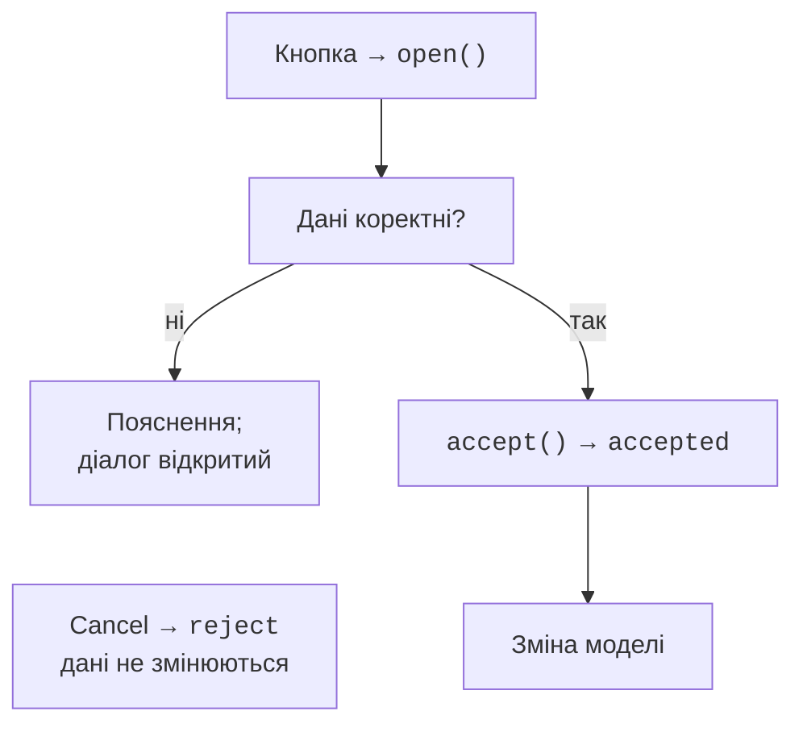
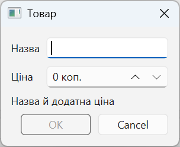
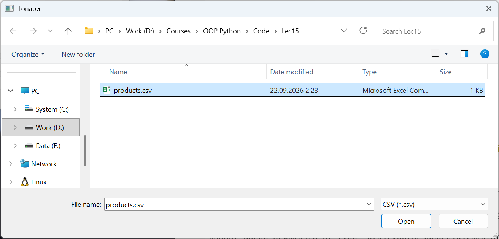

# Власні діалоги

## Власні діалоги та результати

**Діалог** (*dialog*) – тимчасове вікно окремої взаємодії. Модальний діалог блокує взаємодію з батьківським вікном, немодальний дозволяє працювати паралельно. Батько визначає зв’язок вікон, володіння та зручне розташування. `QDialogButtonBox` надає стандартні кнопки й сигнали accepted/rejected. <https://doc.qt.io/qt-6/qdialog.html>.

Виклик `dialog.exec()` повертає `QDialog.DialogCode.Accepted` або Rejected, але запускає вкладений цикл подій. Qt рекомендує за можливості асинхронне `open()` зі сигналом `accepted`: керування одразу повертається, тому діалог треба зберігати в атрибуті або забезпечити його життя іншим способом. `show()` зазвичай показує немодальний діалог.



Рис. 15.7. Підтвердження діалогу після валідації {.caption}

`accept()` означає успішне завершення. Перевизначте його, щоб повторно перевірити поля, навіть якщо OK був вимкнений. `reject()` скасовує діалог без зміни бізнес-даних. Не зберігайте напівзаповнений запис у базу при кожному натисканні клавіші, якщо користувач ще має можливість скасувати форму.

### Стандартні діалоги

`QFileDialog.getOpenFileName` і `getSaveFileName` повертають пару `(filename, selected_filter)`; порожнє ім’я означає Cancel. Фільтр `CSV (*.csv)` допомагає вибору, але не перевіряє вміст. Помилки читання й неправильну структуру файла все одно обробляють. У Windows використовуйте об’єкти Path замість склеювання шляхів.

`QMessageBox.question` повертає конкретну StandardButton: порівнюйте її з Yes або No, а не з довільним bool. `warning` і `critical` повідомляють про проблеми. `QInputDialog` повертає значення та прапорець підтвердження. Для `QColorDialog` після Cancel перевіряють `isValid` кольору; `QFontDialog` також дає результат підтвердження.

### Приклад 2. Товар і перевірений імпорт CSV

Діалог приймає назву й додатну ціну в цілих копійках до 1000000. OK активний лише для правильних полів. CSV має заголовок `name,price`; спочатку перевіряється весь файл, потім список поповнюється. Помилка в останньому рядку не додає попередні рядки частково. Порожній коректний файл із заголовком додає 0 записів.

```py
import csv
import sys
from pathlib import Path
from PySide6.QtWidgets import (
    QApplication, QDialog, QDialogButtonBox, QFileDialog,
    QFormLayout, QLabel, QLineEdit, QListWidget, QPushButton,
    QSpinBox, QVBoxLayout, QWidget,
)


class ProductDialog(QDialog):
    def __init__(self, parent: QWidget | None = None) -> None:
        super().__init__(parent)
        self.setWindowTitle("Товар")
        self.name = QLineEdit()
        self.price = QSpinBox()
        self.price.setRange(0, 1_000_000)
        self.price.setSuffix(" коп.")
        self.message = QLabel()
        buttons = (QDialogButtonBox.StandardButton.Ok
                   | QDialogButtonBox.StandardButton.Cancel)
        self.buttons = QDialogButtonBox(buttons)
        form = QFormLayout(self)
        form.addRow("Назва", self.name)
        form.addRow("Ціна", self.price)
        form.addRow(self.message)
        form.addRow(self.buttons)
        self.name.textChanged.connect(self.validate)
        self.price.valueChanged.connect(self.validate)
        self.buttons.accepted.connect(self.accept)
        self.buttons.rejected.connect(self.reject)
        self.validate()

    def validate(self) -> bool:
        valid = (bool(self.name.text().strip())
                 and self.price.value() > 0)
        ok = self.buttons.button(QDialogButtonBox.StandardButton.Ok)
        ok.setEnabled(valid)
        self.message.setText("" if valid else "Назва й додатна ціна")
        return valid

    def accept(self) -> None:
        if self.validate():
            super().accept()

    def product(self) -> tuple[str, int]:
        return self.name.text().strip(), self.price.value()


def read_products(path: Path) -> list[tuple[str, int]]:
    result: list[tuple[str, int]] = []
    with path.open(encoding="utf-8", newline="") as file:
        reader = csv.DictReader(file)
        if reader.fieldnames != ["name", "price"]:
            raise ValueError("Потрібні стовпці name,price")
        for row in reader:
            name = (row.get("name") or "").strip()
            price = int(row.get("price") or "0")
            if None in row or not name or not 1 <= price <= 1_000_000:
                raise ValueError("Неправильний товар")
            result.append((name, price))
    return result


class ProductsWindow(QWidget):
    def __init__(self) -> None:
        super().__init__()
        self.setWindowTitle("Товари")
        self.items = QListWidget()
        self.status = QLabel()
        self.dialog: ProductDialog | None = None
        add = QPushButton("Додати")
        add.clicked.connect(self.open_dialog)
        load = QPushButton("Імпорт CSV")
        load.clicked.connect(self.import_csv)
        layout = QVBoxLayout(self)
        for widget in (self.items, add, load, self.status):
            layout.addWidget(widget)

    def open_dialog(self) -> None:
        self.dialog = ProductDialog(self)
        self.dialog.accepted.connect(self.add_product)
        self.dialog.open()

    def add_product(self) -> None:
        if self.dialog is not None:
            name, price = self.dialog.product()
            self.items.addItem(f"{name}: {price} коп.")

    def import_csv(self) -> None:
        name, _ = QFileDialog.getOpenFileName(
            self, "Товари", "", "CSV (*.csv)"
        )
        if not name:
            return
        try:
            products = read_products(Path(name))
        except OSError, ValueError, csv.Error:
            self.status.setText("Не вдалося прочитати коректний CSV")
            return
        for product, price in products:
            self.items.addItem(f"{product}: {price} коп.")
        self.status.setText(f"Імпортовано: {len(products)}")


if __name__ == "__main__":
    app = QApplication(sys.argv)
    window = ProductsWindow()
    window.show()
    raise SystemExit(app.exec())
```

Уведення `Ручка` і 2500 дає рядок `Ручка: 2500 коп.`. Ціна 0 та ім’я з пробілів залишають діалог відкритим. Cancel нічого не додає. Файл із рядками `Зошит,4000` та `Олівець,1500` після заголовка додає дві позиції. Неправильний рядок або відмова доступу показує повідомлення, залишаючи попередній список без змін.



Рис. 15.8. Діалог товару з вимкненим підтвердженням {.caption}



Рис. 15.9. Вибір CSV для імпорту {.caption}
