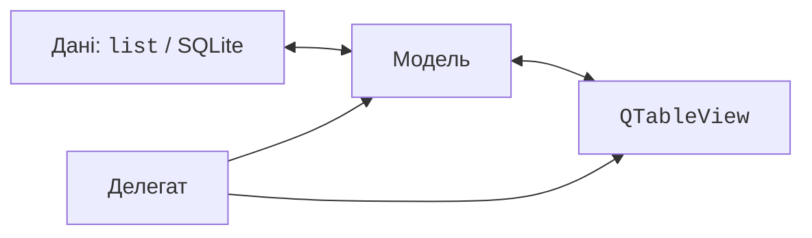
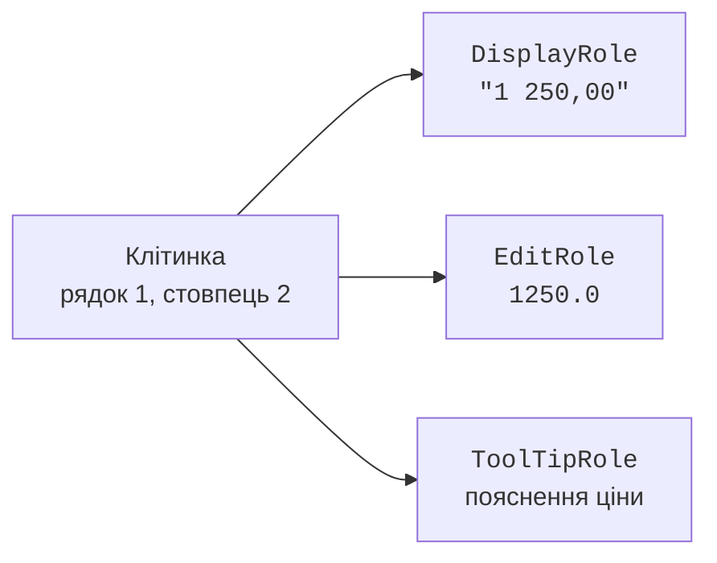

# Моделі, індекси та ролі

## Чому дані не повинні жити лише у клітинках

У невеликому списку справ зручно додавати `QListWidgetItem` безпосередньо у віджет. Але для тисяч записів, пошуку, кількох представлень і збереження в базі виникає запитання: де істинний стан? Якщо копії одного запису лежать у кількох таблицях, їх легко оновити неодночасно. Архітектура **Model/View** відокремлює дані та правила доступу до них від показу на екрані. <https://doc.qt.io/qt-6/model-view-programming.html>.

**Модель** (*model*) надає кількість рядків, стовпців і значення за індексами. **Представлення** (*view*) малює список, таблицю або дерево й керує вибором. **Делегат** (*delegate*) малює окремі елементи та створює редактори. Дані можуть бути списком `dataclass`, результатом SQL або іншим джерелом (рис. 15.1).

Рис. 15.1. Модель, представлення, делегат і джерело даних {.caption}

У класичному MVC контролер виділено окремо. Qt Model/View розподіляє частину обробки взаємодій між представленням і делегатом. Не треба насильно називати кожне вікно «контролером»: важливіші межі відповідальності. Модель не повинна відкривати вікно помилки при кожному запиті клітинки; вона повертає значення або відмову, а інтерфейс пояснює проблему користувачеві.

`QListWidget`, `QTableWidget` і `QTreeWidget` самі керують елементами. `QListView`, `QTableView`, `QTreeView` отримують модель через `setModel`. Одна модель може обслуговувати кілька представлень: редагування в одному відразу відображається в інших після сигналу. Модель повинна жити не менше за представлення; зберігайте її в атрибуті та, де доречно, задавайте батьківський Qt-об’єкт.

## Стандартні моделі, індекси та ролі

`QStringListModel` підходить для списку рядків. `QStandardItemModel` зберігає елементи з ролями, підтримує таблицю й дерево. `QStandardItem` може мати дочірні елементи, тому дерево категорій не потребує власної моделі на першому етапі. У таблиці `QHeaderView` керує шириною стовпців: `Stretch` розтягує, `ResizeToContents` підбирає ширину за вмістом. Останній режим для дуже великих таблиць може бути дорогим.

**Індекс моделі** (*model index*) – `QModelIndex` із рядком, стовпцем, батьківським індексом та зв’язком із моделлю. Це не постійний ідентифікатор бізнес-запису. Після видалення, перезавантаження або сортування не можна покладатися на старий номер рядка. Для збереження вибору між перезавантаженнями використовуйте стабільний `id` запису.

`QModelIndex()` без аргументів – недійсний індекс; його часто використовують як позначення кореня плоскої таблиці. Перед читанням перевіряють `isValid()`. У табличній моделі `rowCount(parent)` і `columnCount(parent)` повертають 0 для дійсного батька, бо клітинки не мають дочірніх рядків.

Рис. 15.2. Одна клітинка дає різні значення для різних ролей {.caption}

**Роль** (*role*) визначає, яку інформацію просить представлення. `DisplayRole` – показаний текст або число; `EditRole` – значення для редактора; `ToolTipRole` – пояснення; `ForegroundRole` і `BackgroundRole` – оформлення; `TextAlignmentRole` – вирівнювання. `CheckStateRole` повертає стан прапорця, а `UserRole` та наступні значення придатні для власних даних, наприклад стабільного id.

Повернення `None` для непідтримуваної ролі є правильним. Якщо повертати текст для будь-якої ролі, представлення може спробувати інтерпретувати його як колір або шрифт. Для числового сортування `EditRole` або окрема роль повинні містити число, а не рядок на кшталт `"1 250,00 грн"`.

::: info Знімок екрана
Create one QStandardItemModel with three rows and two columns; attach QListView, QTableView, QTreeView, edit an item and show all views updated.
:::

Рис. 15.3. Спільна модель у списку, таблиці та дереві {.caption}

## Власна модель: контракт із представленням

Нащадок `QAbstractTableModel` реалізує `rowCount`, `columnCount` і `data`; `headerData` додає заголовки. Ці методи викликаються часто, тому не повинні виконувати мережеві запити, змінювати дані або запускати важкі обчислення. Вони читають підготовлений стан. <https://doc.qt.io/qtforpython-6/PySide6/QtCore/QAbstractTableModel.html>.

Для редагування `flags` повертає `ItemIsEditable`, а `setData` перевіряє роль, індекс і нове значення. Після успішної зміни надсилається `dataChanged(topLeft, bottomRight, roles)`. Порожній список ролей означає зміну всіх ролей; точний список допомагає уникнути зайвих оновлень, якщо відомий наперед. Відхилене значення повертає `False` і не змінює запис.

Додавання рядків має три фази: `beginInsertRows`, зміна джерела, `endInsertRows`. Для видалення використовують відповідну пару `beginRemoveRows`/`endRemoveRows`. Діапазон містить і перший, і останній рядок. Валідацію виконують перед `begin...`, щоб не залишити модель між початком і завершенням повідомлення.

`beginResetModel`/`endResetModel` використовують для заміни всього набору. Reset може втратити вибір і постійні індекси; це не універсальний спосіб виправити відсутні сигнали при зміні однієї клітинки. Для одного запису потрібне точне повідомлення.
