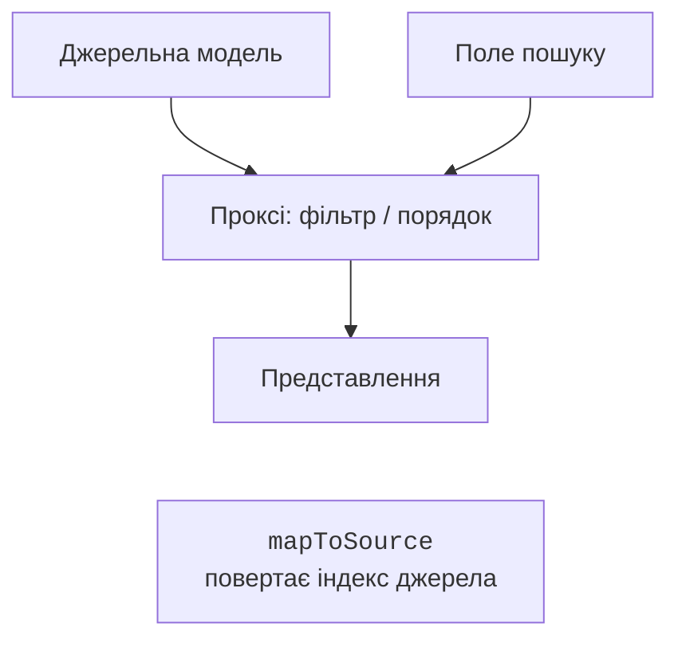
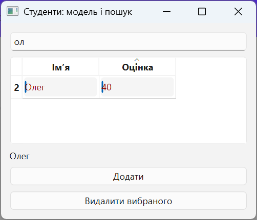

# Проксі, сортування та делегати

## Проксі, сортування та вибір

`QSortFilterProxyModel` накладає порядок і фільтр на джерельну модель без копіювання бізнес-даних. Представлення підключається до проксі, а проксі – до джерела (рис. 15.4). <https://doc.qt.io/qt-6/qsortfilterproxymodel.html>.



Рис. 15.4. Фільтрація та перетворення індексів проксі {.caption}

`setFilterKeyColumn(0)` задає стовпець пошуку. `setFilterFixedString(text)` трактує введення буквально, а `setFilterRegularExpression` – як регулярний вираз. Для звичайного поля пошуку перший варіант безпечніший щодо неочікуваного значення символів `[` або `*`. Регістр налаштовують `setFilterCaseSensitivity`.

Для кількох критеріїв перевизначають `filterAcceptsRow`: метод читає джерельні індекси та повертає bool. Не змінюйте модель усередині фільтра. `setSortingEnabled(True)` у таблиці дозволяє натискати заголовок; проксі сортує дані відповідної ролі.

**Вибір** (*selection*) зберігає `QItemSelectionModel`. Сигнали `currentChanged` та `selectionChanged` відрізняються: поточний індекс один, а виділених клітинок може бути багато. Для master-detail поточний запис головної таблиці визначає дані форми або другої таблиці. `doubleClicked` доречний для відкриття редактора чи деталей.

Індекс із представлення належить проксі. Перед доступом до списку джерельної моделі викличте `mapToSource`; для зворотного переходу – `mapFromSource`. Без цього після сортування можна видалити зовсім інший запис. Це одна з найважливіших перевірок теми.

### Приклад 1. Студенти: редагування, пошук і деталі

Створимо модель над списком `Student`. Оцінка – ціле число 0–100, ім’я непорожнє. Таблиця дозволяє редагування; низькі оцінки мають відмінний колір, але саме число завжди видиме. Пошук працює за частиною імені, а підпис унизу показує вибраного студента. Кнопка видалення явно переводить індекс проксі у джерельний.

```py
import sys
from dataclasses import dataclass
from PySide6.QtCore import (
    QAbstractTableModel, QModelIndex, QSortFilterProxyModel, Qt,
)
from PySide6.QtGui import QColor
from PySide6.QtWidgets import (
    QApplication, QLabel, QLineEdit, QPushButton, QTableView,
    QVBoxLayout, QWidget,
)


@dataclass
class Student:
    name: str
    grade: int


class StudentModel(QAbstractTableModel):
    def __init__(self, rows: list[Student]) -> None:
        super().__init__()
        self.rows = list(rows)

    def rowCount(self, parent: QModelIndex = QModelIndex()) -> int:
        return 0 if parent.isValid() else len(self.rows)

    def columnCount(self, parent: QModelIndex = QModelIndex()) -> int:
        return 0 if parent.isValid() else 2

    def data(self, index: QModelIndex, role: int = 0) -> object:
        if not index.isValid():
            return None
        student = self.rows[index.row()]
        if role in (Qt.ItemDataRole.DisplayRole,
                    Qt.ItemDataRole.EditRole):
            if index.column() == 0:
                return student.name
            return student.grade
        if role == Qt.ItemDataRole.ToolTipRole:
            return "Оцінка від 0 до 100"
        if (role == Qt.ItemDataRole.ForegroundRole
                and student.grade < 50):
            return QColor("darkred")
        return None

    def headerData(self, section: int, orientation: Qt.Orientation,
                   role: int = 0) -> object:
        if role != Qt.ItemDataRole.DisplayRole:
            return None
        if orientation == Qt.Orientation.Horizontal:
            return ("Ім’я", "Оцінка")[section]
        return section + 1

    def flags(self, index: QModelIndex) -> Qt.ItemFlag:
        flags = super().flags(index)
        if index.isValid():
            flags |= Qt.ItemFlag.ItemIsEditable
        return flags

    def setData(self, index: QModelIndex, value: object,
                role: int = Qt.ItemDataRole.EditRole) -> bool:
        if not index.isValid() or role != Qt.ItemDataRole.EditRole:
            return False
        student = self.rows[index.row()]
        if index.column() == 0:
            name = str(value).strip()
            if not name:
                return False
            student.name = name
        else:
            text = str(value)
            if not text.isascii() or not text.isdecimal():
                return False
            grade = int(text)
            if not 0 <= grade <= 100:
                return False
            student.grade = grade
        self.dataChanged.emit(index, index, [])
        return True

    def add(self, student: Student) -> None:
        if not student.name.strip() or not 0 <= student.grade <= 100:
            raise ValueError("Неправильний студент")
        row = len(self.rows)
        self.beginInsertRows(QModelIndex(), row, row)
        self.rows.append(student)
        self.endInsertRows()

    def remove(self, row: int) -> bool:
        if not 0 <= row < len(self.rows):
            return False
        self.beginRemoveRows(QModelIndex(), row, row)
        del self.rows[row]
        self.endRemoveRows()
        return True


class StudentsWindow(QWidget):
    def __init__(self) -> None:
        super().__init__()
        self.setWindowTitle("Студенти: модель і пошук")
        self.model = StudentModel([Student("Анна", 85),
                                   Student("Олег", 40)])
        self.proxy = QSortFilterProxyModel(self)
        self.proxy.setSourceModel(self.model)
        self.proxy.setFilterKeyColumn(0)
        self.proxy.setFilterCaseSensitivity(
            Qt.CaseSensitivity.CaseInsensitive
        )
        search = QLineEdit()
        search.setPlaceholderText("Частина імені")
        search.textChanged.connect(self.proxy.setFilterFixedString)
        self.view = QTableView()
        self.view.setModel(self.proxy)
        self.view.setSortingEnabled(True)
        self.details = QLabel("Оберіть рядок")
        selection = self.view.selectionModel()
        selection.currentChanged.connect(self.selected)
        add = QPushButton("Додати")
        add.clicked.connect(
            lambda: self.model.add(Student("Новий", 0))
        )
        remove = QPushButton("Видалити вибраного")
        remove.clicked.connect(self.remove_selected)
        layout = QVBoxLayout(self)
        for widget in (search, self.view, self.details, add, remove):
            layout.addWidget(widget)

    def selected(self, current: QModelIndex,
                 previous: QModelIndex) -> None:
        source = self.proxy.mapToSource(current)
        text = "–"
        if source.isValid():
            text = self.model.rows[source.row()].name
        self.details.setText(text)

    def remove_selected(self) -> None:
        source = self.proxy.mapToSource(self.view.currentIndex())
        if source.isValid():
            self.model.remove(source.row())


if __name__ == "__main__":
    app = QApplication(sys.argv)
    window = StudentsWindow()
    window.show()
    raise SystemExit(app.exec())
```

За фільтра `ол` видно Олега з оцінкою 40. Після сортування і видалення цього рядка залишається Анна, а не перший рядок початкового списку. Редагування оцінки на 101 або `2.5` відхиляється; значення 0 і 100 дозволені. Кнопка «Додати» створює навчальний запис, який можна відредагувати у таблиці. У прикладному застосунку введення нового запису краще винести до діалогу, як у наступному прикладі.


Рис. 15.5. Редагована таблиця студентів {.caption}



Рис. 15.6. Фільтр і вибір запису через проксі {.caption}

## Делегати: редактор не є джерелом даних

`QStyledItemDelegate` за замовчуванням добирає редактор за типом значення. Власний делегат перевизначає `createEditor`, `setEditorData` та `setModelData`. Наприклад, для дати створюється `QDateEdit`, початкове значення читається з `EditRole`, а після редагування записується через `model.setData`. Лабораторний приклад журналу витрат містить повний делегат дати.

Не змінюйте список даних напряму з делегата: модель тоді не надішле потрібного сигналу й не виконає валідацію. Делегат спрощує введення, але остаточне правило належить моделі або сервісу. Для зовнішнього ключа Qt SQL має готовий `QSqlRelationalDelegate` з редактором вибору пов’язаного запису.
