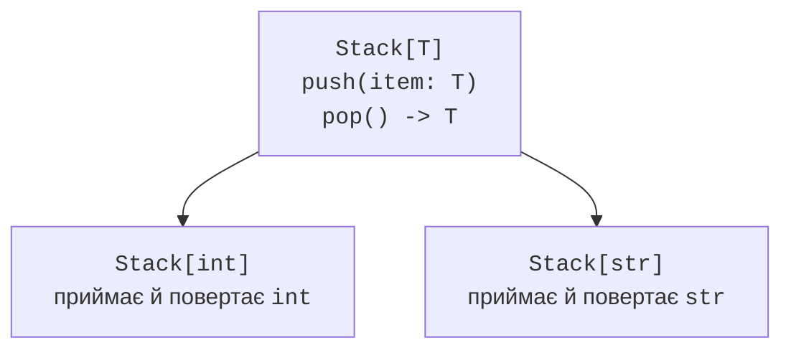
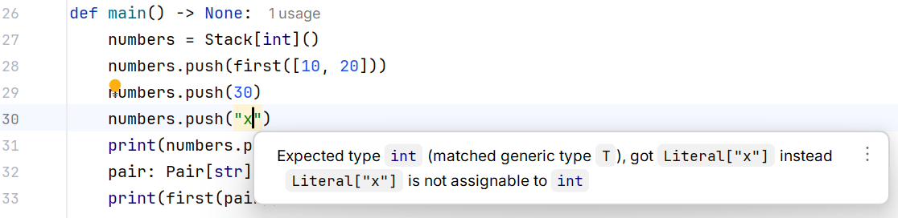

# Узагальнені типи та протоколи

## Приклад 2. Узагальнені колекції

Узагальнення пов’язує тип входу з типом виходу. Функція `first[T]` повертає саме тип елементів, а не довільний `object`. Параметр типу не є аргументом, який користувач вводить у CLI. Синтаксис PEP 695 доступний у Python 3.12+, а значення за замовчуванням параметрів типу – у Python 3.13+.

```py
from collections.abc import Sequence


type Pair[T] = tuple[T, T]


def first[T](items: Sequence[T]) -> T:
    if not items:
        raise ValueError("Порожня послідовність")
    return items[0]


class Stack[T = str]:
    def __init__(self) -> None:
        self._items: list[T] = []

    def push(self, item: T) -> None:
        self._items.append(item)

    def pop(self) -> T:
        if not self._items:
            raise IndexError("Порожній стек")
        return self._items.pop()


def main() -> None:
    numbers = Stack[int]()
    numbers.push(first([10, 20]))
    numbers.push(30)
    print(numbers.pop(), numbers.pop())
    pair: Pair[str] = ("код", "тест")
    print(first(pair))


if __name__ == "__main__":
    main()
```

Результат: `30 10`, потім `код`. У `Stack[int]` метод `push` приймає `int`, а `pop` повертає `int`. Спроба `push("x")` порушує статичний контракт, але Python сам не встановлює перевірку типів під час виконання. Відсутність перевірки mypy не можна компенсувати одним успішним запуском.



Рис. 16.5. Типовий параметр і конкретний стек {.caption}

Обмеження `[T: (int, float)]` означає вибір одного з перелічених типів; межа `[T: SomeProtocol]` допускає типи, що відповідають контракту. Це не перевірка числового діапазону. Не додавайте параметр типу, якщо він ні з чим не пов’язує результат: звичайного протоколу часто достатньо.

У старих проєктах трапляються `TypeVar` і `Generic[T]`. Підтримуйте узгоджений стиль у межах одного визначення. Для навчальних проєктів Python 3.14 використовуємо новий синтаксис; старий потрібен насамперед для читання залежностей.



Рис. 16.6. Перевірка типу аргументу узагальненого стека {.caption}

## Приклад 3. Репозиторій як структурний контракт

Протокол описує операції, а не спосіб зберігання. Споживач репозиторію може працювати з реалізацією в пам’яті або в SQLite, якщо обидві дотримуються контракту. Тип `T | None` змушує обробити відсутність запису до доступу до його полів.

```py
from dataclasses import dataclass
from typing import Protocol


class Repository[T](Protocol):
    def get(self, key: int) -> T | None: ...


@dataclass(frozen=True)
class Book:
    title: str


class MemoryBooks:
    def __init__(self) -> None:
        self._books = {1: Book("Python")}

    def get(self, key: int) -> Book | None:
        return self._books.get(key)


def title(repo: Repository[Book], key: int) -> str:
    book = repo.get(key)
    return "не знайдено" if book is None else book.title


def main() -> None:
    repo = MemoryBooks()
    print(title(repo, 1))
    print(title(repo, 2))


if __name__ == "__main__":
    main()
```

Результат: `Python`, потім `не знайдено`. Успадковувати `MemoryBooks` від `Repository` не потрібно: mypy зіставляє структуру методів. Це не усуває потреби перевіряти фактичну поведінку, наприклад відсутність випадкової зміни збережених даних або правильне закриття з’єднання.
