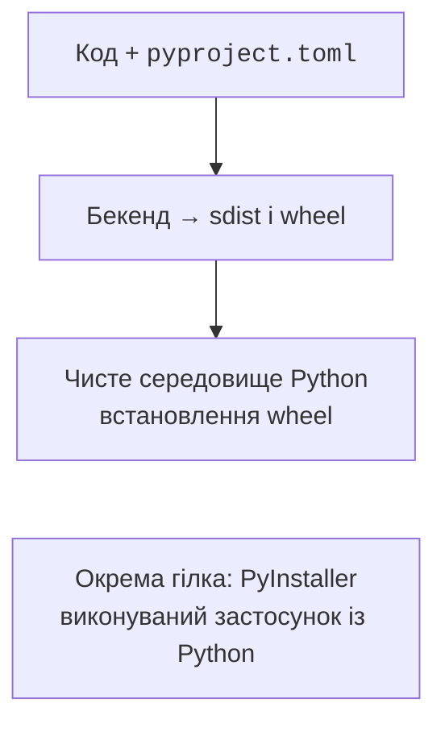
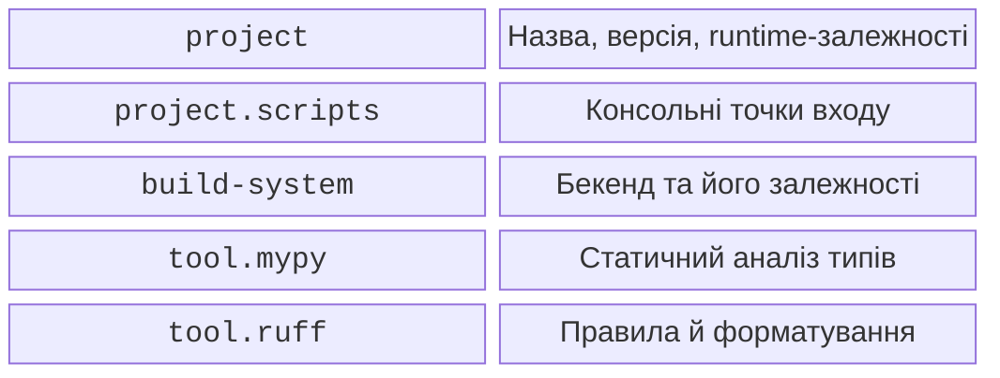

# Пакет, дистрибутив і pyproject.toml

## Пакет для імпорту та дистрибутив

Пакет для імпорту – каталог модулів, наприклад `units_converter`. Дистрибутив – одиниця встановлення з назвою й версією; його назва може містити дефіс: `units-converter`. Назви не обов’язково збігаються. Один дистрибутив може містити декілька пакетів.

**sdist** містить джерела та метадані, потрібні для збирання; **wheel** містить підготовлені файли для встановлення. Wheel не є самодостатнім виконуваним файлом: для звичайного Python-пакета потрібні відповідний інтерпретатор і його залежності. Теги у назві wheel описують Python, ABI та платформу. Чистий Python-пакет може мати тег `py3-none-any`, а пакет із машинним кодом – конкретні теги.



Рис. 16.1. Два способи передавання програми {.caption}

Ізольоване збирання встановлює залежності бекенда в тимчасове середовище. Це інше середовище, ніж те, в якому виконуються тести. Наявність бібліотеки в PyCharm не гарантує, що вона оголошена в метаданих. Так само локальний `import` із кореня репозиторію не доводить, що потрібний модуль потрапив до wheel.

Довідка PyPA: <https://packaging.python.org/en/latest/tutorials/packaging-projects/>. У цій роботі обов’язкове локальне збирання та перевірка wheel; обліковий запис і публікація в зовнішньому реєстрі не потрібні.

## Структура проєкту та pyproject.toml

Розміщення коду в `src/` допомагає виявити помилки встановлення: поточний каталог не підміняє встановлений пакет. У прикладі створимо конвертер невід’ємної скінченної довжини з метрів у сантиметри. Результат округлюється тільки під час друку.

```text
units-project/
  pyproject.toml
  README.md
  src/
    units_converter/
      __init__.py
      cli.py
      py.typed
  tests/
    test_units.py
```

Порожній `py.typed` позначає наявність анотацій для споживача пакета. У `README.md` запишіть призначення, вимоги, команду встановлення й приклад `units-convert 1.25`. Файл метаданих:

```toml
[build-system]
requires = ["hatchling"]
build-backend = "hatchling.build"

[project]
name = "units-converter"
version = "0.1.0"
description = "Навчальний конвертер довжини"
readme = "README.md"
requires-python = ">=3.14"
dependencies = []

[project.scripts]
units-convert = "units_converter.cli:main"

[project.optional-dependencies]
dev = ["pytest", "mypy", "ruff", "build", "hatchling"]

[tool.hatch.build.targets.wheel]
packages = ["src/units_converter"]

[tool.mypy]
python_version = "3.14"
strict = true

[tool.ruff]
target-version = "py314"
line-length = 70

[tool.ruff.lint]
select = ["E4", "E7", "E9", "F", "I", "B", "UP"]
```

`[project]` описує дистрибутив, `[build-system]` – спосіб його збирання. Точка входу посилається на функцію без дужок: інсталятор створить команду, яка викличе `main()` і передасть її результат як код завершення. У метаданих не записують шляхи до локального `python.exe` чи середовища автора.



Рис. 16.2. Призначення секцій pyproject.toml {.caption}

`dependencies` потрібні користувачу. Extra `dev` тут обрано для простого встановлення `pip install -e ".[dev]"`. Альтернатива для проєкту uv – `[dependency-groups]` із групою `dev`; ця група не перетворюється на залежність користувацького wheel. Не дублюйте дві схеми без потреби. Поля `authors` і `license` слід заповнювати реальними даними та обраною ліцензією.

## Приклад 1. Бібліотека й консольна точка входу

Файл `src/units_converter/__init__.py`:

```py
from math import isfinite


def to_centimetres(metres: float) -> float:
    if not isfinite(metres) or not 0 <= metres <= 1e6:
        raise ValueError("Довжина має бути від 0 до 1000000 м")
    return metres * 100
```

Файл `src/units_converter/cli.py`:

```py
import argparse

from units_converter import to_centimetres


def main() -> int:
    parser = argparse.ArgumentParser(description="Метри → см")
    parser.add_argument("metres", type=float)
    args = parser.parse_args()
    try:
        result = to_centimetres(args.metres)
    except ValueError as error:
        parser.error(str(error))
    print(f"{result:.2f} см")
    return 0


if __name__ == "__main__":
    raise SystemExit(main())
```

Модуль не читає аргументи під час імпорту. `argparse` формує `--help`, перевіряє число й повідомляє про неправильний вхід у `stderr` з кодом 2. Контракт предметної функції незалежний від CLI, тому його легко використати у графічному застосунку. Для `1.25` команда друкує `125.00 см` і повертає код 0.

Файл `tests/test_units.py`:

```py
import pytest

from units_converter import to_centimetres


def test_conversion() -> None:
    assert to_centimetres(1.25) == pytest.approx(125)
    assert to_centimetres(0) == 0


@pytest.mark.parametrize("value", [-1, float("nan"), 1e7])
def test_invalid(value: float) -> None:
    with pytest.raises(ValueError):
        to_centimetres(value)
```

Верхня межа належить контракту навчального прикладу й запобігає надмірним значенням результату. Анотація `float` не перевіряє скінченність або діапазон; це завдання виконуваного коду.
