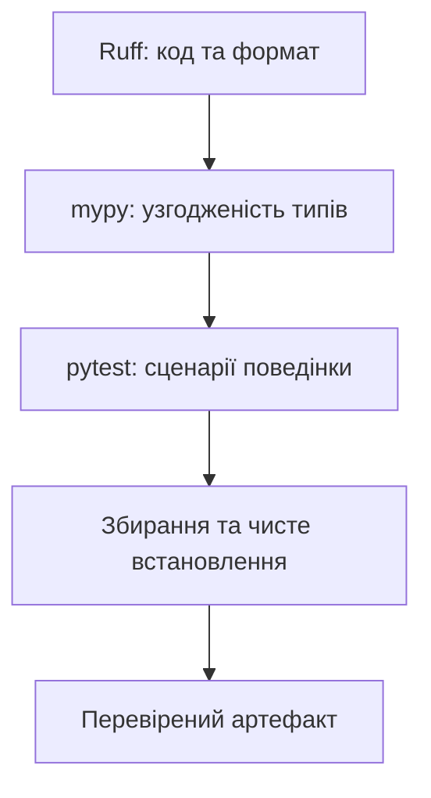

# Статичний аналіз і реліз

## Точніші анотації та межа статичної перевірки

`TypedDict` описує ключі словника; `Literal` – скінченний набір значень; `Final` – заборону повторного присвоєння для аналізатора; `Self` – тип поточного класу в методах, що повертають об’єкт. Вони не роблять дані JSON автоматично надійними. Результат зовнішнього читання перевіряють перед побудовою типізованої моделі.

```py
from typing import Final, Literal, TypedDict


class Options(TypedDict):
    mode: Literal["short", "full"]
    limit: int


MAX_LIMIT: Final = 100


def describe(options: Options) -> str:
    if not 1 <= options["limit"] <= MAX_LIMIT:
        raise ValueError("Ліміт поза межами")
    return f"{options['mode']}: {options['limit']}"


print(describe({"mode": "short", "limit": 5}))
```

Результат – `short: 5`. `@overload` описує декілька статичних сигнатур, але після них усе одно потрібна одна реалізація. `TypeIs` дозволяє функції-предикату звужувати тип в обох гілках; тіло предиката повинно справді перевіряти відповідну властивість. `cast` лише повідомляє аналізатору припущення автора й нічого не перетворює. Не використовуйте його замість валідації.

Декоратор може зберегти параметри функції за допомогою `ParamSpec`, записаного в новому синтаксисі як `**P`:

```py
from collections.abc import Callable
from functools import wraps


def logged[**P, T](func: Callable[P, T]) -> Callable[P, T]:
    @wraps(func)
    def wrapper(*args: P.args, **kwargs: P.kwargs) -> T:
        print("Виклик", func.__name__)
        return func(*args, **kwargs)

    return wrapper


@logged
def square(value: int) -> int:
    return value * value


print(square(4))
```

Результат: `Виклик square`, потім `16`. `Callable[..., Any]` втратив би перевірку аргументів, а тут виклик `square("x")` залишається статично неправильним. Складність анотації виправдана збереженням реального контракту.

## Приклад 4. Перевірки перед релізом

Тести перевіряють обрані сценарії виконання. mypy перевіряє узгодженість типів без запуску програми. Ruff знаходить обрані стильові й логічні проблеми; форматувальник стабілізує запис. Жоден інструмент не доводить правильності предметної формули.

Для контрольованого експерименту створіть окремий `bad.py`:

```py
value: int = "10"
print(value + 1)
```

`python -m mypy --strict bad.py` має завершитися ненульовим кодом і повідомити про несумісне присвоєння. Це навмисно неправильний приклад: його не включають у пакет. Виправлення `value: int = 10` усуває причину; `Any` або загальне вимкнення аналізу лише приховало б її.

::: info Знімок екрана
Ілюстрацію буде додано.
:::

Рис. 16.7. Діагностика mypy та успішні перевірки пакета {.caption}

`ruff check --fix` змінює файли, тому перегляньте різницю після запуску. Небезпечні автоматичні виправлення не слід вмикати без аналізу. `ruff format --check` лише перевіряє формат, `ruff format` його застосовує. Обрані правила `E4,E7,E9,F,I,B,UP` охоплюють помилки, імпорти й модернізацію; ширину друкованого лістингу додатково перевіряють у PDF.

Поступове впровадження mypy починайте з предметного шару, далі типізуйте межі CLI, файлів і бази. Якщо виняток необхідний, використовуйте конкретний код `type: ignore[код]` і пояснення. PyCharm, pyright та інші аналізатори можуть мати інші набори перевірок. Для відтворюваного захисту визначено один основний інструмент і його версію – mypy в середовищі проєкту.

## Автоматизація та фінальна перевірка

Хуки pre-commit запускають перевірки перед локальним комітом, але можуть бути пропущені. CI повторює їх у чистому середовищі. Зелений статус стосується конкретного коміту й набору перевірок; він не є дозволом на публікацію або гарантією відсутності помилок.



Рис. 16.8. Послідовність перевірки артефакту {.caption}

Для наведеного проєкту файл `.github/workflows/ci.yml` може містити такий мінімальний процес. Приклад не потребує секретів і не публікує артефакти в реєстрі.

```yaml
name: Python checks
on: [push, pull_request]
permissions:
  contents: read
jobs:
  check:
    runs-on: windows-latest
    steps:
      - uses: actions/checkout@v7
      - uses: actions/setup-python@v7
        with:
          python-version: '3.14'
      - run: python -m pip install -e ".[dev]"
      - run: python -m ruff check .
      - run: python -m ruff format --check .
      - run: python -m mypy src
      - run: python -m pytest -q
      - run: python -m build
```

У проєкті uv встановлення можна замінити на `uv sync --locked`, а запуск інструментів – на `uv run --locked ...`; сам uv також має бути встановлений у CI. Для суворої повторюваності фіксують версії інструментів та ревізії дій. Наведені major-теги перевірено за офіційними репозиторіями на дату підготовки матеріалу.

README має пояснювати встановлення, одиниці, приклади, помилки та спосіб перевірки. `.gitignore` виключає середовища, кеші, `build/`, `dist/` і локальні налаштування. Артефакти передають окремо від коду. Реліз перевіряють із чистого встановлення, а виконуваний файл – ще й з іншого робочого каталогу.
